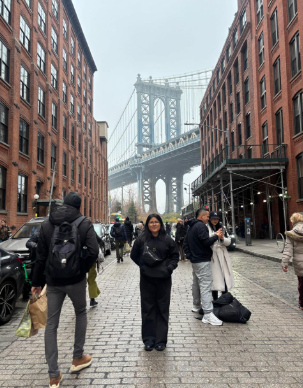

  

<h3 align="center">
Universidad Peruana de Ciencias Aplicadas
</h3>

<h3 align="center">
Ingeniería de Software  
  
Periodo: 202610
  
1ASI0732 - Diseño de Experimentos de Ingeniería de Software
  
NRC: 12316  
  
Docente: Julio Manuel Noriega Melendez
  
<strong>Informe de TB1</strong>  
  
Startup: 
  
Producto: GigMap  
  
<strong>Integrantes</strong>  
  
Bejarano Martinez, Alvaro Leandro (u202311640)
  
Collantes Carrillo, Diego Mateo (u202311823)
  
Lizarbe Alvarez, Ariana Nickole (u202311704) 
  
Ortiz Cardenas, Johanna Antuanete (u202310358)
  
Sarmiento Medina, Loreley (u202310005)
  
Zegarra Lopez, Renato Sebastian Rubber (u202311558)
  
 

**Abril, 2026**
</h3>

## Registro de Versiones del Informe

<table>
  <thead>
    <tr>
      <th>Versión</th>
      <th>Fecha</th>
      <th>Autor</th>
      <th>Descripción de modificación</th>
    </tr>
  </thead>
  <tbody>
    <tr>
      <td>TB1</td>
      <td>26/04/2026</td>
      <td>
        - Bejarano Martinez, Alvaro Leandro  
        - Collantes Carrillo, Diego Mateo  
        - Ortiz Cardenas, Johanna Antuanete  
        - Sarmiento Medina, Loreley  
        - Zegarra López, Renato Sebastián Rubber
      </td>
      <td>
     En esta entrega se avanzaron los siguientes puntos:  
  <b>Capítulo I: Introducción</b> 
  - 1.1. Startup Profile 
  - 1.1.1. Descripción de la Startup 
  - 1.1.2. Perfiles de integrantes del equipo 
  - 1.2. Solution Profile 
  - 1.2.1. Antecedentes y problemática 
  - 1.2.2. Lean UX Process 
  - 1.2.2.1. Lean UX Problem Statements 
  - 1.2.2.2. Lean UX Assumptions 
  - 1.2.2.3. Lean UX Hypothesis Statements 
  - 1.2.2.4. Lean UX Canvas 
  - 1.3. Segmentos objetivo  
  <b>Capítulo II: Requirements Elicitation & Analysis</b> 
  - 2.1. Competidores 
  - 2.1.1. Análisis competitivo 
  - 2.1.2. Estrategias y tácticas frente a competidores 
  - 2.2. Entrevistas 
  - 2.2.1. Diseño de entrevistas 
  - 2.2.2. Registro de entrevistas 
  - 2.2.3. Análisis de entrevistas 
  - 2.3. Needfinding 
  - 2.3.1. User Personas 
  - 2.3.2. User Task Matrix 
  - 2.3.3. User Journey Mapping 
  - 2.3.4. Empathy Mapping 
  - 2.3.5. As-is Scenario Mapping 
  - 2.4. Ubiquitous Language  
  <b>Capítulo III: Requirements Specification</b> 
  - 3.1. To-Be Scenario Mapping 
  - 3.2. User Stories 
  - 3.3. Product Backlog 
  - 3.4. Impact Mapping  
  <b>Capítulo IV: Product Design</b> 
  - 4.1. Style Guidelines 
  - 4.1.1. General Style Guidelines 
  - 4.1.2. Web Style Guidelines 
  - 4.1.3. Mobile Style Guidelines 
  - 4.1.3.1. iOS Mobile Style Guidelines 
  - 4.1.3.2. Android Mobile Style Guidelines 
  - 4.2. Information Architecture 
  - 4.2.1. Organization Systems 
  - 4.2.2. Labeling Systems 
  - 4.2.3. SEO Tags and Meta Tags 
  - 4.2.4. Searching Systems 
  - 4.2.5. Navigation Systems 
  - 4.3. Landing Page UI Design 
  - 4.3.1. Landing Page Wireframe 
  - 4.3.2. Landing Page Mock-up 
  - 4.4. Mobile Applications UX/UI Design 
  - 4.4.1. Mobile Applications Wireframes 
  - 4.4.2. Mobile Applications Wireflow Diagrams 
  - 4.4.3. Mobile Applications Mock-ups 
  - 4.4.4. Mobile Applications User Flow Diagrams 
  - 4.5. Mobile Applications Prototyping 
  - 4.5.1. Android Mobile Applications Prototyping 
  - 4.5.2. iOS Mobile Applications Prototyping 
  - 4.6. Web Applications UX/UI Design 
  - 4.6.1. Web Applications Wireframes 
  - 4.6.2. Web Applications Wireflow Diagrams 
  - 4.6.3. Web Applications Mock-ups 
  - 4.6.4. Web Applications User Flow Diagrams 
  - 4.7. Web Applications Prototyping 
  - 4.8. Domain-Driven Software Architecture 
  - 4.8.1. Software Architecture Context Diagram 
  - 4.8.2. Software Architecture Container Diagrams 
  - 4.8.3. Software Architecture Components Diagrams 
  - 4.9. Software Object-Oriented Design 
  - 4.9.1. Class Diagrams 
  - 4.9.2. Class Dictionary 
  - 4.10. Database Design 
  - 4.10.1. Relational/Non-Relational Database Diagram  
  <b>Capítulo V: Product Implementation</b> 
  - 5.1. Software Configuration Management 
  - 5.1.1. Software Development Environment Configuration 
  - 5.1.2. Source Code Management 
  - 5.1.3. Source Code Style Guide & Conventions 
  - 5.1.4. Software Deployment Configuration 
  - 5.2. Product Implementation & Deployment 
  - 5.2.1. Sprint Backlogs 
  - 5.2.2. Implemented Landing Page Evidence 
  - 5.2.3. Implemented Frontend-Web Application Evidence 
  - 5.2.4. Acuerdo de Servicio - SaaS 
  - 5.2.5. Implemented Native-Mobile Application Evidence 
  - 5.2.6. Implemented RESTful API and/or Serverless Backend Evidence 
  - 5.2.7. RESTful API documentation 
  - 5.2.8. Team Collaboration Insights 
  - 5.3. Video About-the-Product
      </td>
    </tr>
  </tbody>
</table>

## Project Report Collaboration Insights
URL de repositorio del reporte del proyecto: `https://github.com/PruebitaPe/GigMap-Report.git`

**TB1 (26/04/2026):**

## **Contenido**
- [STUDENT OUTCOME](#student-outcome)
- [Part I: As-Is Software Project](#part-i-as-is-software-project)
- [CAPÍTULO I: Introducción](#capítulo-i-introducción)
  - [1.1. Startup Profile](#11-startup-profile)
      - [1.1.1. Descripción de la Startup](#111-descripción-de-la-startup)
      - [1.1.2. Perfiles de integrantes del equipo](#112-perfiles-de-integrantes-del-equipo)
  - [1.2. Solution Profile](#12-solution-profile)
      - [1.2.1. Nombre del producto](#121-nombre-del-producto)
      - [1.2.2. Antecedentes y problemática](#122-antecedentes-y-problemática)
      - [1.2.3. Lean UX Process](#123-lean-ux-process)
        - [1.2.3.1. Lean UX Problem Statements](#1231-lean-ux-problem-statements)
        - [1.2.3.2. Lean UX Assumptions](#1232-lean-ux-assumptions)
        - [1.2.3.3. Lean UX Hypothesis Statements](#1233-lean-ux-hypothesis-statements)
        - [1.2.3.4. Lean UX Canvas](#1234-lean-ux-canvas)
  - [1.3. Segmentos objetivo](#13-segmentos-objetivo)
- [Capítulo II: Requirements Elicitation & Analysis](#capítulo-ii-requirements-elicitation--analysis)
  - [2.1. Competidores](#21-competidores)
    - [2.1.1. Análisis competitivo](#211-análisis-competitivo)
    - [2.1.2. Estrategias y tácticas frente a competidores](#212-estrategias-y-tácticas-frente-a-competidores)
  - [2.2. Entrevistas](#22-entrevistas)
    - [2.2.1. Diseño de entrevistas](#221-diseño-de-entrevistas)
    - [2.2.2. Registro de entrevistas](#222-registro-de-entrevistas)
    - [2.2.3. Análisis de entrevistas](#223-análisis-de-entrevistas)
  - [2.3. Needfinding](#23-needfinding)
    - [2.3.1. User Personas](#231-user-personas)
    - [2.3.2. User Task Matrix](#232-user-task-matrix)
    - [2.3.3. User Journey Mapping](#233-user-journey-mapping)
    - [2.3.4. Empathy Mapping](#234-empathy-mapping)
    - [2.3.5. As-is Scenario Mapping](#235-as-is-scenario-mapping)
  - [2.4. Ubiquitous Language](#24-ubiquitous-language)
- [Capítulo III: Requirements Specification](#capítulo-iii-requirements-specification)
  - [3.1. To-Be Scenario Mapping](#31-to-be-scenario-mapping)
  - [3.2. User Stories](#32-user-stories)
  - [3.3. Product Backlog](#33-product-backlog)
  - [3.4. Impact Mapping](#34-impact-mapping)
- [Capítulo IV: Product Design](#capítulo-iv-product-design)
  - [4.1. Style Guidelines](#41-style-guidelines)
    - [4.1.1. General Style Guidelines](#411-general-style-guidelines)
    - [4.1.2. Web Style Guidelines](#412-web-style-guidelines)
    - [4.1.3. Mobile Style Guidelines](#413-mobile-style-guidelines)
      - [4.1.3.1. iOS Mobile Style Guidelines](#4131-ios-mobile-style-guidelines)
      - [4.1.3.2. Android Mobile Style Guidelines](#4132-android-mobile-style-guidelines)
  - [4.2. Information Architecture](#42-information-architecture)
    - [4.2.1. Organization Systems](#421-organization-systems)
    - [4.2.2. Labeling Systems](#422-labeling-systems)
    - [4.2.3. SEO Tags and Meta Tags](#423-seo-tags-and-meta-tags)
    - [4.2.4. Searching Systems](#424-searching-systems)
    - [4.2.5. Navigation Systems](#425-navigation-systems)
  - [4.3. Landing Page UI Design](#43-landing-page-ui-design)
    - [4.3.1. Landing Page Wireframe](#431-landing-page-wireframe)
    - [4.3.2. Landing Page Mock-up](#432-landing-page-mock-up)
  - [4.4. Mobile Applications UX/UI Design](#44-mobile-applications-uxui-design)
    - [4.4.1. Mobile Applications Wireframes](#441-mobile-applications-wireframes)
    - [4.4.2. Mobile Applications Wireflow Diagrams](#442-mobile-applications-wireflow-diagrams)
    - [4.4.3. Mobile Applications Mock-ups](#443-mobile-applications-mock-ups)
    - [4.4.4. Mobile Applications User Flow Diagrams](#444-mobile-applications-user-flow-diagrams)
  - [4.5. Mobile Applications Prototyping](#45-mobile-applications-prototyping)
    - [4.5.1. Android Mobile Applications Prototyping](#451-android-mobile-applications-prototyping)
    - [4.5.2. iOS Mobile Applications Prototyping](#452-ios-mobile-applications-prototyping)
  - [4.6. Web Applications UX/UI Design](#46-web-applications-uxui-design)
    - [4.6.1. Web Applications Wireframes](#461-web-applications-wireframes)
    - [4.6.2. Web Applications Wireflow Diagrams](#462-web-applications-wireflow-diagrams)
    - [4.6.3. Web Applications Mock-ups](#463-web-applications-mock-ups)
    - [4.6.4. Web Applications User Flow Diagrams](#464-web-applications-user-flow-diagrams)
  - [4.7. Web Applications Prototyping](#47-web-applications-prototyping)
  - [4.8. Domain-Driven Software Architecture](#48-domain-driven-software-architecture)
    - [4.8.1. Software Architecture Context Diagram](#481-software-architecture-context-diagram)
    - [4.8.2. Software Architecture Container Diagrams](#482-software-architecture-container-diagrams)
    - [4.8.3. Software Architecture Components Diagrams](#483-software-architecture-components-diagrams)
  - [4.9. Software Object-Oriented Design](#49-software-object-oriented-design)
    - [4.9.1. Class Diagrams](#491-class-diagrams)
    - [4.9.2. Class Dictionary](#492-class-dictionary)
  - [4.10. Database Design](#410-database-design)
    - [4.10.1. Relational/Non-Relational Database Diagram](#4101-relationalnon-relational-database-diagram)
- [Capítulo V: Product Implementation](#capítulo-v-product-implementation)
  - [5.1. Software Configuration Management](#51-software-configuration-management)
    - [5.1.1. Software Development Environment Configuration](#511-software-development-environment-configuration)
    - [5.1.2. Source Code Management](#512-source-code-management)
    - [5.1.3. Source Code Style Guide & Conventions](#513-source-code-style-guide--conventions)
    - [5.1.4. Software Deployment Configuration](#514-software-deployment-configuration)
  - [5.2. Product Implementation & Deployment](#52-product-implementation--deployment)
    - [5.2.1. Sprint Backlogs](#521-sprint-backlogs)
    - [5.2.2. Implemented Landing Page Evidence](#522-implemented-landing-page-evidence)
    - [5.2.3. Implemented Frontend-Web Application Evidence](#523-implemented-frontend-web-application-evidence)
    - [5.2.4. Acuerdo de Servicio - SaaS](#524-acuerdo-de-servicio---saas)
    - [5.2.5. Implemented Native-Mobile Application Evidence](#525-implemented-native-mobile-application-evidence)
    - [5.2.6. Implemented RESTful API and/or Serverless Backend Evidence](#526-implemented-restful-api-andor-serverless-backend-evidence)
    - [5.2.7. RESTful API documentation](#527-restful-api-documentation)
    - [5.2.8. Team Collaboration Insights](#528-team-collaboration-insights)
  - [5.3. Video About-the-Product](#53-video-about-the-product)

## **Student Outcome**
ABET – EAC - Student Outcome 4:  
La capacidad de reconocer responsabilidades éticas y profesionales en situaciones de ingeniería y hacer juicios informados, que deben considerar el impacto de las soluciones de ingeniería en contextos globales, económicos, ambientales y sociales.

<table border="1">
  <thead>
    <tr>
      <th>Criterio específico</th>
      <th>Acciones realizadas</th>
      <th>Conclusiones</th>
    </tr>
  </thead>
  <tbody>
    <tr>
      <td> 4.c.1 Reconoce responsabilidad ética y profesional en situaciones de ingeniería de software </td>
      <td>
        Bejarano Martinez, Alvaro Leandro   
        TB1:   Se encargó de organizar la estructura del capítulo 3, manteniendo un enfoque ordenado y coherente en el desarrollo del contenido. Además, promovió un ambiente de trabajo colaborativo, asegurando que cada integrante pueda aportar sus ideas y que estas se integren adecuadamente en la revisión de las historias de usuario.   
        Collantes Carrillo, Diego Mateo   
        TB1:   Participó en el desarrollo del capítulo 4, aportando principalmente en la redacción del contenido para que sea claro, entendible y bien estructurado. Asimismo, colaboró en la revisión de las historias de usuario, buscando que estas comuniquen correctamente las necesidades del usuario.  
        Lizarbe Alvarez, Ariana Nickole   
        TB1:  Contribuyó en el desarrollo del capítulo 3, aplicando pensamiento crítico y habilidades de trabajo en equipo. Participó en la mejora de las historias de usuario, procurando que estén bien definidas y considerando siempre la experiencia del usuario final.  
        Ortiz Cardenas, Johanna Antuanete   
        TB1:  
        Desarrolló el capítulo 4 con un enfoque en la calidad y cumplimiento de los entregables. Además, investigó información relevante y aportó ideas que ayudaron a fortalecer las historias de usuario y el contenido del informe.  
        Sarmiento Medina, Loreley   
        TB1:   Se encargó del desarrollo del capítulo 1, asegurando una base sólida y bien estructurada para el proyecto. También realizó una revisión general del informe y de las historias de usuario, verificando la coherencia, organización y alineación con los objetivos planteados.  
        Zegarra López, Renato Sebastián Rubber   
        TB1:   Desarrolló el capítulo 2 aplicando sus habilidades de análisis y creatividad, aportando ideas que enriquecieron la propuesta. Asimismo, participó en la revisión de las historias de usuario, mejorando su claridad y consistencia.  
      </td>
      <td> A lo largo del desarrollo del trabajo, el equipo demostró una adecuada comprensión de sus responsabilidades éticas y profesionales, reflejada en la forma en que organizaron sus tareas y colaboraron entre sí. Cada integrante asumió su rol con compromiso, asegurando la calidad del contenido y el cumplimiento de los objetivos establecidos. Además, se priorizó la comunicación y el respeto por las ideas de todos, lo que permitió integrar diferentes aportes de manera ordenada. Esto evidencia una práctica responsable dentro del proceso de desarrollo del proyecto.</td>
    </tr>
    <tr>
      <td> 4.c.2 Emite juicios informados considerando el impacto de las soluciones de ingeniería de software en contextos globales, económicos, ambientales y sociales </td>
      <td>
        Bejarano Martinez, Alvaro Leandro   
        TB1:   Se aseguró de que las decisiones tomadas dentro del equipo sigan un enfoque organizado y responsable, considerando la importancia de mantener un trabajo estructurado que permita un desarrollo sostenible del proyecto.  
        Collantes Carrillo, Diego Mateo   
        TB1:  Aportó a que el contenido del proyecto sea comprensible y accesible, considerando el impacto social de la solución en la forma en que las personas descubren y acceden a la música en vivo.  
        Lizarbe Alvarez, Ariana Nickole   
        TB1:   Incorporó una perspectiva empática en el desarrollo del proyecto, analizando cómo la solución puede mejorar la experiencia del usuario y fortalecer la conexión entre los fans y la comunidad musical.  
        Ortiz Cardenas, Johanna Antuanete   
        TB1: Investigó y consideró tendencias tecnológicas actuales, con el objetivo de asegurar que la solución propuesta sea viable y tenga un impacto positivo tanto en el entorno digital como en el ámbito cultural.  
        Sarmiento Medina, Loreley   
        TB1:   Analizó la problemática considerando su impacto en el contexto social y cultural, asegurando que la propuesta esté alineada con necesidades reales y aporte valor tanto a los usuarios como a los artistas.  
        Zegarra López, Renato Sebastián Rubber   
        TB1:  Evaluó la solución desde un enfoque analítico y creativo, considerando su impacto en la difusión de artistas emergentes y en la mejora de la experiencia de los usuarios dentro del ecosistema musical. 
      </td>
      <td>El equipo logró considerar el impacto de la solución propuesta desde una perspectiva más amplia, tomando en cuenta aspectos sociales, culturales y tecnológicos. A través del análisis de la problemática, se evidenció una intención clara de generar valor tanto para los usuarios como para los artistas emergentes. Asimismo, se evaluó cómo la solución puede influir en la forma en que las personas acceden a la música en vivo y participan en la escena local. Esto demuestra una capacidad para tomar decisiones informadas, alineadas con el contexto y las necesidades reales del entorno.</td>
    </tr>
  </tbody>
</table>

# Part I: As-Is Software Project 

# CAPÍTULO I: Introducción

## 1.1. Startup Profile

### 1.1.1. Descripción de la Startup

StayBits es una startup creativa y tecnológica dedicada a transformar la manera en que las personas descubren, conectan y disfrutan la música en vivo, convencidos de que cada concierto, sin importar su escala, tiene la capacidad de despertar emociones únicas y generar lazos duraderos entre artistas y fans. Nuestro esfuerzo se centra en GigMap, una aplicación mobile interactiva que funciona como un puente entre los amantes de la música y los escenarios de su ciudad, ofreciendo un mapa dinámico con geolocalización donde los usuarios pueden explorar eventos en tiempo real, seguir a sus artistas preferidos, conocer las fechas de sus giras, registrar su asistencia en conciertos y compartir experiencias con otros fans. Además, proporcionamos herramientas de visibilidad y promoción para bandas emergentes, impulsando así el crecimiento de la escena musical independiente. En StayBits creemos en el poder de la comunidad, el descubrimiento espontáneo y la tecnología como motores para enriquecer la vida cultural, con la visión de crear una red global en la que cada presentación en vivo "desde un pequeño bar hasta un gran festival internacional" pueda ser encontrada, compartida y disfrutada al máximo, celebrando la div ersidad y el dinamismo del mundo musical. Con pasión, innovación y compromiso social, desde el corazón de StayBits impulsamos proyectos como GigMap, que reinventan la manera de vivir la música en directo y la acercan a quienes más la disfrutan.

Nuestra misión es conectar a las personas con la música en vivo mediante tecnología innovadora, facilitando el descubrimiento de eventos y fortaleciendo la relación entre artistas y fans. Y la vision que tenemos es ser la plataforma líder a nivel global en el descubrimiento de música en vivo, impulsando comunidades musicales y dando visibilidad a artistas de todo tipo de estilos.

### 1.1.2. Perfiles de integrantes del equipo
| Estudiante | Descripción |
|------------|-------------|
|  **Bejarano Martinez, Alvaro Leandro (u202311640)** | Mi nombre es Alvaro Leandro Bejarano Martínez, estudiante de la carrera Ingeniería de Software y me destaco por mi perseverancia, organización y capacidad para trabajar en equipo. Me esfuerzo por mantener un ambiente estructurado dentro del grupo, donde cada miembro se sienta valorado y sus ideas sean escuchadas y respetadas. Mi compromiso es fomentar la colaboración efectiva, asegurando que cada contribución se integre de manera ordenada y alineada con los objetivos comunes del equipo. |
|  **Collantes Carrillo, Diego Mateo (u202311823)** | Mi nombre es Diego Collantes. Tengo 20 años. Soy estudiante de sexto ciclo en la Universidad Peruana de Ciencias Aplicadas (UPC). Disfruto de leer, redactar y escuchar música en mi tiempo libre. Elegí esta carrera, ya que me interesó todo el proceso que hay detrás de cada aplicación o programa que usamos en nuestro día a día. Personalmente, espero ampliar mis conocimientos en este ámbito a lo largo de este curso. Además, estoy comprometido a contribuir en todo lo que sea posible con el equipo y a desempeñarme de manera adecuada. |
|  **Lizarbe Alvarez, Ariana Nickole (u202311704)** | Mi nombre es Ariana Lizarbe, tengo 20 años y estoy cursando el sexto ciclo de la carrera de ingeniería de software en la Universidad Peruana de Ciencias Aplicadas. En mi tiempo libre fuera de la universidad, procuro mejorar mis habilidades blandas, como la empatía o inteligencia emocional. También, me esfuerzo en adquirir conocimientos que pueden ayudarme a desarrollarme como futura profesional, como distintos lenguajes de programación. A su vez, disfruto de escuchar música, podcasts, leer y ver series de televisión. Me comprometo a colaborar de manera activa y responsable en la creación de esta startup, aportando mis habilidades en pensamiento crítico, trabajo en equipo y adaptabilidad para alcanzar un trabajo de calidad sobresaliente. |
|  **Ortiz Cardenas, Johanna Antuanete (u202310358)** | Mi nombre es Johanna Antuanete Ortiz Cárdenas, tengo 20 años y me encuentro en el sexto ciclo de la carrera de Ingeniería de Software. Me considero una persona proactiva y responsable, siempre buscando que mis trabajos sean de la mejor calidad posible. Me apasiona investigar sobre tecnología, lo que me permite estar al tanto de las últimas novedades y tendencias. En mi tiempo libre, disfruto jugar videojuegos, escuchar música y leer cómics. En el presente proyecto grupal, me comprometo a colaborar de manera activa, aportando ideas y siendo puntual con los entregables para garantizar resultados sobresalientes. |
|  **Sarmiento Medina, Loreley (u202310005)** |  Mi nombre es Loreley Sarmiento, tengo 20 años y actualmente curso la carrera de Ingeniería de Software. Me considero una persona responsable, organizada y con buena disposición para el trabajo en equipo, ya que valoro la comunicación y la colaboración como elementos clave para lograr buenos resultados. Me interesa seguir aprendiendo constantemente y asumir nuevos retos que me permitan fortalecer mis habilidades.En este proyecto, busco participar de manera activa, apoyar a mis compañeros, aportar ideas que contribuyan al desarrollo del equipo y cumplir con las tareas asignadas dentro de los plazos establecidos, con el objetivo de alcanzar un resultado de calidad. |
|  **Zegarra Lopez, Renato Sebastian Rubber (u202311558)** | Mi nombre es Renato Zegarra, tengo 20 años y actualmente estoy cursando la carrera de Ingeniería de Software en la Universidad Peruana de Ciencias Aplicadas. Fuera de mis estudios, disfruto explorar mis intereses en música, videojuegos y tecnología, siempre buscando nuevas formas de integrar estas pasiones en mi vida cotidiana. Me comprometo a colaborar de manera activa y responsable en la elaboración de este documento y en la concreción de la idea propuesta, aportando mis habilidades en análisis, creatividad y adaptabilidad. Estoy convencido de que con esfuerzo y trabajo en equipo, podemos alcanzar resultados innovadores y de alta calidad. |

## 1.2. Solution Profile

### 1.2.1. Nombre del producto

GigMap es una solución pensada para facilitar la forma en que las personas descubren y viven la música en vivo. Permite encontrar conciertos cercanos en tiempo real a partir de los gustos e intereses de cada usuario, ofreciendo una experiencia más personalizada. Además, ayuda a seguir artistas, conocer sus próximos eventos y descubrir nuevas propuestas musicales. Así, convierte cada salida en una oportunidad para conectar con la escena local de manera más natural y dinámica.

### 1.2.2. Antecedentes y problemática

**What**:

Las personas experimentan dificultad para descubrir y encontrar conciertos en vivo, en especial aquellos no tan conocidos. Esto reduce la visibilidad de artistas emergentes, limita el acceso a experiencias musicales auténticas y debilita el impacto de la música local en la rutina de los fans.
Por ejemplo, Chartmetric (2023) reporta que el 99,9 % de los artistas añadidos a la aplicación ese año permanecieron en las categorías de "no descubiertos" o "en desarrollo", mientras solo el 0,1 % alcanzó niveles medios o de éxito, destacando la extrema saturación de talento y la falta de visibilidad

**When**:

Esta problemática surge especialmente justo cuando las personas están dispuestas a disfrutar de música en vivo pero no tienen acceso a información confiable en tiempo real. Este escenario ocurre con frecuencia durante salidas espontáneas en fin de semana, cuando los fans intentan seguir a artistas emergentes pero desconocen sus fechas locales, y también en el caso de turistas que desean explorar la vida cultural de nuevas ciudades sin herramientas adecuadas de difusión. La evidencia de comportamiento en la recopilacion de Google (2016) sobre búsquedas locales que indica que el 76% de quienes buscan “algo cerca” en su smartphone visitan un lugar relacionado en 24 horas, subrayando la relevancia de la inmediatez móvil.

**Where**:

Ocurre en diversos entornos:
	- En la rutina diaria de los usuarios
 	- Al viajar o buscar actividades fuera de la zona habitual
  	- En barrios con oferta musical pero escasa visibilidad digital
	- En ciudades donde los medios tradicionales no alcanzan al público digital o joven
 
 La UNESCO (2022) advierte que los marcos e infraestructuras digitales son claves para ampliar el acceso y la participación cultural.
 

**Why**:

Porque asistir a conciertos en vivo genera valor cultural, emocional y social. No solo fortalece el sentido de comunidad y apoya directamente a los artistas, sino que también fomenta el descubrimiento de propuestas novedosas. La ausencia de una herramienta eficaz que conecte al público con eventos locales, especialmente independientes o espontáneos, impide el acceso a experiencias significativas y perjudica tanto a los músicos como al público.

**Who**:

Las personas más afectadas son:
	- Fans de música en vivo, tanto jóvenes como adultos, que buscan conciertos interesantes cerca de su ubicación pero carecen de información centralizada y actualizada.
	- Artistas emergentes y bandas independientes, que enfrentan enormes barreras para lograr visibilidad y difusión en un entorno competitivo.
 
La literatura sobre industrias culturales documenta desigualdades estructurales que dificultan a los independientes alcanzar audiencias sin mediación tecnológica (Hesmondhalgh, 2019).

**How**:

GigMap resuelve esta necesidad mediante una aplicación móvil que centraliza, personaliza y geolocaliza información sobre conciertos en tiempo real. La tecnología se apoya en: preferencias del usuario, ubicación, filtros de género, fechas y tipo de evento, alertas personalizadas, acceso a shows independientes, y funciones de recomendación y compartición social. Integra múltiples fuentes (publicaciones de artistas, registros de eventos, recomendaciones sociales) para ofrecer una experiencia fluida, espontánea y enriquecedora.

**How much:**

Si no se interviene:
	- Artistas pierden oportunidades para darse a conocer, generar ingresos y construir una base de seguidores.
	- La asistencia a conciertos disminuye, afectando la economía de espacios culturales, bares y promotores locales.
	- La vida cultural urbana se empobrece al invisibilizar propuestas valiosas.
	- Hay frustración entre los fans que desean experiencias auténticas y no encuentran cómo acceder a ellas.

En cambio, una solución como GigMap tiene un alto potencial de impacto positivo, ya que puede fomentar la cultura local, promover el descubrimiento musical y apoyar el ecosistema artístico independiente, directamente conectando al público con la música en vivo.

### 1.2.3. Lean UX Process

#### 1.2.3.1. Lean UX Problem Statements

Nuestros usuarios son personas apasionadas por la música en vivo: jóvenes, adultos que buscan experiencias auténticas y desean conectar con la escena musical de cada ciudad. Para ellos, encontrar conciertos cercanos en tiempo real y con información adaptada a sus intereses es una necesidad real, ya que muchos eventos, sobre todo los de menor escala, pasan desapercibidos por la falta de difusión. Esta brecha provoca que el público no logre descubrir a los artistas emergentes y que la escena independiente vea limitado su alcance y crecimiento. Sabremos que hemos respondido a este desafío cuando los usuarios utilicen GigMap para asistir a más conciertos, se incremente la visibilidad de músicos independientes y exista una participación activa en funciones como la geolocalización, las alertas personalizadas y la exploración de eventos.

Por este motivo, GigMap asume el compromiso de ofrecer una aplicación accesible, intuitiva y pensada en las necesidades reales del usuario, que sirva de puente directo entre los fans y la música en vivo. A través de herramientas inteligentes de descubrimiento, personalización y notificación, GigMap busca fortalecer el vínculo entre artistas y público, impulsando una cultura musical más diversa, cercana e inclusiva. El propósito es empoderar tanto a quienes crean como a quienes disfrutan la música, construyendo una comunidad que valore, comparta y mantenga viva la experiencia única de los conciertos en directo.

#### 1.2.3.2. Lean UX Assumptions

Creemos que los usuarios de GigMap son principalmente jóvenes y adultos que disfrutan de la música en vivo y valoran experiencias auténticas, tanto en su ciudad como durante sus viajes. Detectamos que estas personas enfrentan dificultades para descubrir conciertos de pequeña y mediana escala debido a la falta de canales de difusión efectivos, lo que genera una desconexión con los artistas emergentes y los hace perderse de eventos significativos. Consideramos que valorarán una aplicación móvil que les permita recibir notificaciones personalizadas, explorar conciertos cercanos en tiempo real y descubrir propuestas locales de manera sencilla y atractiva. Una solución efectiva debe ser intuitiva, basada en la geolocalización, personalizable según gustos musicales y capaz de visibilizar eventos independientes que no suelen aparecer en medios tradicionales.

**Assumptions Worksheet**

**¿Quién es el usuario?** 

- Personas que disfrutan de la música en vivo y buscan nuevas experiencias culturales.
- Artistas emergentes que desean difundir su música y conectar con la comunidad.

**¿Dónde encaja nuestro producto en su trabajo o vida?**

- GigMap funcionará como una herramienta esencial en el día a día de los usuarios, ayudándoles a tomar decisiones rápidas y seguras sobre qué conciertos asistir.
- Puede utilizarse al planificar una salida, durante un viaje o incluso en recorridos cotidianos, sirviendo como guía personalizada para descubrir experiencias musicales alineadas con su estilo de vida.
- Será un acompañante constante en el teléfono móvil, facilitando la exploración urbana y el acceso a la escena musical local.

**¿Qué problemas tiene nuestro producto?**

- Falta de información confiable y en tiempo real sobre conciertos y eventos musicales independientes.
- Dificultad para acceder a opciones culturales en zonas desconocidas o con baja difusión digital.
- Escasez de soluciones intuitivas que integren mapas, recomendaciones y experiencias personalizadas en una sola aplicación móvil.

**¿Cuándo y cómo es nuestro producto utilizado?**

- GigMap se usa cuando los usuarios quieren salir y explorar opciones musicales cercanas.
- Puede utilizarse a lo largo del día, ya sea en el trabajo, en caminatas, paseos o al organizar actividades sociales.
- Disponible en dispositivos móviles, debe ser intuitiva y accesible incluso para usuarios con poca experiencia tecnológica.

**¿Qué características son importantes?**

- Mapas interactivos que muestren eventos musicales según los géneros favoritos del usuario.
- Información en tiempo real sobre afluencia, accesibilidad y cambios en la programación de los conciertos.
- Alertas personalizadas con recordatorios y novedades relevantes.
- Recomendaciones basadas en ubicación, historial de asistencia y gustos musicales.
- Perfiles diferenciados para fans y artistas, con beneficios adaptados a cada rol.

**Objetivos**

- Facilitar el descubrimiento de conciertos: ayudar a los usuarios a encontrar eventos cercanos de manera personalizada y rápida.
- Fortalecer la conexión entre fans y artistas: generar una red activa de interacción y apoyo mutuo.
- Transformar la movilidad urbana en una experiencia cultural: vincular la exploración de la ciudad con la música en vivo.
- Impulsar la participación en la escena local: promover la asistencia a eventos, el descubrimiento de nuevos talentos y la difusión de la música independiente.

**Alcances**

Asistencia personalizada en tiempo real

- Recomendaciones adaptadas a los intereses, ubicación y contexto del usuario.
- Actualizaciones en vivo sobre horarios, cambios y disponibilidad de entradas.
- Mapas interactivos que indiquen rutas claras hacia los eventos.

Accesibilidad y usabilidad

- Interfaz intuitiva, moderna y clara.
- Optimizada para smartphones y tablets, incluso en condiciones de conectividad limitada.
  
Conexión con comunidad y expertos

- Espacios para recomendaciones de expertos y experiencias compartidas por otros usuarios.
- Valoraciones y comentarios que fortalezcan la confianza y la participación activa.

**Escalabilidad**

- Adaptable a diferentes ciudades y contextos culturales.
- Capacidad para integrar datos locales y expandirse globalmente.

**Business Outcomes**

- Convertirse en la aplicación móvil de referencia para el descubrimiento de música en vivo.
- Generar datos anónimos útiles para políticas culturales y desarrollo urbano.
- Posicionarse como pionera en una categoría de aplicaciones de exploración cultural móvil.
- Crear un ecosistema en el que GigMap sea el punto de conexión entre usuarios, artistas y ciudades.

**User Outcomes**

- Acceso rápido a conciertos cercanos y alineados con los gustos del usuario.
- Mayor participación en eventos de artistas emergentes e independientes.
- Incremento en la visibilidad de músicos locales y diversidad cultural.
- Interacción directa entre fans y artistas a través de notificaciones y herramientas de descubrimiento.
- Reducción de la desconexión entre la oferta musical local y los posibles asistentes.

**Features**

- Mapas interactivos de conciertos filtrados por género, fecha y ubicación.
- Buscador inteligente con filtros avanzados y autocompletado.
- Sección para fans con beneficios exclusivos y recomendaciones personalizadas.
- Sección para artistas con herramientas de promoción y análisis de audiencia.
- Recomendaciones basadas en ubicación y gustos musicales previos.
- Experiencia de uso fluida, confiable y centrada en el usuario.

#### 1.2.3.3. Lean UX Hypothesis Statements

Creemos que, si GigMap cuenta con una interfaz intuitiva y está optimizada para dispositivos móviles, incluso los usuarios con poca experiencia tecnológica podrán utilizar la aplicación con facilidad para orientarse y descubrir nuevos conciertos en su entorno.

Creemos que, si GigMap ofrece recomendaciones de conciertos basadas en los intereses y preferencias del usuario, así como en la proximidad de los eventos, se logrará una experiencia más personalizada y una exploración más fluida de la oferta musical disponible.

Creemos que, si GigMap integra una comunidad activa en la que los usuarios puedan compartir experiencias y reportar incidencias, se fomentará la confianza colectiva y la participación constante, reforzando el valor colaborativo de la aplicación.

Creemos que, si GigMap proporciona una aplicación móvil para que los artistas emergentes publiquen sus conciertos y conecten con un público local, aumentarán sus oportunidades de visibilización, crecimiento y fidelización de seguidores, fortaleciendo así su carrera artística a largo plazo.

Creemos que, si GigMap permite a los usuarios dejar reseñas y comentarios sobre conciertos y presentaciones, los artistas obtendrán retroalimentación constructiva que les permitirá mejorar su desempeño y consolidar su éxito en futuros eventos.

Creemos que, si GigMap destaca a artistas emergentes y facilita su participación en conciertos junto a músicos ya consolidados, se incrementarán sus posibilidades de ser reconocidos por profesionales de la industria, contribuyendo a su desarrollo y proyección en la escena musical.

#### 1.2.3.4. Lean UX Canvas

<table border="1">
  <tr>
    <th>Business Problem</th>
    <th>Solutions</th>
    <th>Business Outcomes</th>
  </tr>
  <tr>
    <td>
      Muchas personas que disfrutan de la música en vivo, así como artistas y cantantes, tanto independientes como formales, enfrentan dificultades para descubrir o difundir conciertos, especialmente los de pequeña o mediana escala. Esta desconexión limita el crecimiento de la escena musical local, reduce la visibilidad de los artistas y hace que los fans se pierdan experiencias auténticas.
    </td>
    <td>
      GigMap es una aplicación móvil que conecta a los amantes de la música con conciertos en tiempo real, permitiendo descubrir eventos cercanos mediante geolocalización, recibir notificaciones personalizadas según gustos musicales y acceder a la agenda de presentaciones de artistas locales. Además, ofrece una aplicación para que los músicos puedan publicar sus eventos y llegar a su público ideal.
    </td>
    <td>
      Esperamos que GigMap incremente la asistencia a conciertos, visibilice a más artistas independientes y fomente una comunidad musical más conectada. El éxito se medirá por el aumento de usuarios activos, la cantidad de eventos compartidos en la aplicación y el crecimiento en la interacción entre fans y artistas.
    </td>
  </tr>
  <tr>
    <th>Users</th>
    <th colspan="2">User Benefits</th>
  </tr>
  <tr>
    <td>
      Nuestros usuarios son personas apasionadas por la música en vivo, así como artistas y cantantes, tanto independientes como formales, que buscan descubrir o difundir eventos musicales con mayor facilidad. Comparten el objetivo de vivir experiencias musicales únicas o de hacer crecer su audiencia.
    </td>
    <td colspan="2">
      <ul>
        <li>Descubrimiento de conciertos cercanos en tiempo real gracias a la geolocalización.</li>
        <li>Notificaciones personalizadas según el estilo musical de interés.</li>
        <li>Para artistas: herramienta efectiva y accesible para promocionar sus presentaciones.</li>
        <li>Mayor conexión entre músicos y fans en escenarios culturales reales.</li>
      </ul>
    </td>
  </tr>
  <tr>
    <th>Hypotheses</th>
    <th>What’s the most important thing we need to learn first?</th>
    <th>What’s the least amount of work we need to do to learn the most important thing?</th>
  </tr>
  <tr>
    <td>
      Creemos que, al ofrecer una solución que conecta a personas y artistas mediante conciertos geolocalizados y notificaciones personalizadas, los usuarios asistirán a más eventos y los músicos lograrán una mayor difusión, fortaleciendo la comunidad musical local y mejorando la experiencia para ambas partes.
    </td>
    <td>
      Es fundamental validar si los fans consideran útil la aplicación para descubrir conciertos relevantes y si los artistas encuentran valioso el canal para promover sus presentaciones.
    </td>
    <td>
      Desarrollar un prototipo funcional que muestre conciertos cercanos según ubicación e intereses musicales, incluyendo una opción para que los artistas registren sus eventos. Luego, probarlo con un grupo de usuarios y músicos para obtener retroalimentación directa sobre la utilidad y la experiencia.
    </td>
  </tr>
</table>

## 1.3. Segmentos objetivo

**Fans de la música (jóvenes y adultos jóvenes):**

De acuerdo con Duche Pérez y Andía Gonzales (2019), el 54 % de los estudiantes universitarios asiste a conciertos “de vez en cuando” (1 o 2 veces al año). Este dato respalda el comportamiento cultural de este segmento universitario 

- Edad estimada: 16 a 35 años

- Ubicación: Principalmente en zonas urbanas con oferta cultural como Lima.

- Características demográficas y de comportamiento:
  
	- Incorporan la música como parte del día a día.
	- Consumen contenido en aplicaciones como Spotify, Apple Music.
	- Siguen a artistas en redes sociales como Instagram, TikTok o X.
	- Comparten sus preferencias musicales con amigos y buscan experiencias reales significativas.

- Necesidades principales:

	- Descubrir conciertos cercanos en tiempo real.
	- Recibir notificaciones sobre giras o presentaciones.
	- Compartir su asistencia en redes.
	- Encontrar fácilmente eventos pequeños o independientes poco promocionados.

**Artistas emergentes y bandas independientes:** 

Según Chartmetric (2024), de los artistas añadidos en 2023, el 99.9 % terminó el año en las categorías “Undiscovered” o “Developing”, mientras que solo una minúscula proporción logró avanzar a niveles más altos como Mid-Level o Mainstream

Crecimiento económico del sector independiente:
El mercado global de artistas independientes alcanzó un valor estimado de USD 160.6 mil millones en 2025, y se espera que crezca a USD 219.93 mil millones para 2030, expandiéndose a una tasa anual compuesta del 6.49% 

- Edad estimada: 18 a 40 años
  
- Ubicación: Zonas urbanas o semiurbanas con escena cultural dinámica, como Lima.

- Características demográficas y de comportamiento:

	- Generalmente son músicos autogestionados o integrantes de bandas independientes que no cuentan con el respaldo de grandes disqueras.
	- Utilizan redes sociales y aplicaciones como principales canales de promoción, interacción con su audiencia y difusión de eventos.
	- Buscan herramientas tecnológicas que les ofrezcan mayor visibilidad, autonomía en la gestión de sus actividades y una comunicación directa con sus seguidores.

- Necesidades principales:

	- Promocionar conciertos y aumentar su visibilidad en el ámbito local.
	- Construir y fidelizar su audiencia.
	- Disponer de herramientas simples de geolocalización y organización de calendario.
	- Medir y analizar la asistencia a sus presentaciones para mejorar su estrategia.

# CAPÍTULO II: Requirements Elicitation & Analysis

## 2.1. Competidores

### 2.1.1. Análisis competitivo

### 2.1.2. Estrategias y tácticas frente a competidores

## 2.2. Entrevistas

### 2.2.1. Diseño de entrevistas

### 2.2.2. Registro de entrevistas

### 2.2.3. Análisis de entrevistas

## 2.3. Needfinding

### 2.3.1. User Personas

### 2.3.2. User Task Matrix

### 2.3.3. User Journey Mapping

### 2.3.4. Empathy Mapping

### 2.3.5. As-is Scenario Mapping

## 2.4. Ubiquitous Language

# CAPÍTULO III: Requirements Specification

## 3.1. To-Be Scenario Mapping

## 3.2. User Stories

**Epics:**
| Epic ID | Título                                             | Descripción                                                                                                                                                                                       |
|---------|----------------------------------------------------|---------------------------------------------------------------------------------------------------------------------------------------------------------------------------------------------------|
| EP01    | Creación y descubrimiento de conciertos         | Esta épica se centra en permitir a los artistas registrar y gestionar conciertos en la aplicación, mientras que los usuarios podrán descubrir nuevos eventos según su ubicación, género musical y artistas favoritos. Se busca optimizar la experiencia de búsqueda y exploración para que los fans encuentren fácilmente conciertos relevantes y personalizados. |
| EP02    | Notificaciones personalizadas                      | Incluye el desarrollo de un sistema de alertas que informe a los usuarios sobre nuevos conciertos, cambios en eventos, promociones y recordatorios, todo basado en sus preferencias e historial de interacción. El objetivo es mantenerlos siempre actualizados y fomentar su participación activa en la aplicación.|
| EP03    | Interacción social y comunidades               | Esta épica permitirá a los usuarios interactuar con otros fans a través de comunidades dentro de la aplicación. Se busca construir un espacio social donde los usuarios compartan experiencias, recomendaciones y opiniones, fortaleciendo el sentido de comunidad alrededor de la música en vivo.|
| EP04    | Gestión de Identidad y Acceso (Registro y Autenticación) | Enfocada en el inicio de sesión y registro de usuarios, esta épica incluye autenticación mediante correo electrónico o redes sociales, recuperación de contraseñas y gestión de roles y permisos básicos. Su objetivo es garantizar la seguridad, privacidad y facilidad de acceso a la aplicación para todos los usuarios. |
| EP05    | Exploración y Gestión de Eventos Relacionados    | Esta épica se centra en permitir la creación y descubrimiento de eventos asociados a un concierto principal, como juntadas de fans en un parque, fiestas temáticas previas, actividades comunitarias o afterparties. Los usuarios podrán explorar, unirse y organizar este tipo de encuentros que enriquecen la experiencia musical más allá del show oficial. El objetivo es fomentar la interacción entre fans y ampliar el ecosistema de eventos alrededor de los conciertos.|
| EP06    | Desarrollo técnico del backend (RESTful API)       | Esta épica comprende la implementación de la infraestructura técnica que soportará la aplicación, incluyendo la base de datos, API, servicios en la nube y escalabilidad del sistema. El foco está en garantizar rendimiento, seguridad y estabilidad para manejar de manera eficiente las operaciones de usuarios y organizadores. |
| EP07    | Plataforma informativa (Landing Page)     | Se centra en el desarrollo de una landing page que funcione como punto de entrada informativo, presentando la propuesta de valor, características principales y beneficios de la aplicación. El objetivo es atraer nuevos usuarios, transmitiendo confianza y profesionalismo desde la primera interacción. |

**User Stories:**
<table>
  <thead>
    <tr>
      <th>Story ID</th>
      <th>User</th>
      <th>Priority</th>
      <th>Epic</th>
    </tr>
  </thead>
  <tbody>
    <tr>
      <td>US01</td>
      <td>Fan</td>
      <td>3</td>
      <td>EP01</td>
    </tr>
    <tr>
      <td><strong>Title</strong></td>
      <td colspan="3">Filtrar conciertos por género musical</td>
    </tr>
    <tr>
      <td colspan="4"><strong>Description</strong></td>
    </tr>
    <tr>
      <td colspan="4">Como fan, quiero filtrar conciertos por género para ver solo los que me interesan.</td>
    </tr>
    <tr>
      <td colspan="4"><strong>Acceptance Criteria</strong></td>
    </tr>
    <tr>
      <td colspan="4">
        <strong>Escenario 1: Filtrar conciertos por un género</strong> 
        Dado que el usuario se encuentra en la lista de conciertos 
        Cuando selecciona un género musical en el filtro 
        Entonces el sistema muestra únicamente los conciertos que pertenecen a ese género.  
        <strong>Escenario 2: No hay resultados para el género seleccionado</strong> 
        Dado que el usuario se encuentra en la lista de conciertos 
        Cuando selecciona un género musical que no tiene conciertos disponibles 
        Entonces el sistema muestra un mensaje indicando que no hay resultados.
      </td>
    </tr>
  </tbody>
</table>

<table>
  <thead>
    <tr>
      <th>Story ID</th>
      <th>User</th>
      <th>Priority</th>
      <th>Epic</th>
    </tr>
  </thead>
  <tbody>
    <tr>
      <td>US02</td>
      <td>Artista</td>
      <td>5</td>
      <td>EP01</td>
    </tr>
    <tr>
      <td><strong>Title</strong></td>
      <td colspan="3">Publicar nuevo concierto</td>
    </tr>
    <tr>
      <td colspan="4"><strong>Description</strong></td>
    </tr>
    <tr>
      <td colspan="4">Como artista, quiero crear un evento para promocionar mi presentación.</td>
    </tr>
    <tr>
      <td colspan="4"><strong>Acceptance Criteria</strong></td>
    </tr>
    <tr>
      <td colspan="4">
        <strong>Escenario: Acceso al formulario de creación de evento</strong> 
        Dado que el artista inicia sesión 
        Cuando accede a "Crear evento" 
        Entonces puede ingresar datos y publicarlo en el mapa.  
        <strong>Escenario: Publicación inmediata y visible</strong> 
        Dado que los datos son válidos 
        Cuando se confirma la creación 
        Entonces el evento aparece visible en la aplicación.
      </td>
    </tr>
  </tbody>
</table>

<table>
  <thead>
    <tr>
      <th>Story ID</th>
      <th>User</th>
      <th>Priority</th>
      <th>Epic</th>
    </tr>
  </thead>
  <tbody>
    <tr>
      <td>US03</td>
      <td>Artista</td>
      <td>2</td>
      <td>EP03</td>
    </tr>
    <tr>
      <td><strong>Title</strong></td>
      <td colspan="3">Personalizar perfil de artista</td>
    </tr>
    <tr>
      <td colspan="4"><strong>Description</strong></td>
    </tr>
    <tr>
      <td colspan="4">Como artista, quiero personalizar mi perfil con mi nombre artístico y fotografía para conectar mejor con el público.</td>
    </tr>
    <tr>
      <td colspan="4"><strong>Acceptance Criteria</strong></td>
    </tr>
    <tr>
      <td colspan="4">
    <strong>Escenario 1: Actualizar nombre artístico y fotografía</strong> 
    Dado que el artista se encuentra en la sección de edición de perfil 
    Cuando ingresa un nombre artístico válido y selecciona una fotografía 
    Entonces el sistema guarda los cambios y muestra la información actualizada en su perfil.  
<strong>Escenario 2: Intentar guardar sin datos válidos</strong> 
    Dado que el artista se encuentra en la sección de edición de perfil 
    Cuando intenta guardar el perfil sin ingresar un nombre artístico o sin seleccionar una fotografía válida 
    Entonces el sistema muestra un mensaje de error indicando que los campos son obligatorios o inválidos.
      </td>
    </tr>
  </tbody>
</table>

<table>
  <thead>
    <tr>
      <th>Story ID</th>
      <th>User</th>
      <th>Priority</th>
      <th>Epic</th>
    </tr>
  </thead>
  <tbody>
    <tr>
      <td>US04</td>
      <td>Usuario</td>
      <td>5</td>
      <td>EP03</td>
    </tr>
    <tr>
      <td><strong>Title</strong></td>
      <td colspan="3">Crear comunidad</td>
    </tr>
    <tr>
      <td colspan="4"><strong>Description</strong></td>
    </tr>
    <tr>
      <td colspan="4">Como usuario, quiero crear una comunidad temática para reunir a otros usuarios en torno a intereses compartidos.</td>
    </tr>
    <tr>
      <td colspan="4"><strong>Acceptance Criteria</strong></td>
    </tr>
    <tr>
      <td colspan="4">
        <strong>Escenario: Acceso a la opción de crear comunidad</strong> 
		Dado que el usuario ha iniciado sesión 
		Cuando accede a la sección de comunidades 
		Entonces puede ver y seleccionar la opción para crear una nueva comunidad.  
        <strong>Escenario: Creación de comunidad correcta</strong> 
		Dado que el usuario ha accedido al formulario de creación 
		Cuando completa los campos requeridos y confirma la acción 
		Entonces se crea la comunidad y queda visible para otros usuarios.
      </td>
    </tr>
  </tbody>
</table>

<table>
  <thead>
    <tr>
      <th>Story ID</th>
      <th>User</th>
      <th>Priority</th>
      <th>Epic</th>
    </tr>
  </thead>
  <tbody>
    <tr>
      <td>US05</td>
      <td>Fan</td>
      <td>5</td>
      <td>EP01</td>
    </tr>
    <tr>
      <td><strong>Title</strong></td>
      <td colspan="3">Ver mapa con geolocalización</td>
    </tr>
    <tr>
      <td colspan="4"><strong>Description</strong></td>
    </tr>
    <tr>
      <td colspan="4">Como fan, quiero ver un mapa con mi ubicación y los conciertos cercanos marcados para explorar visualmente las opciones disponibles.</td>
    </tr>
    <tr>
      <td colspan="4"><strong>Acceptance Criteria</strong></td>
    </tr>
    <tr>
      <td colspan="4">
        <strong>Escenario: Visualización del mapa con eventos</strong> 
        Dado que el usuario está logueado y ha permitido el acceso a su ubicación 
        Cuando entra a la sección de mapa 
        Entonces visualiza su ubicación y los conciertos cercanos.  
        <strong>Escenario: Información de eventos en el mapa</strong> 
        Dado que el usuario interactúa con un marcador de evento 
        Cuando hace clic en un ícono del mapa 
        Entonces puede ver detalles del evento como nombre, hora y lugar.
      </td>
    </tr>
  </tbody>
</table>

<table>
  <thead>
    <tr>
      <th>Story ID</th>
      <th>User</th>
      <th>Priority</th>
      <th>Epic</th>
    </tr>
  </thead>
  <tbody>
    <tr>
      <td>US06</td>
      <td>Usuario</td>
      <td>2</td>
      <td>EP01</td>
    </tr>
    <tr>
      <td><strong>Title</strong></td>
      <td colspan="3">Buscar conciertos</td>
    </tr>
    <tr>
      <td colspan="4"><strong>Description</strong></td>
    </tr>
    <tr>
      <td colspan="4">Como usuario, quiero buscar conciertos por nombre o artista para encontrarlos fácilmente.</td>
    </tr>
    <tr>
      <td colspan="4"><strong>Acceptance Criteria</strong></td>
    </tr>
    <tr>
      <td colspan="4">
        <strong>Escenario: Búsqueda por palabra clave</strong> 
        Dado que el usuario accede al buscador de conciertos 
        Cuando escribe un nombre o artista 
        Entonces se muestran los conciertos coincidentes.
      </td>
    </tr>
  </tbody>
</table>

<table>
  <thead>
    <tr>
      <th>Story ID</th>
      <th>User</th>
      <th>Priority</th>
      <th>Epic</th>
    </tr>
  </thead>
  <tbody>
    <tr>
      <td>US07</td>
      <td>Usuario</td>
      <td>2</td>
      <td>EP03</td>
    </tr>
    <tr>
      <td><strong>Title</strong></td>
      <td colspan="3">Buscar comunidades</td>
    </tr>
    <tr>
      <td colspan="4"><strong>Description</strong></td>
    </tr>
    <tr>
      <td colspan="4">Como usuario, quiero buscar comunidades por nombre o temática para unirme a las que me interesen.</td>
    </tr>
    <tr>
      <td colspan="4"><strong>Acceptance Criteria</strong></td>
    </tr>
    <tr>
      <td colspan="4">
        <strong>Escenario: Búsqueda de comunidades</strong> 
        Dado que el usuario accede al buscador de comunidades 
        Cuando ingresa una palabra clave 
        Entonces ve las comunidades coincidentes.
      </td>
    </tr>
  </tbody>
</table>

<table>
  <thead>
    <tr>
      <th>Story ID</th>
      <th>User</th>
      <th>Priority</th>
      <th>Epic</th>
    </tr>
  </thead>
  <tbody>
    <tr>
      <td>US08</td>
      <td>Usuario registrado</td>
      <td>3</td>
      <td>EP04</td>
    </tr>
    <tr>
      <td><strong>Title</strong></td>
      <td colspan="3">Iniciar sesión en la app mobile</td>
    </tr>
    <tr>
      <td colspan="4"><strong>Description</strong></td>
    </tr>
    <tr>
      <td colspan="4">Como usuario registrado, quiero iniciar sesión desde la aplicación móvil para acceder a mi cuenta.</td>
    </tr>
    <tr>
      <td colspan="4"><strong>Acceptance Criteria</strong></td>
    </tr>
    <tr>
      <td colspan="4">
        <strong>Escenario: Ingreso exitoso desde app mobile</strong> 
        Dado que el usuario tiene una cuenta 
        Cuando accede al formulario de login y envía sus credenciales 
        Entonces accede correctamente a su perfil.
      </td>
    </tr>
  </tbody>
</table>

<table>
  <thead>
    <tr>
      <th>Story ID</th>
      <th>User</th>
      <th>Priority</th>
      <th>Epic</th>
    </tr>
  </thead>
  <tbody>
    <tr>
      <td>US09</td>
      <td>Artista</td>
      <td>3</td>
      <td>EP04</td>
    </tr>
    <tr>
      <td><strong>Title</strong></td>
      <td colspan="3">Registrarse como artista</td>
    </tr>
    <tr>
      <td colspan="4"><strong>Description</strong></td>
    </tr>
    <tr>
      <td colspan="4">Como nuevo usuario, quiero registrarme como artista para promocionar mis conciertos.</td>
    </tr>
    <tr>
      <td colspan="4"><strong>Acceptance Criteria</strong></td>
    </tr>
    <tr>
      <td colspan="4">
        <strong>Escenario: Registro como artista</strong> 
        Dado que el visitante accede al formulario de registro 
        Cuando selecciona la opción 'Artista' y completa sus datos 
        Entonces su cuenta es creada con perfil de artista.
      </td>
    </tr>
  </tbody>
</table>
<table>
  <thead>
    <tr>
      <th>Story ID</th>
      <th>User</th>
      <th>Priority</th>
      <th>Epic</th>
    </tr>
  </thead>
  <tbody>
    <tr>
      <td>US10</td>
      <td>Fan</td>
      <td>3</td>
      <td>EP04</td>
    </tr>
    <tr>
      <td><strong>Title</strong></td>
      <td colspan="3">Registrarse como fan</td>
    </tr>
    <tr>
      <td colspan="4"><strong>Description</strong></td>
    </tr>
    <tr>
      <td colspan="4">Como nuevo usuario, quiero registrarme como fan para participar en la comunidad y explorar conciertos.</td>
    </tr>
    <tr>
      <td colspan="4"><strong>Acceptance Criteria</strong></td>
    </tr>
    <tr>
      <td colspan="4">
        <strong>Escenario: Registro como fan</strong> 
        Dado que el visitante accede al formulario de registro 
        Cuando selecciona la opción 'Fan' y completa sus datos 
        Entonces su cuenta es creada con perfil de fan.
      </td>
    </tr>
  </tbody>
</table>

<table>
  <thead>
    <tr>
      <th>Story ID</th>
      <th>User</th>
      <th>Priority</th>
      <th>Epic</th>
    </tr>
  </thead>
  <tbody>
    <tr>
      <td>US11</td>
      <td>Fan</td>
      <td>2</td>
      <td>EP01</td>
    </tr>
    <tr>
      <td><strong>Title</strong></td>
      <td colspan="3">Zoom a concierto en el mapa</td>
    </tr>
    <tr>
      <td colspan="4"><strong>Description</strong></td>
    </tr>
    <tr>
      <td colspan="4">Como fan, quiero que al seleccionar un concierto en el mapa se haga zoom a su ubicación.</td>
    </tr>
    <tr>
      <td colspan="4"><strong>Acceptance Criteria</strong></td>
    </tr>
    <tr>
      <td colspan="4">
        <strong>Escenario: Zoom en mapa a concierto seleccionado</strong> 
        Dado que el usuario está en el mapa 
        Cuando hace touch en un concierto 
        Entonces el mapa se centra y hace zoom sobre su ubicación.
      </td>
    </tr>
  </tbody>
</table>
<table>
  <thead>
    <tr>
      <th>Story ID</th>
      <th>User</th>
      <th>Priority</th>
      <th>Epic</th>
    </tr>
  </thead>
  <tbody>
    <tr>
      <td>US12</td>
      <td>Usuario</td>
      <td>2</td>
      <td>EP01</td>
    </tr>
    <tr>
      <td><strong>Title</strong></td>
      <td colspan="3">Ver estado del concierto</td>
    </tr>
    <tr>
      <td colspan="4"><strong>Description</strong></td>
    </tr>
    <tr>
      <td colspan="4">Como usuario, quiero saber si un concierto está disponible o agotado para decidir si puedo asistir.</td>
    </tr>
    <tr>
      <td colspan="4"><strong>Acceptance Criteria</strong></td>
    </tr>
    <tr>
      <td colspan="4">
        <strong>Escenario: Visualización de estado del concierto</strong> 
        Dado que el usuario revisa la lista de conciertos 
        Cuando observa el estado de disponibilidad 
        Entonces puede ver si el evento está 'Disponible' o 'Agotado'.
      </td>
    </tr>
  </tbody>
</table>
<table>
  <thead>
    <tr>
      <th>Story ID</th>
      <th>User</th>
      <th>Priority</th>
      <th>Epic</th>
    </tr>
  </thead>
  <tbody>
    <tr>
      <td>US13</td>
      <td>Fan</td>
      <td>3</td>
      <td>EP01</td>
    </tr>
    <tr>
      <td><strong>Title</strong></td>
      <td colspan="3">Ver información detallada del concierto</td>
    </tr>
    <tr>
      <td colspan="4"><strong>Description</strong></td>
    </tr>
    <tr>
      <td colspan="4">Como fan, quiero ver la información completa de un concierto para decidir si asistir.</td>
    </tr>
    <tr>
      <td colspan="4"><strong>Acceptance Criteria</strong></td>
    </tr>
    <tr>
      <td colspan="4">
        <strong>Escenario: Acceso a detalles del concierto</strong> 
        Dado que el usuario selecciona un concierto 
        Cuando accede a su ficha de detalle 
        Entonces visualiza el artista, ubicación, fecha, hora, imagen, y descripción.
      </td>
    </tr>
  </tbody>
</table>
<table>
  <thead>
    <tr>
      <th>Story ID</th>
      <th>User</th>
      <th>Priority</th>
      <th>Epic</th>
    </tr>
  </thead>
  <tbody>
    <tr>
      <td>US14</td>
      <td>Fan</td>
      <td>3</td>
      <td>EP03</td>
    </tr>
    <tr>
      <td><strong>Title</strong></td>
      <td colspan="3">Unirse a una comunidad</td>
    </tr>
    <tr>
      <td colspan="4"><strong>Description</strong></td>
    </tr>
    <tr>
      <td colspan="4">Como fan, quiero unirme a una comunidad musical para interactuar con otros usuarios con intereses similares.</td>
    </tr>
    <tr>
      <td colspan="4"><strong>Acceptance Criteria</strong></td>
    </tr>
    <tr>
      <td colspan="4">
        <strong>Escenario: Unirse a comunidad</strong> 
        Dado que el fan accede a una comunidad disponible 
        Cuando presiona el botón 'Unirse' 
        Entonces queda registrado como miembro.
      </td>
    </tr>
  </tbody>
</table>
<table>
  <thead>
    <tr>
      <th>Story ID</th>
      <th>User</th>
      <th>Priority</th>
      <th>Epic</th>
    </tr>
  </thead>
  <tbody>
    <tr>
      <td>US15</td>
      <td>Fan</td>
      <td>3</td>
      <td>EP03</td>
    </tr>
    <tr>
      <td><strong>Title</strong></td>
      <td colspan="3">Publicar en la comunidad</td>
    </tr>
    <tr>
      <td colspan="4"><strong>Description</strong></td>
    </tr>
    <tr>
      <td colspan="4">Como fan, quiero crear publicaciones en la comunidad a la que me he unido, para compartir opiniones, fotos o recomendaciones con otros miembros.</td>
    </tr>
    <tr>
      <td colspan="4"><strong>Acceptance Criteria</strong></td>
    </tr>
    <tr>
      <td colspan="4">
        <strong>Escenario: Crear publicación exitosa</strong> 
        Dado que el usuario está unido a una comunidad, 
        Cuando accede a la comunidad y le da al botón agregar una nueva publicación y escribe un mensaje, 
        Entonces la publicación se guarda y se muestra en el feed de la comunidad.
      </td>
    </tr>
  </tbody>
</table>
<table>
  <thead>
    <tr>
      <th>Story ID</th>
      <th>User</th>
      <th>Priority</th>
      <th>Epic</th>
    </tr>
  </thead>
  <tbody>
    <tr>
      <td>US16</td>
      <td>Fan</td>
      <td>2</td>
      <td>EP03</td>
    </tr>
    <tr>
      <td><strong>Title</strong></td>
      <td colspan="3">Editar perfil personal</td>
    </tr>
    <tr>
      <td colspan="4"><strong>Description</strong></td>
    </tr>
    <tr>
      <td colspan="4">Como fan, quiero poder editar mi información de perfil (foto, nombre y nombre de usuario), para que los demás usuarios puedan reconocerme fácilmente y mantener mi perfil actualizado.</td>
    </tr>
    <tr>
      <td colspan="4"><strong>Acceptance Criteria</strong></td>
    </tr>
    <tr>
      <td colspan="4">
        <strong>Escenario: Actualizar información del perfil</strong> 
        Dado que el usuario accede a la sección "Mi Perfil", 
        Cuando le da al botón editar perfil, 
        Entonces puede editar su nombre, nombre de usuario y cambiar su foto de perfil.
      </td>
    </tr>
  </tbody>
</table>
<table>
  <thead>
    <tr>
      <th>Story ID</th>
      <th>User</th>
      <th>Priority</th>
      <th>Epic</th>
    </tr>
  </thead>
  <tbody>
    <tr>
      <td>US17</td>
      <td>Fan</td>
      <td>3</td>
      <td>EP01</td>
    </tr>
    <tr>
      <td><strong>Title</strong></td>
      <td colspan="3">Confirmar o marcar asistencia a un concierto</td>
    </tr>
    <tr>
      <td colspan="4"><strong>Description</strong></td>
    </tr>
    <tr>
      <td colspan="4">Como fan, quiero poder marcar un concierto como “Marcar asistencia”, para llevar un seguimiento de los conciertos que planeo asistir.</td>
    </tr>
    <tr>
      <td colspan="4"><strong>Acceptance Criteria</strong></td>
    </tr>
    <tr>
      <td colspan="4">
        <strong>Escenario: Confirmar asistencia a un evento</strong> 
        Dado que el usuario visualiza los detalles de un evento, 
        Cuando presiona el botón "Confirmar asistencia", 
        Entonces el evento se agrega a su lista de “Por asistir” y el botón cambia a "Cancelar asistencia".  
        <strong>Escenario: Cancelar asistencia</strong> 
        Dado que el evento ya está marcado como “Por asistir”, 
        Cuando presiona el botón "Cancelar asistencia", 
        Entonces el evento se elimina de su lista de eventos futuros y vuelve a estar disponible para confirmar.
      </td>
    </tr>
  </tbody>
</table>
<table>
  <thead>
    <tr>
      <th>Story ID</th>
      <th>User</th>
      <th>Priority</th>
      <th>Epic</th>
    </tr>
  </thead>
  <tbody>
    <tr>
      <td>US18</td>
      <td>Usuario</td>
      <td>2</td>
      <td>EP03</td>
    </tr>
    <tr>
      <td><strong>Title</strong></td>
      <td colspan="3">Ver comunidades accedidas</td>
    </tr>
    <tr>
      <td colspan="4"><strong>Description</strong></td>
    </tr>
    <tr>
      <td colspan="4">Como usuario, quiero visualizar en el apartado "Tus grupos" las comunidades a las que me he unido.</td>
    </tr>
    <tr>
      <td colspan="4"><strong>Acceptance Criteria</strong></td>
    </tr>
    <tr>
      <td colspan="4">
        <strong>Escenario: Visualización de comunidades unidas</strong> 
        Dado que el usuario ha ingresado a comunidades 
        Cuando accede a la sección "Tus grupos" 
        Entonces puede ver la lista de comunidades a las que pertenece.
      </td>
    </tr>
  </tbody>
</table>
<table>
  <thead>
    <tr>
      <th>Story ID</th>
      <th>User</th>
      <th>Priority</th>
      <th>Epic</th>
    </tr>
  </thead>
  <tbody>
    <tr>
      <td>US19</td>
      <td>Usuario</td>
      <td>2</td>
      <td>EP03</td>
    </tr>
    <tr>
      <td><strong>Title</strong></td>
      <td colspan="3">Reaccionar a publicaciones en comunidades</td>
    </tr>
    <tr>
      <td colspan="4"><strong>Description</strong></td>
    </tr>
    <tr>
      <td colspan="4">Como usuario, quiero poder reaccionar a publicaciones dentro de las comunidades.</td>
    </tr>
    <tr>
      <td colspan="4"><strong>Acceptance Criteria</strong></td>
    </tr>
    <tr>
      <td colspan="4">
        <strong>Escenario: Reacción a publicación</strong> 
        Dado que el usuario navega por una comunidad 
        Cuando encuentra una publicación 
        Entonces puede reaccionar con un emoji o símbolo.
      </td>
    </tr>
  </tbody>
</table>
<table>
  <thead>
    <tr>
      <th>Story ID</th>
      <th>User</th>
      <th>Priority</th>
      <th>Epic</th>
    </tr>
  </thead>
  <tbody>
    <tr>
      <td>US20</td>
      <td>Usuario</td>
      <td>2</td>
      <td>EP03</td>
    </tr>
    <tr>
      <td><strong>Title</strong></td>
      <td colspan="3">Acceder a perfil de otros usuarios</td>
    </tr>
    <tr>
      <td colspan="4"><strong>Description</strong></td>
    </tr>
    <tr>
      <td colspan="4">Como usuario, quiero poder acceder al perfil de otros usuarios para conocer más sobre ellos.</td>
    </tr>
    <tr>
      <td colspan="4"><strong>Acceptance Criteria</strong></td>
    </tr>
    <tr>
      <td colspan="4">
        <strong>Escenario: Navegar al perfil de otro usuario</strong> 
        Dado que el usuario ve un nombre o avatar 
        Cuando hace clic sobre él 
        Entonces se redirige al perfil público de ese usuario.
      </td>
    </tr>
  </tbody>
</table>
<table>
  <thead>
    <tr>
      <th>Story ID</th>
      <th>User</th>
      <th>Priority</th>
      <th>Epic</th>
    </tr>
  </thead>
  <tbody>
    <tr>
      <td>US21</td>
      <td>Usuario</td>
      <td>2</td>
      <td>EP03</td>
    </tr>
    <tr>
      <td><strong>Title</strong></td>
      <td colspan="3">Ver publicaciones con like</td>
    </tr>
    <tr>
      <td colspan="4"><strong>Description</strong></td>
    </tr>
    <tr>
      <td colspan="4">Como usuario, quiero ver una lista de publicaciones a las que les he dado "like".</td>
    </tr>
    <tr>
      <td colspan="4"><strong>Acceptance Criteria</strong></td>
    </tr>
    <tr>
      <td colspan="4">
        <strong>Escenario: Historial de publicaciones favoritas</strong> 
        Dado que el usuario ha interactuado en comunidades 
        Cuando accede a su sección de favoritos 
        Entonces puede visualizar todas las publicaciones que le han gustado.
      </td>
    </tr>
  </tbody>
</table>
<table>
  <thead>
    <tr>
      <th>Story ID</th>
      <th>User</th>
      <th>Priority</th>
      <th>Epic</th>
    </tr>
  </thead>
  <tbody>
    <tr>
      <td>US22</td>
      <td>Usuario</td>
      <td>2</td>
      <td>EP01</td>
    </tr>
    <tr>
      <td><strong>Title</strong></td>
      <td colspan="3">Permitir acceso a ubicación</td>
    </tr>
    <tr>
      <td colspan="4"><strong>Description</strong></td>
    </tr>
    <tr>
      <td colspan="4">Como usuario, quiero que GigMap acceda a mi ubicación para recibir información personalizada.</td>
    </tr>
    <tr>
      <td colspan="4"><strong>Acceptance Criteria</strong></td>
    </tr>
    <tr>
      <td colspan="4">
        <strong>Escenario: Permiso de ubicación</strong> 
        Dado que el usuario entra a la app por primera vez 
        Cuando se le solicita permiso de ubicación 
        Entonces puede aceptar o denegar el acceso.
      </td>
    </tr>
  </tbody>
</table>
<table>
  <thead>
    <tr>
      <th>Story ID</th>
      <th>User</th>
      <th>Priority</th>
      <th>Epic</th>
    </tr>
  </thead>
  <tbody>
    <tr>
      <td>US23</td>
      <td>Usuario</td>
      <td>3</td>
      <td>EP03</td>
    </tr>
    <tr>
      <td><strong>Title</strong></td>
      <td colspan="3">Subir imágenes en comunidades</td>
    </tr>
    <tr>
      <td colspan="4"><strong>Description</strong></td>
    </tr>
    <tr>
      <td colspan="4">Como usuario, quiero subir imágenes en publicaciones de comunidad para compartir experiencias visuales.</td>
    </tr>
    <tr>
      <td colspan="4"><strong>Acceptance Criteria</strong></td>
    </tr>
    <tr>
      <td colspan="4">
        <strong>Escenario: Publicación con imagen</strong> 
        Dado que el usuario quiere compartir contenido 
        Cuando crea una publicación 
        Entonces puede adjuntar una o más imágenes que se muestren en el feed.
      </td>
    </tr>
  </tbody>
</table>
<table>
  <thead>
    <tr>
      <th>Story ID</th>
      <th>User</th>
      <th>Priority</th>
      <th>Epic</th>
    </tr>
  </thead>
  <tbody>
    <tr>
      <td>US24</td>
      <td>Usuario de GigMap</td>
      <td>3</td>
      <td>EP05</td>
    </tr>
    <tr>
      <td><strong>Title</strong></td>
      <td colspan="3">Ver eventos asociados</td>
    </tr>
    <tr>
      <td colspan="4"><strong>Description</strong></td>
    </tr>
    <tr>
      <td colspan="4">Como usuario de GigMap, quiero ver un apartado de eventos relacionados en el perfil de un concierto, para conocer actividades cercanas en tiempo y lugar (pre/after/meetups) que podría realizar.</td>
    </tr>
    <tr>
      <td colspan="4"><strong>Acceptance Criteria</strong></td>
    </tr>
    <tr>
      <td colspan="4">
        <strong>Escenario: Ver eventos relacionados exitosamente</strong> 
        Dado que estoy autenticado 
        Y estoy en el perfil de un concierto 
        Cuando desplazo la vista hasta el apartado “Eventos relacionados” 
        Entonces veo una lista de eventos con título, fecha/hora y distancia 
        Y puedo abrir el detalle de cualquier evento desde su tarjeta.
      </td>
    </tr>
  </tbody>
</table>
<table>
  <thead>
    <tr>
      <th>Story ID</th>
      <th>User</th>
      <th>Priority</th>
      <th>Epic</th>
    </tr>
  </thead>
  <tbody>
    <tr>
      <td>US25</td>
      <td>Usuario</td>
      <td>2</td>
      <td>EP05</td>
    </tr>
    <tr>
      <td><strong>Title</strong></td>
      <td colspan="3">Confirmar o marcar asistencia a eventos asociados</td>
    </tr>
    <tr>
      <td colspan="4"><strong>Description</strong></td>
    </tr>
    <tr>
      <td colspan="4">Como usuario, quiero poder marcar mi asistencia a un evento asociado, para que pueda llevar un seguimiento de los eventos asociados que planeo asistir.</td>
    </tr>
    <tr>
      <td colspan="4"><strong>Acceptance Criteria</strong></td>
    </tr>
    <tr>
      <td colspan="4">
        <strong>Escenario: Confirmar asistencia</strong> 
        Dado que el usuario visualiza los detalles de un evento asociado, 
        Cuando presiona el botón "Confirmar asistencia", 
        Entonces el evento asociado se agrega a su lista de “Por asistir” y el botón cambia a "Cancelar asistencia".  
        <strong>Escenario: Cancelar asistencia</strong> 
        Dado que el evento asociado ya está marcado como “Confirmar asistencia”, 
        Cuando presiona el botón "Cancelar asistencia", 
        Entonces el evento asociado se elimina de su lista de eventos futuros y vuelve a estar disponible para confirmar.
      </td>
    </tr>
  </tbody>
</table>
<table>
  <thead>
    <tr>
      <th>Story ID</th>
      <th>User</th>
      <th>Priority</th>
      <th>Epic</th>
    </tr>
  </thead>
  <tbody>
    <tr>
      <td>US26</td>
      <td>Usuario</td>
      <td>2</td>
      <td>EP03</td>
    </tr>
    <tr>
      <td><strong>Title</strong></td>
      <td colspan="3">Visualizar el contenido de las comunidades pertenecientes</td>
    </tr>
    <tr>
      <td colspan="4"><strong>Description</strong></td>
    </tr>
    <tr>
      <td colspan="4">Como usuario, quiero poder visualizar las publicaciones y anuncios de las comunidades que sigo en la pantalla de “Mis comunidades”.</td>
    </tr>
    <tr>
      <td colspan="4"><strong>Acceptance Criteria</strong></td>
    </tr>
    <tr>
      <td colspan="4">
        <strong>Escenario: Visualizar el contenido de las comunidades exitosamente</strong> 
        Dado que un usuario sigue una o más comunidades 
        Cuando accede a la pantalla "Mis comunidades" 
        Entonces el sistema muestra las publicaciones y anuncios más recientes de esas comunidades.
      </td>
    </tr>
  </tbody>
</table>
<table>
  <thead>
    <tr>
      <th>Story ID</th>
      <th>User</th>
      <th>Priority</th>
      <th>Epic</th>
    </tr>
  </thead>
  <tbody>
    <tr>
      <td>US27</td>
      <td>Usuario</td>
      <td>5</td>
      <td>EP02</td>
    </tr>
    <tr>
      <td><strong>Title</strong></td>
      <td colspan="3">Recibir recordatorio de concierto por asistir</td>
    </tr>
    <tr>
      <td colspan="4"><strong>Description</strong></td>
    </tr>
    <tr>
      <td colspan="4">Como usuario, quiero recibir la notificación de recordatorio del concierto al que confirme mi asistencia cuando la fecha de presentación esté cercana.</td>
    </tr>
    <tr>
      <td colspan="4"><strong>Acceptance Criteria</strong></td>
    </tr>
    <tr>
      <td colspan="4">
        <strong>Escenario: Recordatorio antes del evento</strong> 
        Dado que el usuario confirmó asistencia a un concierto en GigMap 
        Cuando falten 24 horas para la fecha del evento 
        Entonces recibe una notificación con el nombre, lugar y hora del concierto.
      </td>
    </tr>
  </tbody>
</table>
<table>
  <thead>
    <tr>
      <th>Story ID</th>
      <th>User</th>
      <th>Priority</th>
      <th>Epic</th>
    </tr>
  </thead>
  <tbody>
    <tr>
      <td>US28</td>
      <td>Usuario registrado</td>
      <td>5</td>
      <td>EP02</td>
    </tr>
    <tr>
      <td><strong>Title</strong></td>
      <td colspan="3">Recibir notificaciones de conciertos cercanos</td>
    </tr>
    <tr>
      <td colspan="4"><strong>Description</strong></td>
    </tr>
    <tr>
      <td colspan="4">Como usuario registrado, quiero recibir notificaciones sobre conciertos cerca de mi ubicación para no perderme eventos de mi interés.</td>
    </tr>
    <tr>
      <td colspan="4"><strong>Acceptance Criteria</strong></td>
    </tr>
    <tr>
      <td colspan="4">
        <strong>Escenario: Notificación de un concierto cercano disponible</strong> 
        Dado que el usuario tiene activadas las notificaciones 
        Cuando se registre un nuevo concierto en un radio de 5 km de su ubicación 
        Entonces recibe una notificación en su dispositivo con el nombre, fecha y lugar del evento.
      </td>
    </tr>
  </tbody>
</table>
<table>
  <thead>
    <tr>
      <th>Story ID</th>
      <th>User</th>
      <th>Priority</th>
      <th>Epic</th>
    </tr>
  </thead>
  <tbody>
    <tr>
      <td>US29</td>
      <td>Usuario</td>
      <td>5</td>
      <td>EP02</td>
    </tr>
    <tr>
      <td><strong>Title</strong></td>
      <td colspan="3">Recibir notificaciones por interacciones sociales</td>
    </tr>
    <tr>
      <td colspan="4"><strong>Description</strong></td>
    </tr>
    <tr>
      <td colspan="4">Como usuario, quiero recibir notificaciones cuando alguien interactúe con mis publicaciones (comentarios, likes, etc.) para mantenerme al tanto de la actividad en mi perfil.</td>
    </tr>
    <tr>
      <td colspan="4"><strong>Acceptance Criteria</strong></td>
    </tr>
    <tr>
      <td colspan="4">
        <strong>Escenario: Notificación por comentario recibido</strong> 
        Dado que el usuario ha publicado un contenido en una comunidad 
        Cuando otro usuario comente en su publicación 
        Entonces recibe una notificación indicando quién comentó y un acceso directo para ver el comentario.  
        <strong>Escenario: Notificación por like recibido</strong> 
        Dado que el usuario ha compartido una publicación o confirmado asistencia a un evento 
        Cuando otro usuario dé "like" a esa publicación 
        Entonces recibe una notificación con el nombre del usuario que reaccionó.
      </td>
    </tr>
  </tbody>
</table>
<table>
  <thead>
    <tr>
      <th>Story ID</th>
      <th>User</th>
      <th>Priority</th>
      <th>Epic</th>
    </tr>
  </thead>
  <tbody>
    <tr>
      <td>US30</td>
      <td>Fan</td>
      <td>2</td>
      <td>EP05</td>
    </tr>
    <tr>
      <td><strong>Title</strong></td>
      <td colspan="3">Ver información detallada del evento asociado</td>
    </tr>
    <tr>
      <td colspan="4"><strong>Description</strong></td>
    </tr>
    <tr>
      <td colspan="4">Como fan, quiero ver la información completa de un concierto para decidir si asistir.</td>
    </tr>
    <tr>
      <td colspan="4"><strong>Acceptance Criteria</strong></td>
    </tr>
    <tr>
      <td colspan="4">
        <strong>Escenario: Acceso a detalles del evento asociado</strong> 
        Dado que el usuario selecciona un evento asociado 
        Cuando accede a su ficha de detalle 
        Entonces visualiza la temática, ubicación, fecha, hora, imagen, y descripción.
      </td>
    </tr>
  </tbody>
</table>
<table>
  <thead>
    <tr>
      <th>Story ID</th>
      <th>User</th>
      <th>Priority</th>
      <th>Epic</th>
    </tr>
  </thead>
  <tbody>
    <tr>
      <td>US31</td>
      <td>Visitante (Fan)</td>
      <td>1</td>
      <td>EP07</td>
    </tr>
    <tr>
      <td><strong>Title</strong></td>
      <td colspan="3">Ver beneficios para fans</td>
    </tr>
    <tr>
      <td colspan="4"><strong>Description</strong></td>
    </tr>
    <tr>
      <td colspan="4">Como visitante del segmento fan, quiero conocer los beneficios de la app para mí, para decidir registrarme.</td>
    </tr>
    <tr>
      <td colspan="4"><strong>Acceptance Criteria</strong></td>
    </tr>
    <tr>
      <td colspan="4">
        <strong>Escenario: Acceso a sección para fans</strong> 
        Dado que el visitante accede a la landing page 
        Cuando visualiza la sección "Para fans de la música" 
        Entonces puede leer los beneficios de unirse a la app.  
        <strong>Escenario: Decisión de registro influenciada por beneficios</strong> 
        Dado que el visitante revisa los beneficios presentados 
        Cuando encuentra opciones que se alinean con sus intereses 
        Entonces aumenta su intención de registrarse en la aplicación
      </td>
    </tr>
  </tbody>
</table>
<table>
  <thead>
    <tr>
      <th>Story ID</th>
      <th>User</th>
      <th>Priority</th>
      <th>Epic</th>
    </tr>
  </thead>
  <tbody>
    <tr>
      <td>US32</td>
      <td>Visitante (Artista)</td>
      <td>1</td>
      <td>EP07</td>
    </tr>
    <tr>
      <td><strong>Title</strong></td>
      <td colspan="3">Ver beneficios para artista</td>
    </tr>
    <tr>
      <td colspan="4"><strong>Description</strong></td>
    </tr>
    <tr>
      <td colspan="4">Como visitante del segmento artista, quiero ver cómo la app me ayuda a promocionar mis eventos.</td>
    </tr>
    <tr>
      <td colspan="4"><strong>Acceptance Criteria</strong></td>
    </tr>
    <tr>
      <td colspan="4">
        <strong>Escenario: Acceso a sección para artistas</strong> 
        Dado que el visitante está en la landing page 
        Cuando revisa la sección "Para artistas" 
        Entonces puede visualizar herramientas y ventajas destacadas.  
        <strong>Escenario: Evaluación del valor de la app</strong> 
        Dado que el visitante es un artista emergente 
        Cuando analiza las herramientas promocionales disponibles 
        Entonces comprende cómo GigMap puede ayudarle a crecer.
      </td>
    </tr>
  </tbody>
</table>
<table>
  <thead>
    <tr>
      <th>Story ID</th>
      <th>User</th>
      <th>Priority</th>
      <th>Epic</th>
    </tr>
  </thead>
  <tbody>
    <tr>
      <td>US33</td>
      <td>Visitante</td>
      <td>1</td>
      <td>EP07</td>
    </tr>
    <tr>
      <td><strong>Title</strong></td>
      <td colspan="3">Acceder a testimonios</td>
    </tr>
    <tr>
      <td colspan="4"><strong>Description</strong></td>
    </tr>
    <tr>
      <td colspan="4">Como visitante, quiero leer testimonios de usuarios reales para aumentar mi confianza en la app.</td>
    </tr>
    <tr>
      <td colspan="4"><strong>Acceptance Criteria</strong></td>
    </tr>
    <tr>
      <td colspan="4">
        <strong>Escenario: Visualización de comentarios de usuarios</strong> 
        Dado que el visitante navega por la landing 
        Cuando encuentra la sección de testimonios 
        Entonces puede leer comentarios y valoraciones de otros usuarios.  
        <strong>Escenario: Confianza reforzada por experiencias ajenas</strong> 
        Dado que el visitante tiene dudas sobre la app 
        Cuando lee testimonios positivos 
        Entonces se siente más confiado para unirse.
      </td>
    </tr>
  </tbody>
</table>

## 3.3. Product Backlog

## 3.4. Impact Mapping

# CAPÍTULO IV: Product Design

## 4.1. Style Guidelines

### 4.1.1. General Style Guidelines

### 4.1.2. Web Style Guidelines

### 4.1.3. Mobile Style Guidelines

#### 4.1.3.1. iOS Mobile Style Guidelines

#### 4.1.3.2. Android Mobile Style Guidelines

## 4.2. Information Architecture

### 4.2.1. Organization Systems

### 4.2.2. Labeling Systems

### 4.2.3. SEO Tags and Meta Tags

### 4.2.4. Searching Systems

### 4.2.5. Navigation Systems

## 4.3. Landing Page UI Design

### 4.3.1. Landing Page Wireframe

### 4.3.2. Landing Page Mock-up

## 4.4. Mobile Applications UX/UI Design

### 4.4.1. Mobile Applications Wireframes

### 4.4.2. Mobile Applications Wireflow Diagrams

### 4.4.3. Mobile Applications Mock-ups

### 4.4.4. Mobile Applications User Flow Diagrams

## 4.5. Mobile Applications Prototyping

### 4.5.1. Android Mobile Applications Prototyping

### 4.5.2. iOS Mobile Applications Prototyping

## 4.6. Web Applications UX/UI Design

### 4.6.1. Web Applications Wireframes

### 4.6.2. Web Applications Wireflow Diagrams

### 4.6.3. Web Applications Mock-ups

### 4.6.4. Web Applications User Flow Diagrams

## 4.7. Web Applications Prototyping

## 4.8. Domain-Driven Software Architecture

### 4.8.1. Software Architecture Context Diagram

### 4.8.2. Software Architecture Container Diagrams

### 4.8.3. Software Architecture Components Diagrams

## 4.9. Software Object-Oriented Design

### 4.9.1. Class Diagrams

### 4.9.2. Class Dictionary

## 4.10. Database Design

### 4.10.1. Relational/Non-Relational Database Diagram

# CAPÍTULO V: Product Implementation

## 5.1. Software Configuration Management

### 5.1.1. Software Development Environment Configuration

### 5.1.2. Source Code Management

### 5.1.3. Source Code Style Guide & Conventions

### 5.1.4. Software Deployment Configuration

## 5.2. Product Implementation & Deployment

### 5.2.1. Sprint Backlogs

### 5.2.2. Implemented Landing Page Evidence

### 5.2.3. Implemented Frontend-Web Application Evidence

### 5.2.4. Acuerdo de Servicio - SaaS

### 5.2.5. Implemented Native-Mobile Application Evidence

### 5.2.6. Implemented RESTful API and/or Serverless Backend Evidence

### 5.2.7. RESTful API documentation

### 5.2.8. Team Collaboration Insights

## 5.3. Video About-the-Product
