

  

<h3 align="center">
Universidad Peruana de Ciencias Aplicadas
</h3>

<h3 align="center">
Ingeniería de Software  
  
Periodo: 202610
  
1ASI0732 - Diseño de Experimentos de Ingeniería de Software
  
NRC: 12316  
  
Docente: Julio Manuel Noriega Melendez
  
<strong>Informe de TB1</strong>  
  
Startup: 
  
Producto: GigMap  
  
<strong>Integrantes</strong>  
  
Bejarano Martinez, Alvaro Leandro (u202311640)
  
Collantes Carrillo, Diego Mateo (u202311823)
  
Lizarbe Alvarez, Ariana Nickole (u202311704) 
  
Ortiz Cardenas, Johanna Antuanete (u202310358)
  
Sarmiento Medina, Loreley (u202310005)
  
Zegarra Lopez, Renato Sebastian Rubber (u202311558)
  
 

**Abril, 2026**
</h3>

## Registro de Versiones del Informe

<table>
  <thead>
    <tr>
      <th>Versión</th>
      <th>Fecha</th>
      <th>Autor</th>
      <th>Descripción de modificación</th>
    </tr>
  </thead>
  <tbody>
    <tr>
      <td>TB1</td>
      <td>26/04/2026</td>
      <td>
        - Bejarano Martinez, Alvaro Leandro  
        - Collantes Carrillo, Diego Mateo  
        - Ortiz Cardenas, Johanna Antuanete  
        - Sarmiento Medina, Loreley  
        - Zegarra López, Renato Sebastián Rubber
      </td>
      <td>
     En esta entrega se avanzaron los siguientes puntos:  
  <b>Capítulo I: Introducción</b> 
  - 1.1. Startup Profile 
  - 1.1.1. Descripción de la Startup 
  - 1.1.2. Perfiles de integrantes del equipo 
  - 1.2. Solution Profile 
  - 1.2.1. Antecedentes y problemática 
  - 1.2.2. Lean UX Process 
  - 1.2.2.1. Lean UX Problem Statements 
  - 1.2.2.2. Lean UX Assumptions 
  - 1.2.2.3. Lean UX Hypothesis Statements 
  - 1.2.2.4. Lean UX Canvas 
  - 1.3. Segmentos objetivo  
  <b>Capítulo II: Requirements Elicitation & Analysis</b> 
  - 2.1. Competidores 
  - 2.1.1. Análisis competitivo 
  - 2.1.2. Estrategias y tácticas frente a competidores 
  - 2.2. Entrevistas 
  - 2.2.1. Diseño de entrevistas 
  - 2.2.2. Registro de entrevistas 
  - 2.2.3. Análisis de entrevistas 
  - 2.3. Needfinding 
  - 2.3.1. User Personas 
  - 2.3.2. User Task Matrix 
  - 2.3.3. User Journey Mapping 
  - 2.3.4. Empathy Mapping 
  - 2.3.5. As-is Scenario Mapping 
  - 2.4. Ubiquitous Language  
  <b>Capítulo III: Requirements Specification</b> 
  - 3.1. To-Be Scenario Mapping 
  - 3.2. User Stories 
  - 3.3. Product Backlog 
  - 3.4. Impact Mapping  
  <b>Capítulo IV: Product Design</b> 
  - 4.1. Style Guidelines 
  - 4.1.1. General Style Guidelines 
  - 4.1.2. Web Style Guidelines 
  - 4.1.3. Mobile Style Guidelines 
  - 4.1.3.1. iOS Mobile Style Guidelines 
  - 4.1.3.2. Android Mobile Style Guidelines 
  - 4.2. Information Architecture 
  - 4.2.1. Organization Systems 
  - 4.2.2. Labeling Systems 
  - 4.2.3. SEO Tags and Meta Tags 
  - 4.2.4. Searching Systems 
  - 4.2.5. Navigation Systems 
  - 4.3. Landing Page UI Design 
  - 4.3.1. Landing Page Wireframe 
  - 4.3.2. Landing Page Mock-up 
  - 4.4. Mobile Applications UX/UI Design 
  - 4.4.1. Mobile Applications Wireframes 
  - 4.4.2. Mobile Applications Wireflow Diagrams 
  - 4.4.3. Mobile Applications Mock-ups 
  - 4.4.4. Mobile Applications User Flow Diagrams 
  - 4.5. Mobile Applications Prototyping 
  - 4.5.1. Android Mobile Applications Prototyping 
  - 4.5.2. iOS Mobile Applications Prototyping 
  - 4.6. Web Applications UX/UI Design 
  - 4.6.1. Web Applications Wireframes 
  - 4.6.2. Web Applications Wireflow Diagrams 
  - 4.6.3. Web Applications Mock-ups 
  - 4.6.4. Web Applications User Flow Diagrams 
  - 4.7. Web Applications Prototyping 
  - 4.8. Domain-Driven Software Architecture 
  - 4.8.1. Software Architecture Context Diagram 
  - 4.8.2. Software Architecture Container Diagrams 
  - 4.8.3. Software Architecture Components Diagrams 
  - 4.9. Software Object-Oriented Design 
  - 4.9.1. Class Diagrams 
  - 4.9.2. Class Dictionary 
  - 4.10. Database Design 
  - 4.10.1. Relational/Non-Relational Database Diagram  
  <b>Capítulo V: Product Implementation</b> 
  - 5.1. Software Configuration Management 
  - 5.1.1. Software Development Environment Configuration 
  - 5.1.2. Source Code Management 
  - 5.1.3. Source Code Style Guide & Conventions 
  - 5.1.4. Software Deployment Configuration 
  - 5.2. Product Implementation & Deployment 
  - 5.2.1. Sprint Backlogs 
  - 5.2.2. Implemented Landing Page Evidence 
  - 5.2.3. Implemented Frontend-Web Application Evidence 
  - 5.2.4. Acuerdo de Servicio - SaaS 
  - 5.2.5. Implemented Native-Mobile Application Evidence 
  - 5.2.6. Implemented RESTful API and/or Serverless Backend Evidence 
  - 5.2.7. RESTful API documentation 
  - 5.2.8. Team Collaboration Insights 
  - 5.3. Video About-the-Product
      </td>
    </tr>
  </tbody>
</table>

## Project Report Collaboration Insights
URL de repositorio del reporte del proyecto: `https://github.com/PruebitaPe/GigMap-Report.git`

**TB1 (26/04/2026):**

## **Contenido**
- [STUDENT OUTCOME](#student-outcome)
- [Part I: As-Is Software Project](#part-i-as-is-software-project)
- [CAPÍTULO I: Introducción](#capítulo-i-introducción)
  - [1.1. Startup Profile](#11-startup-profile)
      - [1.1.1. Descripción de la Startup](#111-descripción-de-la-startup)
      - [1.1.2. Perfiles de integrantes del equipo](#112-perfiles-de-integrantes-del-equipo)
  - [1.2. Solution Profile](#12-solution-profile)
      - [1.2.1. Nombre del producto](#121-nombre-del-producto)
      - [1.2.2. Antecedentes y problemática](#122-antecedentes-y-problemática)
      - [1.2.3. Lean UX Process](#123-lean-ux-process)
        - [1.2.3.1. Lean UX Problem Statements](#1231-lean-ux-problem-statements)
        - [1.2.3.2. Lean UX Assumptions](#1232-lean-ux-assumptions)
        - [1.2.3.3. Lean UX Hypothesis Statements](#1233-lean-ux-hypothesis-statements)
        - [1.2.3.4. Lean UX Canvas](#1234-lean-ux-canvas)
  - [1.3. Segmentos objetivo](#13-segmentos-objetivo)
- [Capítulo II: Requirements Elicitation & Analysis](#capítulo-ii-requirements-elicitation--analysis)
  - [2.1. Competidores](#21-competidores)
    - [2.1.1. Análisis competitivo](#211-análisis-competitivo)
    - [2.1.2. Estrategias y tácticas frente a competidores](#212-estrategias-y-tácticas-frente-a-competidores)
  - [2.2. Entrevistas](#22-entrevistas)
    - [2.2.1. Diseño de entrevistas](#221-diseño-de-entrevistas)
    - [2.2.2. Registro de entrevistas](#222-registro-de-entrevistas)
    - [2.2.3. Análisis de entrevistas](#223-análisis-de-entrevistas)
  - [2.3. Needfinding](#23-needfinding)
    - [2.3.1. User Personas](#231-user-personas)
    - [2.3.2. User Task Matrix](#232-user-task-matrix)
    - [2.3.3. User Journey Mapping](#233-user-journey-mapping)
    - [2.3.4. Empathy Mapping](#234-empathy-mapping)
    - [2.3.5. As-is Scenario Mapping](#235-as-is-scenario-mapping)
  - [2.4. Ubiquitous Language](#24-ubiquitous-language)
- [Capítulo III: Requirements Specification](#capítulo-iii-requirements-specification)
  - [3.1. To-Be Scenario Mapping](#31-to-be-scenario-mapping)
  - [3.2. User Stories](#32-user-stories)
  - [3.3. Product Backlog](#33-product-backlog)
  - [3.4. Impact Mapping](#34-impact-mapping)
- [Capítulo IV: Product Design](#capítulo-iv-product-design)
  - [4.1. Style Guidelines](#41-style-guidelines)
    - [4.1.1. General Style Guidelines](#411-general-style-guidelines)
    - [4.1.2. Web Style Guidelines](#412-web-style-guidelines)
    - [4.1.3. Mobile Style Guidelines](#413-mobile-style-guidelines)
      - [4.1.3.1. iOS Mobile Style Guidelines](#4131-ios-mobile-style-guidelines)
      - [4.1.3.2. Android Mobile Style Guidelines](#4132-android-mobile-style-guidelines)
  - [4.2. Information Architecture](#42-information-architecture)
    - [4.2.1. Organization Systems](#421-organization-systems)
    - [4.2.2. Labeling Systems](#422-labeling-systems)
    - [4.2.3. SEO Tags and Meta Tags](#423-seo-tags-and-meta-tags)
    - [4.2.4. Searching Systems](#424-searching-systems)
    - [4.2.5. Navigation Systems](#425-navigation-systems)
  - [4.3. Landing Page UI Design](#43-landing-page-ui-design)
    - [4.3.1. Landing Page Wireframe](#431-landing-page-wireframe)
    - [4.3.2. Landing Page Mock-up](#432-landing-page-mock-up)
  - [4.4. Mobile Applications UX/UI Design](#44-mobile-applications-uxui-design)
    - [4.4.1. Mobile Applications Wireframes](#441-mobile-applications-wireframes)
    - [4.4.2. Mobile Applications Wireflow Diagrams](#442-mobile-applications-wireflow-diagrams)
    - [4.4.3. Mobile Applications Mock-ups](#443-mobile-applications-mock-ups)
    - [4.4.4. Mobile Applications User Flow Diagrams](#444-mobile-applications-user-flow-diagrams)
  - [4.5. Mobile Applications Prototyping](#45-mobile-applications-prototyping)
    - [4.5.1. Android Mobile Applications Prototyping](#451-android-mobile-applications-prototyping)
    - [4.5.2. iOS Mobile Applications Prototyping](#452-ios-mobile-applications-prototyping)
  - [4.6. Web Applications UX/UI Design](#46-web-applications-uxui-design)
    - [4.6.1. Web Applications Wireframes](#461-web-applications-wireframes)
    - [4.6.2. Web Applications Wireflow Diagrams](#462-web-applications-wireflow-diagrams)
    - [4.6.3. Web Applications Mock-ups](#463-web-applications-mock-ups)
    - [4.6.4. Web Applications User Flow Diagrams](#464-web-applications-user-flow-diagrams)
  - [4.7. Web Applications Prototyping](#47-web-applications-prototyping)
  - [4.8. Domain-Driven Software Architecture](#48-domain-driven-software-architecture)
    - [4.8.1. Software Architecture Context Diagram](#481-software-architecture-context-diagram)
    - [4.8.2. Software Architecture Container Diagrams](#482-software-architecture-container-diagrams)
    - [4.8.3. Software Architecture Components Diagrams](#483-software-architecture-components-diagrams)
  - [4.9. Software Object-Oriented Design](#49-software-object-oriented-design)
    - [4.9.1. Class Diagrams](#491-class-diagrams)
    - [4.9.2. Class Dictionary](#492-class-dictionary)
  - [4.10. Database Design](#410-database-design)
    - [4.10.1. Relational/Non-Relational Database Diagram](#4101-relationalnon-relational-database-diagram)
- [Capítulo V: Product Implementation](#capítulo-v-product-implementation)
  - [5.1. Software Configuration Management](#51-software-configuration-management)
    - [5.1.1. Software Development Environment Configuration](#511-software-development-environment-configuration)
    - [5.1.2. Source Code Management](#512-source-code-management)
    - [5.1.3. Source Code Style Guide & Conventions](#513-source-code-style-guide--conventions)
    - [5.1.4. Software Deployment Configuration](#514-software-deployment-configuration)
  - [5.2. Product Implementation & Deployment](#52-product-implementation--deployment)
    - [5.2.1. Sprint Backlogs](#521-sprint-backlogs)
    - [5.2.2. Implemented Landing Page Evidence](#522-implemented-landing-page-evidence)
    - [5.2.3. Implemented Frontend-Web Application Evidence](#523-implemented-frontend-web-application-evidence)
    - [5.2.4. Acuerdo de Servicio - SaaS](#524-acuerdo-de-servicio---saas)
    - [5.2.5. Implemented Native-Mobile Application Evidence](#525-implemented-native-mobile-application-evidence)
    - [5.2.6. Implemented RESTful API and/or Serverless Backend Evidence](#526-implemented-restful-api-andor-serverless-backend-evidence)
    - [5.2.7. RESTful API documentation](#527-restful-api-documentation)
    - [5.2.8. Team Collaboration Insights](#528-team-collaboration-insights)
  - [5.3. Video About-the-Product](#53-video-about-the-product)

## **Student Outcome**
ABET – EAC - Student Outcome 4:  
La capacidad de reconocer responsabilidades éticas y profesionales en situaciones de ingeniería y hacer juicios informados, que deben considerar el impacto de las soluciones de ingeniería en contextos globales, económicos, ambientales y sociales.

<table border="1">
  <thead>
    <tr>
      <th>Criterio específico</th>
      <th>Acciones realizadas</th>
      <th>Conclusiones</th>
    </tr>
  </thead>
  <tbody>
    <tr>
      <td> 4.c.1 Reconoce responsabilidad ética y profesional en situaciones de ingeniería de software </td>
      <td>
        Bejarano Martinez, Alvaro Leandro   
        TB1:   Se encargó de organizar la estructura del capítulo 3, manteniendo un enfoque ordenado y coherente en el desarrollo del contenido. Además, promovió un ambiente de trabajo colaborativo, asegurando que cada integrante pueda aportar sus ideas y que estas se integren adecuadamente en la revisión de las historias de usuario.   
        Collantes Carrillo, Diego Mateo   
        TB1:   Participó en el desarrollo del capítulo 4, aportando principalmente en la redacción del contenido para que sea claro, entendible y bien estructurado. Asimismo, colaboró en la revisión de las historias de usuario, buscando que estas comuniquen correctamente las necesidades del usuario.  
        Lizarbe Alvarez, Ariana Nickole   
        TB1:  Contribuyó en el desarrollo del capítulo 3, aplicando pensamiento crítico y habilidades de trabajo en equipo. Participó en la mejora de las historias de usuario, procurando que estén bien definidas y considerando siempre la experiencia del usuario final.  
        Ortiz Cardenas, Johanna Antuanete   
        TB1:  
        Desarrolló el capítulo 4 con un enfoque en la calidad y cumplimiento de los entregables. Además, investigó información relevante y aportó ideas que ayudaron a fortalecer las historias de usuario y el contenido del informe.  
        Sarmiento Medina, Loreley   
        TB1:   Se encargó del desarrollo del capítulo 1, asegurando una base sólida y bien estructurada para el proyecto. También realizó una revisión general del informe y de las historias de usuario, verificando la coherencia, organización y alineación con los objetivos planteados.  
        Zegarra López, Renato Sebastián Rubber   
        TB1:   Desarrolló el capítulo 2 aplicando sus habilidades de análisis y creatividad, aportando ideas que enriquecieron la propuesta. Asimismo, participó en la revisión de las historias de usuario, mejorando su claridad y consistencia.  
      </td>
      <td> A lo largo del desarrollo del trabajo, el equipo demostró una adecuada comprensión de sus responsabilidades éticas y profesionales, reflejada en la forma en que organizaron sus tareas y colaboraron entre sí. Cada integrante asumió su rol con compromiso, asegurando la calidad del contenido y el cumplimiento de los objetivos establecidos. Además, se priorizó la comunicación y el respeto por las ideas de todos, lo que permitió integrar diferentes aportes de manera ordenada. Esto evidencia una práctica responsable dentro del proceso de desarrollo del proyecto.</td>
    </tr>
    <tr>
      <td> 4.c.2 Emite juicios informados considerando el impacto de las soluciones de ingeniería de software en contextos globales, económicos, ambientales y sociales </td>
      <td>
        Bejarano Martinez, Alvaro Leandro   
        TB1:   Se aseguró de que las decisiones tomadas dentro del equipo sigan un enfoque organizado y responsable, considerando la importancia de mantener un trabajo estructurado que permita un desarrollo sostenible del proyecto.  
        Collantes Carrillo, Diego Mateo   
        TB1:  Aportó a que el contenido del proyecto sea comprensible y accesible, considerando el impacto social de la solución en la forma en que las personas descubren y acceden a la música en vivo.  
        Lizarbe Alvarez, Ariana Nickole   
        TB1:   Incorporó una perspectiva empática en el desarrollo del proyecto, analizando cómo la solución puede mejorar la experiencia del usuario y fortalecer la conexión entre los fans y la comunidad musical.  
        Ortiz Cardenas, Johanna Antuanete   
        TB1: Investigó y consideró tendencias tecnológicas actuales, con el objetivo de asegurar que la solución propuesta sea viable y tenga un impacto positivo tanto en el entorno digital como en el ámbito cultural.  
        Sarmiento Medina, Loreley   
        TB1:   Analizó la problemática considerando su impacto en el contexto social y cultural, asegurando que la propuesta esté alineada con necesidades reales y aporte valor tanto a los usuarios como a los artistas.  
        Zegarra López, Renato Sebastián Rubber   
        TB1:  Evaluó la solución desde un enfoque analítico y creativo, considerando su impacto en la difusión de artistas emergentes y en la mejora de la experiencia de los usuarios dentro del ecosistema musical. 
      </td>
      <td>El equipo logró considerar el impacto de la solución propuesta desde una perspectiva más amplia, tomando en cuenta aspectos sociales, culturales y tecnológicos. A través del análisis de la problemática, se evidenció una intención clara de generar valor tanto para los usuarios como para los artistas emergentes. Asimismo, se evaluó cómo la solución puede influir en la forma en que las personas acceden a la música en vivo y participan en la escena local. Esto demuestra una capacidad para tomar decisiones informadas, alineadas con el contexto y las necesidades reales del entorno.</td>
    </tr>
  </tbody>
</table>

# Part I: As-Is Software Project 

# CAPÍTULO I: Introducción

## 1.1. Startup Profile

### 1.1.1. Descripción de la Startup

StayBits es una startup creativa y tecnológica dedicada a transformar la manera en que las personas descubren, conectan y disfrutan la música en vivo, convencidos de que cada concierto, sin importar su escala, tiene la capacidad de despertar emociones únicas y generar lazos duraderos entre artistas y fans. Nuestro esfuerzo se centra en GigMap, una aplicación mobile interactiva que funciona como un puente entre los amantes de la música y los escenarios de su ciudad, ofreciendo un mapa dinámico con geolocalización donde los usuarios pueden explorar eventos en tiempo real, seguir a sus artistas preferidos, conocer las fechas de sus giras, registrar su asistencia en conciertos y compartir experiencias con otros fans. Además, proporcionamos herramientas de visibilidad y promoción para bandas emergentes, impulsando así el crecimiento de la escena musical independiente. En StayBits creemos en el poder de la comunidad, el descubrimiento espontáneo y la tecnología como motores para enriquecer la vida cultural, con la visión de crear una red global en la que cada presentación en vivo "desde un pequeño bar hasta un gran festival internacional" pueda ser encontrada, compartida y disfrutada al máximo, celebrando la div ersidad y el dinamismo del mundo musical. Con pasión, innovación y compromiso social, desde el corazón de StayBits impulsamos proyectos como GigMap, que reinventan la manera de vivir la música en directo y la acercan a quienes más la disfrutan.

Nuestra misión es conectar a las personas con la música en vivo mediante tecnología innovadora, facilitando el descubrimiento de eventos y fortaleciendo la relación entre artistas y fans. Y la vision que tenemos es ser la plataforma líder a nivel global en el descubrimiento de música en vivo, impulsando comunidades musicales y dando visibilidad a artistas de todo tipo de estilos.

### 1.1.2. Perfiles de integrantes del equipo
| Estudiante | Descripción |
|------------|-------------|
|  **Bejarano Martinez, Alvaro Leandro (u202311640)** | Mi nombre es Alvaro Leandro Bejarano Martínez, estudiante de la carrera Ingeniería de Software y me destaco por mi perseverancia, organización y capacidad para trabajar en equipo. Me esfuerzo por mantener un ambiente estructurado dentro del grupo, donde cada miembro se sienta valorado y sus ideas sean escuchadas y respetadas. Mi compromiso es fomentar la colaboración efectiva, asegurando que cada contribución se integre de manera ordenada y alineada con los objetivos comunes del equipo. |
|  **Collantes Carrillo, Diego Mateo (u202311823)** | Mi nombre es Diego Collantes. Tengo 20 años. Soy estudiante de sexto ciclo en la Universidad Peruana de Ciencias Aplicadas (UPC). Disfruto de leer, redactar y escuchar música en mi tiempo libre. Elegí esta carrera, ya que me interesó todo el proceso que hay detrás de cada aplicación o programa que usamos en nuestro día a día. Personalmente, espero ampliar mis conocimientos en este ámbito a lo largo de este curso. Además, estoy comprometido a contribuir en todo lo que sea posible con el equipo y a desempeñarme de manera adecuada. |
|  **Lizarbe Alvarez, Ariana Nickole (u202311704)** | Mi nombre es Ariana Lizarbe, tengo 20 años y estoy cursando el sexto ciclo de la carrera de ingeniería de software en la Universidad Peruana de Ciencias Aplicadas. En mi tiempo libre fuera de la universidad, procuro mejorar mis habilidades blandas, como la empatía o inteligencia emocional. También, me esfuerzo en adquirir conocimientos que pueden ayudarme a desarrollarme como futura profesional, como distintos lenguajes de programación. A su vez, disfruto de escuchar música, podcasts, leer y ver series de televisión. Me comprometo a colaborar de manera activa y responsable en la creación de esta startup, aportando mis habilidades en pensamiento crítico, trabajo en equipo y adaptabilidad para alcanzar un trabajo de calidad sobresaliente. |
|  **Ortiz Cardenas, Johanna Antuanete (u202310358)** | Mi nombre es Johanna Antuanete Ortiz Cárdenas, tengo 20 años y me encuentro en el sexto ciclo de la carrera de Ingeniería de Software. Me considero una persona proactiva y responsable, siempre buscando que mis trabajos sean de la mejor calidad posible. Me apasiona investigar sobre tecnología, lo que me permite estar al tanto de las últimas novedades y tendencias. En mi tiempo libre, disfruto jugar videojuegos, escuchar música y leer cómics. En el presente proyecto grupal, me comprometo a colaborar de manera activa, aportando ideas y siendo puntual con los entregables para garantizar resultados sobresalientes. |
|  **Sarmiento Medina, Loreley (u202310005)** |  Mi nombre es Loreley Sarmiento, tengo 20 años y actualmente curso la carrera de Ingeniería de Software. Me considero una persona responsable, organizada y con buena disposición para el trabajo en equipo, ya que valoro la comunicación y la colaboración como elementos clave para lograr buenos resultados. Me interesa seguir aprendiendo constantemente y asumir nuevos retos que me permitan fortalecer mis habilidades.En este proyecto, busco participar de manera activa, apoyar a mis compañeros, aportar ideas que contribuyan al desarrollo del equipo y cumplir con las tareas asignadas dentro de los plazos establecidos, con el objetivo de alcanzar un resultado de calidad. |
|  **Zegarra Lopez, Renato Sebastian Rubber (u202311558)** | Mi nombre es Renato Zegarra, tengo 20 años y actualmente estoy cursando la carrera de Ingeniería de Software en la Universidad Peruana de Ciencias Aplicadas. Fuera de mis estudios, disfruto explorar mis intereses en música, videojuegos y tecnología, siempre buscando nuevas formas de integrar estas pasiones en mi vida cotidiana. Me comprometo a colaborar de manera activa y responsable en la elaboración de este documento y en la concreción de la idea propuesta, aportando mis habilidades en análisis, creatividad y adaptabilidad. Estoy convencido de que con esfuerzo y trabajo en equipo, podemos alcanzar resultados innovadores y de alta calidad. |

## 1.2. Solution Profile

### 1.2.1. Nombre del producto

GigMap es una solución pensada para facilitar la forma en que las personas descubren y viven la música en vivo. Permite encontrar conciertos cercanos en tiempo real a partir de los gustos e intereses de cada usuario, ofreciendo una experiencia más personalizada. Además, ayuda a seguir artistas, conocer sus próximos eventos y descubrir nuevas propuestas musicales. Así, convierte cada salida en una oportunidad para conectar con la escena local de manera más natural y dinámica.

### 1.2.2. Antecedentes y problemática

**What**:

Las personas experimentan dificultad para descubrir y encontrar conciertos en vivo, en especial aquellos no tan conocidos. Esto reduce la visibilidad de artistas emergentes, limita el acceso a experiencias musicales auténticas y debilita el impacto de la música local en la rutina de los fans.
Por ejemplo, Chartmetric (2023) reporta que el 99,9 % de los artistas añadidos a la aplicación ese año permanecieron en las categorías de "no descubiertos" o "en desarrollo", mientras solo el 0,1 % alcanzó niveles medios o de éxito, destacando la extrema saturación de talento y la falta de visibilidad

**When**:

Esta problemática surge especialmente justo cuando las personas están dispuestas a disfrutar de música en vivo pero no tienen acceso a información confiable en tiempo real. Este escenario ocurre con frecuencia durante salidas espontáneas en fin de semana, cuando los fans intentan seguir a artistas emergentes pero desconocen sus fechas locales, y también en el caso de turistas que desean explorar la vida cultural de nuevas ciudades sin herramientas adecuadas de difusión. La evidencia de comportamiento en la recopilacion de Google (2016) sobre búsquedas locales que indica que el 76% de quienes buscan “algo cerca” en su smartphone visitan un lugar relacionado en 24 horas, subrayando la relevancia de la inmediatez móvil.

**Where**:

Ocurre en diversos entornos:
	- En la rutina diaria de los usuarios
 	- Al viajar o buscar actividades fuera de la zona habitual
  	- En barrios con oferta musical pero escasa visibilidad digital
	- En ciudades donde los medios tradicionales no alcanzan al público digital o joven
 
 La UNESCO (2022) advierte que los marcos e infraestructuras digitales son claves para ampliar el acceso y la participación cultural.
 

**Why**:

Porque asistir a conciertos en vivo genera valor cultural, emocional y social. No solo fortalece el sentido de comunidad y apoya directamente a los artistas, sino que también fomenta el descubrimiento de propuestas novedosas. La ausencia de una herramienta eficaz que conecte al público con eventos locales, especialmente independientes o espontáneos, impide el acceso a experiencias significativas y perjudica tanto a los músicos como al público.

**Who**:

Las personas más afectadas son:
	- Fans de música en vivo, tanto jóvenes como adultos, que buscan conciertos interesantes cerca de su ubicación pero carecen de información centralizada y actualizada.
	- Artistas emergentes y bandas independientes, que enfrentan enormes barreras para lograr visibilidad y difusión en un entorno competitivo.
 
La literatura sobre industrias culturales documenta desigualdades estructurales que dificultan a los independientes alcanzar audiencias sin mediación tecnológica (Hesmondhalgh, 2019).

**How**:

GigMap resuelve esta necesidad mediante una aplicación móvil que centraliza, personaliza y geolocaliza información sobre conciertos en tiempo real. La tecnología se apoya en: preferencias del usuario, ubicación, filtros de género, fechas y tipo de evento, alertas personalizadas, acceso a shows independientes, y funciones de recomendación y compartición social. Integra múltiples fuentes (publicaciones de artistas, registros de eventos, recomendaciones sociales) para ofrecer una experiencia fluida, espontánea y enriquecedora.

**How much:**

Si no se interviene:
	- Artistas pierden oportunidades para darse a conocer, generar ingresos y construir una base de seguidores.
	- La asistencia a conciertos disminuye, afectando la economía de espacios culturales, bares y promotores locales.
	- La vida cultural urbana se empobrece al invisibilizar propuestas valiosas.
	- Hay frustración entre los fans que desean experiencias auténticas y no encuentran cómo acceder a ellas.

En cambio, una solución como GigMap tiene un alto potencial de impacto positivo, ya que puede fomentar la cultura local, promover el descubrimiento musical y apoyar el ecosistema artístico independiente, directamente conectando al público con la música en vivo.

### 1.2.3. Lean UX Process

#### 1.2.3.1. Lean UX Problem Statements

Nuestros usuarios son personas apasionadas por la música en vivo: jóvenes, adultos que buscan experiencias auténticas y desean conectar con la escena musical de cada ciudad. Para ellos, encontrar conciertos cercanos en tiempo real y con información adaptada a sus intereses es una necesidad real, ya que muchos eventos, sobre todo los de menor escala, pasan desapercibidos por la falta de difusión. Esta brecha provoca que el público no logre descubrir a los artistas emergentes y que la escena independiente vea limitado su alcance y crecimiento. Sabremos que hemos respondido a este desafío cuando los usuarios utilicen GigMap para asistir a más conciertos, se incremente la visibilidad de músicos independientes y exista una participación activa en funciones como la geolocalización, las alertas personalizadas y la exploración de eventos.

Por este motivo, GigMap asume el compromiso de ofrecer una aplicación accesible, intuitiva y pensada en las necesidades reales del usuario, que sirva de puente directo entre los fans y la música en vivo. A través de herramientas inteligentes de descubrimiento, personalización y notificación, GigMap busca fortalecer el vínculo entre artistas y público, impulsando una cultura musical más diversa, cercana e inclusiva. El propósito es empoderar tanto a quienes crean como a quienes disfrutan la música, construyendo una comunidad que valore, comparta y mantenga viva la experiencia única de los conciertos en directo.

#### 1.2.3.2. Lean UX Assumptions

Creemos que los usuarios de GigMap son principalmente jóvenes y adultos que disfrutan de la música en vivo y valoran experiencias auténticas, tanto en su ciudad como durante sus viajes. Detectamos que estas personas enfrentan dificultades para descubrir conciertos de pequeña y mediana escala debido a la falta de canales de difusión efectivos, lo que genera una desconexión con los artistas emergentes y los hace perderse de eventos significativos. Consideramos que valorarán una aplicación móvil que les permita recibir notificaciones personalizadas, explorar conciertos cercanos en tiempo real y descubrir propuestas locales de manera sencilla y atractiva. Una solución efectiva debe ser intuitiva, basada en la geolocalización, personalizable según gustos musicales y capaz de visibilizar eventos independientes que no suelen aparecer en medios tradicionales.

**Assumptions Worksheet**

**¿Quién es el usuario?** 

- Personas que disfrutan de la música en vivo y buscan nuevas experiencias culturales.
- Artistas emergentes que desean difundir su música y conectar con la comunidad.

**¿Dónde encaja nuestro producto en su trabajo o vida?**

- GigMap funcionará como una herramienta esencial en el día a día de los usuarios, ayudándoles a tomar decisiones rápidas y seguras sobre qué conciertos asistir.
- Puede utilizarse al planificar una salida, durante un viaje o incluso en recorridos cotidianos, sirviendo como guía personalizada para descubrir experiencias musicales alineadas con su estilo de vida.
- Será un acompañante constante en el teléfono móvil, facilitando la exploración urbana y el acceso a la escena musical local.

**¿Qué problemas tiene nuestro producto?**

- Falta de información confiable y en tiempo real sobre conciertos y eventos musicales independientes.
- Dificultad para acceder a opciones culturales en zonas desconocidas o con baja difusión digital.
- Escasez de soluciones intuitivas que integren mapas, recomendaciones y experiencias personalizadas en una sola aplicación móvil.

**¿Cuándo y cómo es nuestro producto utilizado?**

- GigMap se usa cuando los usuarios quieren salir y explorar opciones musicales cercanas.
- Puede utilizarse a lo largo del día, ya sea en el trabajo, en caminatas, paseos o al organizar actividades sociales.
- Disponible en dispositivos móviles, debe ser intuitiva y accesible incluso para usuarios con poca experiencia tecnológica.

**¿Qué características son importantes?**

- Mapas interactivos que muestren eventos musicales según los géneros favoritos del usuario.
- Información en tiempo real sobre afluencia, accesibilidad y cambios en la programación de los conciertos.
- Alertas personalizadas con recordatorios y novedades relevantes.
- Recomendaciones basadas en ubicación, historial de asistencia y gustos musicales.
- Perfiles diferenciados para fans y artistas, con beneficios adaptados a cada rol.

**Objetivos**

- Facilitar el descubrimiento de conciertos: ayudar a los usuarios a encontrar eventos cercanos de manera personalizada y rápida.
- Fortalecer la conexión entre fans y artistas: generar una red activa de interacción y apoyo mutuo.
- Transformar la movilidad urbana en una experiencia cultural: vincular la exploración de la ciudad con la música en vivo.
- Impulsar la participación en la escena local: promover la asistencia a eventos, el descubrimiento de nuevos talentos y la difusión de la música independiente.

**Alcances**

Asistencia personalizada en tiempo real

- Recomendaciones adaptadas a los intereses, ubicación y contexto del usuario.
- Actualizaciones en vivo sobre horarios, cambios y disponibilidad de entradas.
- Mapas interactivos que indiquen rutas claras hacia los eventos.

Accesibilidad y usabilidad

- Interfaz intuitiva, moderna y clara.
- Optimizada para smartphones y tablets, incluso en condiciones de conectividad limitada.
  
Conexión con comunidad y expertos

- Espacios para recomendaciones de expertos y experiencias compartidas por otros usuarios.
- Valoraciones y comentarios que fortalezcan la confianza y la participación activa.

**Escalabilidad**

- Adaptable a diferentes ciudades y contextos culturales.
- Capacidad para integrar datos locales y expandirse globalmente.

**Business Outcomes**

- Convertirse en la aplicación móvil de referencia para el descubrimiento de música en vivo.
- Generar datos anónimos útiles para políticas culturales y desarrollo urbano.
- Posicionarse como pionera en una categoría de aplicaciones de exploración cultural móvil.
- Crear un ecosistema en el que GigMap sea el punto de conexión entre usuarios, artistas y ciudades.

**User Outcomes**

- Acceso rápido a conciertos cercanos y alineados con los gustos del usuario.
- Mayor participación en eventos de artistas emergentes e independientes.
- Incremento en la visibilidad de músicos locales y diversidad cultural.
- Interacción directa entre fans y artistas a través de notificaciones y herramientas de descubrimiento.
- Reducción de la desconexión entre la oferta musical local y los posibles asistentes.

**Features**

- Mapas interactivos de conciertos filtrados por género, fecha y ubicación.
- Buscador inteligente con filtros avanzados y autocompletado.
- Sección para fans con beneficios exclusivos y recomendaciones personalizadas.
- Sección para artistas con herramientas de promoción y análisis de audiencia.
- Recomendaciones basadas en ubicación y gustos musicales previos.
- Experiencia de uso fluida, confiable y centrada en el usuario.

#### 1.2.3.3. Lean UX Hypothesis Statements

Creemos que, si GigMap cuenta con una interfaz intuitiva y está optimizada para dispositivos móviles, incluso los usuarios con poca experiencia tecnológica podrán utilizar la aplicación con facilidad para orientarse y descubrir nuevos conciertos en su entorno.

Creemos que, si GigMap ofrece recomendaciones de conciertos basadas en los intereses y preferencias del usuario, así como en la proximidad de los eventos, se logrará una experiencia más personalizada y una exploración más fluida de la oferta musical disponible.

Creemos que, si GigMap integra una comunidad activa en la que los usuarios puedan compartir experiencias y reportar incidencias, se fomentará la confianza colectiva y la participación constante, reforzando el valor colaborativo de la aplicación.

Creemos que, si GigMap proporciona una aplicación móvil para que los artistas emergentes publiquen sus conciertos y conecten con un público local, aumentarán sus oportunidades de visibilización, crecimiento y fidelización de seguidores, fortaleciendo así su carrera artística a largo plazo.

Creemos que, si GigMap permite a los usuarios dejar reseñas y comentarios sobre conciertos y presentaciones, los artistas obtendrán retroalimentación constructiva que les permitirá mejorar su desempeño y consolidar su éxito en futuros eventos.

Creemos que, si GigMap destaca a artistas emergentes y facilita su participación en conciertos junto a músicos ya consolidados, se incrementarán sus posibilidades de ser reconocidos por profesionales de la industria, contribuyendo a su desarrollo y proyección en la escena musical.

#### 1.2.3.4. Lean UX Canvas

<table border="1">
  <tr>
    <th>Business Problem</th>
    <th>Solutions</th>
    <th>Business Outcomes</th>
  </tr>
  <tr>
    <td>
      Muchas personas que disfrutan de la música en vivo, así como artistas y cantantes, tanto independientes como formales, enfrentan dificultades para descubrir o difundir conciertos, especialmente los de pequeña o mediana escala. Esta desconexión limita el crecimiento de la escena musical local, reduce la visibilidad de los artistas y hace que los fans se pierdan experiencias auténticas.
    </td>
    <td>
      GigMap es una aplicación móvil que conecta a los amantes de la música con conciertos en tiempo real, permitiendo descubrir eventos cercanos mediante geolocalización, recibir notificaciones personalizadas según gustos musicales y acceder a la agenda de presentaciones de artistas locales. Además, ofrece una aplicación para que los músicos puedan publicar sus eventos y llegar a su público ideal.
    </td>
    <td>
      Esperamos que GigMap incremente la asistencia a conciertos, visibilice a más artistas independientes y fomente una comunidad musical más conectada. El éxito se medirá por el aumento de usuarios activos, la cantidad de eventos compartidos en la aplicación y el crecimiento en la interacción entre fans y artistas.
    </td>
  </tr>
  <tr>
    <th>Users</th>
    <th colspan="2">User Benefits</th>
  </tr>
  <tr>
    <td>
      Nuestros usuarios son personas apasionadas por la música en vivo, así como artistas y cantantes, tanto independientes como formales, que buscan descubrir o difundir eventos musicales con mayor facilidad. Comparten el objetivo de vivir experiencias musicales únicas o de hacer crecer su audiencia.
    </td>
    <td colspan="2">
      <ul>
        <li>Descubrimiento de conciertos cercanos en tiempo real gracias a la geolocalización.</li>
        <li>Notificaciones personalizadas según el estilo musical de interés.</li>
        <li>Para artistas: herramienta efectiva y accesible para promocionar sus presentaciones.</li>
        <li>Mayor conexión entre músicos y fans en escenarios culturales reales.</li>
      </ul>
    </td>
  </tr>
  <tr>
    <th>Hypotheses</th>
    <th>What’s the most important thing we need to learn first?</th>
    <th>What’s the least amount of work we need to do to learn the most important thing?</th>
  </tr>
  <tr>
    <td>
      Creemos que, al ofrecer una solución que conecta a personas y artistas mediante conciertos geolocalizados y notificaciones personalizadas, los usuarios asistirán a más eventos y los músicos lograrán una mayor difusión, fortaleciendo la comunidad musical local y mejorando la experiencia para ambas partes.
    </td>
    <td>
      Es fundamental validar si los fans consideran útil la aplicación para descubrir conciertos relevantes y si los artistas encuentran valioso el canal para promover sus presentaciones.
    </td>
    <td>
      Desarrollar un prototipo funcional que muestre conciertos cercanos según ubicación e intereses musicales, incluyendo una opción para que los artistas registren sus eventos. Luego, probarlo con un grupo de usuarios y músicos para obtener retroalimentación directa sobre la utilidad y la experiencia.
    </td>
  </tr>
</table>

## 1.3. Segmentos objetivo

**Fans de la música (jóvenes y adultos jóvenes):**

De acuerdo con Duche Pérez y Andía Gonzales (2019), el 54 % de los estudiantes universitarios asiste a conciertos “de vez en cuando” (1 o 2 veces al año). Este dato respalda el comportamiento cultural de este segmento universitario 

- Edad estimada: 16 a 35 años

- Ubicación: Principalmente en zonas urbanas con oferta cultural como Lima.

- Características demográficas y de comportamiento:
  
	- Incorporan la música como parte del día a día.
	- Consumen contenido en aplicaciones como Spotify, Apple Music.
	- Siguen a artistas en redes sociales como Instagram, TikTok o X.
	- Comparten sus preferencias musicales con amigos y buscan experiencias reales significativas.

- Necesidades principales:

	- Descubrir conciertos cercanos en tiempo real.
	- Recibir notificaciones sobre giras o presentaciones.
	- Compartir su asistencia en redes.
	- Encontrar fácilmente eventos pequeños o independientes poco promocionados.

**Artistas emergentes y bandas independientes:** 

Según Chartmetric (2024), de los artistas añadidos en 2023, el 99.9 % terminó el año en las categorías “Undiscovered” o “Developing”, mientras que solo una minúscula proporción logró avanzar a niveles más altos como Mid-Level o Mainstream

Crecimiento económico del sector independiente:
El mercado global de artistas independientes alcanzó un valor estimado de USD 160.6 mil millones en 2025, y se espera que crezca a USD 219.93 mil millones para 2030, expandiéndose a una tasa anual compuesta del 6.49% 

- Edad estimada: 18 a 40 años
  
- Ubicación: Zonas urbanas o semiurbanas con escena cultural dinámica, como Lima.

- Características demográficas y de comportamiento:

	- Generalmente son músicos autogestionados o integrantes de bandas independientes que no cuentan con el respaldo de grandes disqueras.
	- Utilizan redes sociales y aplicaciones como principales canales de promoción, interacción con su audiencia y difusión de eventos.
	- Buscan herramientas tecnológicas que les ofrezcan mayor visibilidad, autonomía en la gestión de sus actividades y una comunicación directa con sus seguidores.

- Necesidades principales:

	- Promocionar conciertos y aumentar su visibilidad en el ámbito local.
	- Construir y fidelizar su audiencia.
	- Disponer de herramientas simples de geolocalización y organización de calendario.
	- Medir y analizar la asistencia a sus presentaciones para mejorar su estrategia.

# CAPÍTULO II: Requirements Elicitation & Analysis

## 2.1. Competidores

### 2.1.1. Análisis competitivo

<table border="2" style="text-align: center;">
	<tbody>
		<tr >
			<td colspan="6">Competitive Analysis Landscape</td>
		</tr>
		<tr>
			<td colspan="2">¿Por que llevar a cabo este análisis?</td>
			<td colspan="4">Es fundamental para comprender cómo otras plataformas y/o aplicaciones gestionan el descubrimiento de eventos musicales, qué aspectos valoran los usuarios y en qué áreas aún hay oportunidades sin atender, especialmente en lo referente a la promoción de conciertos de pequeña y mediana escala. Al analizar a la competencia con mayor detalle, podremos tomar decisiones más acertadas sobre las funcionalidades, el modelo de negocio, los diferenciadores clave y las estrategias de crecimiento.
            </td>
		</tr>
		<tr>
			<td colspan="2"></td>
			<td>GigMap</td>
			<td>Songkick</td>
			<td>Bandsintown</td>
			<td>Fever</td>
		</tr>
		<tr>
			<td rowspan="2">Perfil</td>
			<td>Overview</td>
			<td>Conecta a los fans con conciertos en vivo a través de un mapa interactivo con geolocalización. Se enfoca en promover la escena musical y fortalecer el vínculo entre artistas y su público local.</td>
			<td>Permite descubrir conciertos de artistas favoritos y recibir alertas personalizadas según ubicación. Se enfoca principalmente en giras de artistas reconocidos.</td>
			<td>Conecta a fans con conciertos mediante recomendaciones basadas en gustos musicales. Incluye herramientas para que artistas promuevan sus eventos.</td>
			<td>Ayuda a descubrir eventos culturales locales, incluyendo conciertos, teatro y experiencias únicas. Su enfoque va más allá de la música en vivo.</td>
		</tr>
		<tr>
			<td>Ventaja competitiva ¿Que valor ofrece a los clientes?</td>
			<td>Facilita el descubrimiento espontáneo de conciertos mediante un mapa interactivo y geolocalizado, acercando a los fans a la música local en tiempo real.</td>
			<td>Ofrece a los usuarios alertas personalizadas sobre conciertos de sus artistas favoritos, permitiendo planificar asistencias con anticipación de forma sencilla.</td>
			<td>Combina recomendaciones personalizadas con herramientas de promoción para artistas, creando un ecosistema donde fans y músicos pueden interactuar directamente.</td>
			<td>Proporciona una experiencia cultural completa con recomendaciones curadas de eventos locales, destacando experiencias exclusivas y originales para cada usuario.</td>
		</tr>
		<tr>
			<td rowspan="2">Perfil de Marketing</td>
			<td>Mercado objetivo</td>
			<td>Personas jóvenes y amantes de la música que buscan descubrir conciertos y conectar con la escena local</td>
			<td>Fans de la música que siguen a artistas reconocidos y desean recibir alertas sobre giras y conciertos en su ciudad o alrededores</td>
			<td>Amantes de la música en general, desde fans de artistas emergentes hasta grandes estrellas, así como músicos que buscan promocionar sus eventos</td>
			<td>Personas urbanas interesadas en actividades culturales y de ocio variadas, que buscan planes originales y experiencias únicas en su ciudad</td>
		</tr>
		<tr>
			<td>Estrategias de marketing</td>
			<td>Se enfoca en el marketing comunitario y uso de redes sociales para promover conciertos en tiempo real y crear comunidad entre fans y artistas.</td>
			<td>Se apoya en integraciones con plataformas de streaming (como Spotify) y recomendaciones personalizadas para captar usuarios. También colabora con artistas reconocidos para promocionar giras y vender entradas.</td>
			<td>Utiliza notificaciones personalizadas, campañas por email y presencia activa en redes sociales. Además, ofrece una plataforma para que los propios artistas promocionen sus shows directamente.</td>
			<td>Realiza campañas digitales segmentadas, usa influencers locales y curaduría de eventos exclusivos para atraer a usuarios. También colabora con marcas para promocionar experiencias temáticas.</td>
		</tr>
		<tr>
			<td rowspan="3">Perfil de Producto</td>
			<td>Productos & Servicios</td>
			<td><ul>
				<li>Productos: Mapa interactivo de conciertos, geolocalización en tiempo real, notificaciones de eventos</li>
				<li>Servicios: Promoción de conciertos, visibilidad para artistas emergentes, creación de comunidad entre fans y artistas</li>
			</ul></td>
			<td><ul>
				<li>Productos: Alertas personalizadas sobre conciertos y recomendaciones basadas en preferencias musicales</li>
				<li>Servicios: Seguimiento de artistas, integración con Spotify y Apple Music, planificación de asistencia a conciertos</li>
			</ul></td>
			<td><ul>
				<li>Productos: Calendario de conciertos, alertas personalizadas, herramientas de promoción para artistas</li>
				<li>Servicios: Promoción de eventos para artistas emergentes, recomendaciones personalizadas, venta de entradas</li>
			</ul></td>
			<td><ul>
				<li>Productos: Descubrimiento de eventos locales, compra de entradas, experiencias exclusivas</li>
				<li>Servicios: Curaduría de eventos, recomendaciones basadas en ubicación, experiencias personalizadas</li>
			</ul></td>
		</tr>
		<tr>
			<td>Precios &amp; Costos</td>
			<td><ul>
				<li>Precios: Gratuito para los usuarios. Las entradas para conciertos se venden a través de otras páginas</li>
				<li>Costos: No tiene costos de suscripción para los usuarios.</li>
			</ul></td>	
			<td><ul>
				<li>Precios: Gratuito para los usuarios. Las entradas para conciertos se venden a través de la aplicación, con un costo asociado por evento.</li>
				<li>Costos: No tiene costos de suscripción para los usuarios. Las ganancias provienen de la venta de entradas y comisiones de los conciertos.</li>
			</ul></td>
			<td><ul>
				<li>Precios: Gratuito para los usuarios. Los conciertos se promocionan a través de la plataforma, con la posibilidad de comprar entradas directamente.</li>
				<li>Costos: Gratuito para los usuarios, pero Bandsintown cobra una tarifa por la venta de entradas y ofrece servicios premium a artistas para mejorar la visibilidad de sus conciertos.</li>
			</ul></td>	
			<td><ul>
				<li>Precios: Gratuito para los usuarios, con una tarifa adicional al comprar entradas para ciertos eventos exclusivos o experiencias premium.</li>
				<li>Costos: Los costos de Fever están principalmente asociados a las entradas y experiencias exclusivas. La plataforma también obtiene ingresos mediante asociaciones con marcas y experiencias temáticas.</li>
			</ul></td>	
		</tr>
		<tr>
			<td>Canales de distribución (Web y/o Móvil)</td>
			<td><ul>
				<li>Web: Landing page donde los usuarios tienen información sobre GigMap</li>
				<li>Móvil: Aplicación móvil para iOS y Android con geolocalización, alertas de eventos y la opción de seguir a artistas locales</li>
			</ul></td>
			<td><ul>
				<li>Web: Disponible a través de su página web para descubrimiento de conciertos y compra de entradas</li>
				<li>Móvil: Aplicación disponible para iOS y Android, donde los usuarios pueden recibir alertas personalizadas y comprar entradas</li>
			</ul></td>
			<td><ul>
				<li>Web: Plataforma web que permite descubrir conciertos y gestionar las preferencias de artistas</li>
				<li>Móvil: Aplicación para iOS y Android, con notificaciones personalizadas y la posibilidad de seguir a artistas y comprar entradas</li>
			</ul></td>
			<td><ul>
				<li>Web: Plataforma web donde los usuarios pueden explorar eventos y comprar entradas</li>
				<li>Móvil: Aplicación para iOS y Android que permite descubrir eventos locales y comprar entradas, con recomendaciones personalizadas</li>
			</ul></td>
		</tr>
		<tr>
			<td rowspan="4">Análisis SWOT</td>
			<td>Fortalezas</td>
			<td>Su enfoque en conciertos emergentes y locales le permite conectar con un público único y auténtico. La geolocalización en tiempo real facilita el descubrimiento de eventos cercanos.</td>
			<td>Tiene una gran base de usuarios gracias a su integración con plataformas como Spotify y Apple Music. Su enfoque en conciertos grandes le permite ofrecer una experiencia robusta en la compra de entradas.</td>
			<td>Ofrece alertas personalizadas para conciertos y promueve tanto artistas emergentes como establecidos. Su enfoque en la personalización le otorga una experiencia única a sus usuarios.</td>
			<td>Ofrece una amplia variedad de eventos, no solo conciertos, lo que atrae a un público diverso. Su enfoque en experiencias exclusivas le da un valor añadido.</td>
		</tr>
		<tr>
			<td>Debilidades</td>
			<td>Al ser una aplicación en crecimiento, su base de usuarios y oferta de conciertos son limitados. Depende de alianzas con locales y artistas para ampliar su alcance.</td>
			<td>Tiene una gran base de usuarios gracias a su integración con plataformas como Spotify y Apple Music. Su enfoque en conciertos grandes le permite ofrecer una experiencia robusta en la compra de entradas.</td>
			<td>Su interfaz puede ser confusa para nuevos usuarios debido a la gran cantidad de notificaciones y conciertos. Las recomendaciones no siempre son precisas ni relevantes para todos los usuarios.</td>
			<td>Su enfoque generalista puede no satisfacer a usuarios que buscan solo conciertos en vivo. El contenido musical no es tan profundo o especializado como en otras plataformas.</td>
		</tr>
		<tr>
			<td>Oportunidades</td>
			<td>Expandir su enfoque en mercados locales y nichos de conciertos emergentes podría fortalecer su propuesta. Ofrecer servicios premium para artistas podría atraer más usuarios y aumentar sus ingresos.</td>
			<td>Puede expandir su alcance hacia mercados más locales, promoviendo artistas emergentes. Colaborar con festivales locales y locales sería una buena forma de ampliar su base de usuarios.</td>
			<td>Puede ampliar sus funciones para vender entradas directamente y ofrecer experiencias exclusivas. Colaboraciones con festivales y marcas musicales podrían atraer a más usuarios.</td>
			<td>Expandir su oferta de conciertos locales podría atraer a un público más específico de fans de música en vivo. Crear contenido exclusivo y eventos personalizados podría aumentar la lealtad de los usuarios.</td>
		</tr>
		<tr>
			<td>Amenazas</td>
			<td>Competir con plataformas y/o aplicaciones consolidadas como Songkick y Bandsintown puede ser desafiante. La saturación del mercado de aplicaciones de conciertos podría dificultar la atracción de usuarios.</td>
			<td>La competencia creciente de aplicaciones como Bandsintown y Fever puede restarle usuarios. La dependencia de aplicación de streaming lo hace vulnerable a cambios en ese ecosistema.</td>
			<td>La competencia de aplicaciones especializadas en conciertos como Songkick y Fever podría reducir su cuota de mercado. Cambios en los hábitos de consumo de entretenimiento digital podrían afectar su relevancia.</td>
			<td>La competencia de aplicaciones como Songkick y Bandsintown podría restarle relevancia en el ámbito musical. La saturación del mercado de eventos y actividades culturales podría hacerle perder protagonismo.</td>
		</tr>
	</tbody>
</table>

### 2.1.2. Estrategias y tácticas frente a competidores

**- Enfoque en el descubrimiento de música en vivo diversa**

Estrategia: Diferenciarse de otras aplicaciones generalistas facilitando el acceso a una variedad de eventos musicales sin importar su escala

Táctica: Mostrar de forma equitativa tanto conciertos masivos como presentaciones más íntimas o alternativas y resaltar aquellos eventos que se alineen con los intereses del usuario mediante algoritmos de recomendación y geolocalización

**- Uso de geolocalización en tiempo real**

Estrategia: Facilitar el descubrimiento espontáneo de conciertos cercanos al usuario

Táctica: Implementar un mapa interactivo que muestre eventos activos cerca del usuario con filtros por género, horario y tipo de artista

**- Alianzas con agentes locales**

Estrategia: Fortalecer la oferta de eventos mediante colaboraciones directas con organizadores independientes

Táctica: Crear programas de colaboración con venues, colectivos culturales y artistas emergentes que les permitan promocionar sus eventos fácilmente dentro de la aplicación

**- Comunidad y participación de los fans**

Estrategia: Construir una comunidad sólida y activa alrededor de la música en vivo

Táctica: Permitir a los usuarios hacer check-in en eventos, compartir fotos y reseñas, seguir a otros fans y artistas, y recibir recompensas por su participación activa

**- Funcionalidades exclusivas para fidelización**

Estrategia: Aumentar la retención y lealtad de los usuarios frente a otras aplicaciones.

Táctica: Ofrecer funciones como seguimiento de giras, alertas personalizadas, y programas de recompensas por asistir a eventos frecuentes o apoyar a artistas locales

## 2.2. Entrevistas

### 2.2.1. Diseño de entrevistas

**Segmento objetivo #1: Fans de la música (16 a 35 años)**

Perfil demográfico y musical:

- ¿Cuál es tu nombre, qué edad tienes y a qué te dedicas?
- ¿Dónde vives actualmente? ¿Sueles asistir a conciertos en tu ciudad?
- ¿Qué géneros musicales disfrutas más?
- ¿Con qué frecuencia vas a conciertos o festivales?

Comportamiento digital y uso de apps:

- ¿Qué aplicaciones usas para descubrir nuevos eventos o artistas?
- ¿Sueles seguir a tus artistas favoritos por redes sociales?
- ¿Usas apps como Spotify, Instagram u otras para encontrar conciertos?

 Expectativas y opinión sobre Gigmap:

- ¿Has tenido problemas para enterarte de conciertos cercanos a ti?
- Si tuvieras una app que te muestre conciertos en vivo cerca, ¿la usarías? ¿por qué?
- ¿Qué funciones te parecerían útiles en una app como GigMap? (por ejemplo: mapa de eventos, notificaciones, filtros por género)
- ¿Qué mejorarías de las apps que ya usas para buscar eventos musicales?
- ¿Te interesaría compartir los eventos a los que vas con tus amigos desde la app?

**Segmento objetivo #2: Artistas emergentes y bandas independientes (18 a 40 años)**

Perfil artístico y canales de promoción:

- ¿Cuál es tu nombre artístico o el de tu banda?
- ¿Qué estilo musical haces y cuántos años llevas en la música?
- ¿Cómo sueles promocionar tus eventos o lanzamientos?
- ¿Qué redes sociales o aplicaciones usas para difundir tus conciertos? (Instagram, TikTok, Spotify, etc.)
- ¿Tienes algún equipo que te apoya en la promoción (manager, community manager) o lo gestionas de manera independiente?

Herramientas digitales y desafíos:

- ¿Te resulta fácil o difícil difundir tus eventos entre el público local?
- ¿Has utilizado apps o aplicaciones para anunciar tus conciertos? ¿Cuál fue tu experiencia?
- ¿Qué barreras encuentras al intentar llenar tus shows o llegar a nuevos oyentes?
- ¿Consideras que las aplicaciones actuales son suficientes para que un artista emergente se dé a conocer?

Opinión y expectativas sobre GigMap:

- ¿Qué te parecería contar con una app donde los usuarios vean tu evento en un mapa musical local?
- ¿Te interesaría que GigMap te permita crear un perfil artístico y gestionar tus fechas de conciertos?
- ¿Qué funcionalidades te parecerían más útiles como artista? (por ejemplo: análisis de asistentes, publicación de eventos, integración con redes)
- ¿Qué te gustaría poder personalizar en la app?
- ¿Cómo crees que GigMap podría ayudarte a crecer como artista?
- ¿Recomendarías una app como GigMap a otros artistas emergentes? ¿Por qué sí o por qué no?
- ¿Te gustaría poder crear una comunidad dentro de la app para interactuar con tus seguidores (ejemplo: compartir contenido exclusivo, enviar notificaciones)?

### 2.2.2. Registro de entrevistas

URL del vídeo de las Entrevistas publicado en OneDrive: `https://upcedupe-my.sharepoint.com/:v:/g/personal/pcsierey_upc_edu_pe/EWAVbjg95iRMieIyfmsp59sBsqLdJ-VfaUPfzpuXXZqWDw?e=MWUekM&nav=eyJyZWZlcnJhbEluZm8iOnsicmVmZXJyYWxBcHAiOiJTdHJlYW1XZWJBcHAiLCJyZWZlcnJhbFZpZXciOiJTaGFyZURpYWxvZy1MaW5rIiwicmVmZXJyYWxBcHBQbGF0Zm9ybSI6IldlYiIsInJlZmVycmFsTW9kZSI6InZpZXcifX0%3D`

### Segmento objetivo #1: Fans de la música

#### Entrevista #1

- **Nombre completo:** Reina Ruiz
- **Edad:** 20 años
- **Distrito:** Cercado de Lima
- **Inicio de entrevista:** 00:01:00

  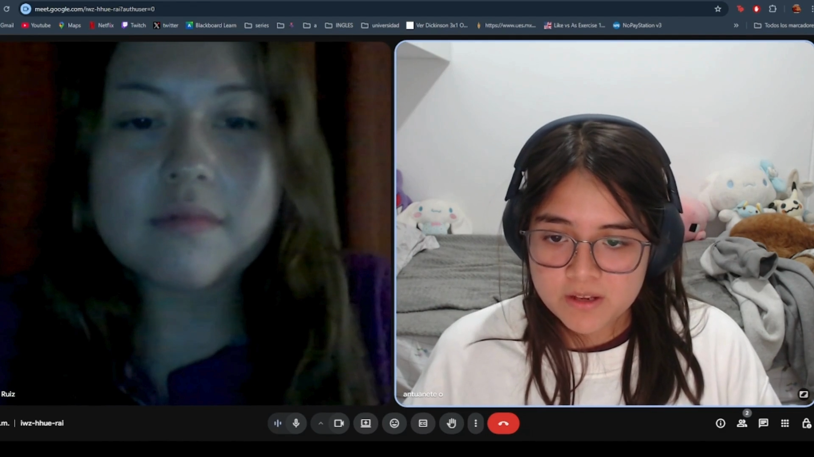

**Resumen:**

Reina Ruiz, de 20 años, es estudiante de la carrera de Hotelería y Turismo y reside actualmente en Cercado de Lima. Aunque no asiste frecuentemente a conciertos, se considera amante de la música y escucha principalmente pop en inglés y salsa.

Para enterarse de eventos musicales o lanzamientos, depende principalmente de las redes sociales de los artistas, aunque reconoce que en muchas ocasiones no ve la publicidad a tiempo o se entera demasiado tarde. Usa Instagram con mayor frecuencia para seguir a sus artistas, aunque también ha interactuado con Spotify.

En relación con la app GigMap, comentó que sí ha tenido dificultades para enterarse de conciertos cercanos, y que definitivamente usaría una aplicación como GigMap, ya que le permitiría descubrir eventos de sus artistas favoritos y organizar salidas con amigos.

Las funcionalidades que más le interesarían incluyen filtros por género musical, recibir información más personalizada y notificaciones automáticas sobre conciertos o eventos de interés. También, considera importante mejorar las apps existentes en cuanto a la efectividad de las notificaciones, ya que estas no siempre le llegan o no están bien configuradas. No utiliza muchas aplicaciones actualmente para buscar eventos, por lo que una solución como GigMap le parece muy útil y novedosa.

Finalmente, le gustaría poder compartir eventos con amigos desde la aplicación, algo que considera clave para socializar alrededor de la música. Esta función permitiría coordinar salidas y crear comunidad en torno a intereses musicales compartidos.

#### Entrevista #2

- **Nombre completo:** Rodrigo Chávez
- **Edad:** 19 años
- **Distrito:** San Martín de Porres
- **Inicio de entrevista:** 00:00:25

  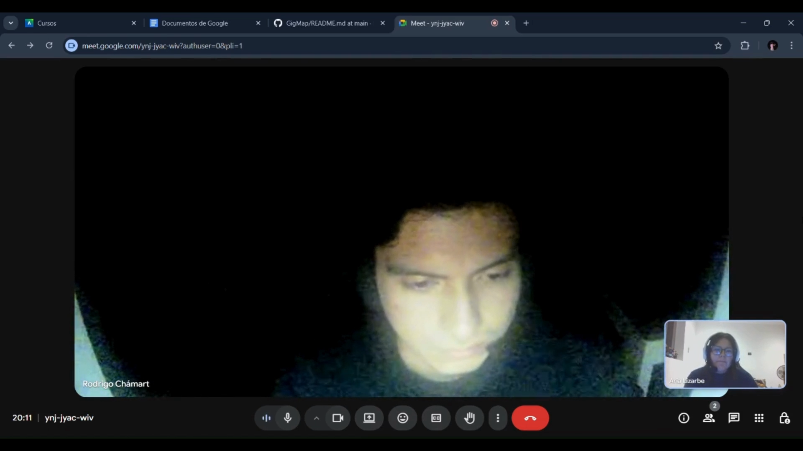

**Resumen:**

Rodrigo Chávez, de 19 años, es estudiante de Ingeniería de Sistemas y vive en San Martín de Porres. Tiene una vida activa como consumidor de música en vivo: asiste a conciertos todos los fines de semana o cada vez que se presenta un artista de su preferencia.

Su gusto musical es muy variado, abarcando desde rock, pop e indie hasta géneros tropicales como cumbia y salsa. Descubre nuevos artistas y eventos principalmente a través de Instagram y YouTube, y sigue activamente a sus artistas favoritos por redes sociales, sobre todo para enterarse de giras o lanzamientos.

Rodrigo ha tenido problemas anteriormente para enterarse de conciertos, como en el caso de Arctic Monkeys, a quienes no pudo ver porque no se enteró a tiempo del evento. Considera que una aplicación como GigMap sería muy útil, especialmente si puede mostrar conciertos cercanos en tiempo real y ayudarle a descubrir nuevos artistas según sus gustos personales.

Entre las funcionalidades que más le interesarían, se encuentran mapa de conciertos por ubicación, filtros por género musical, notificaciones sobre artistas de interés y recomendaciones personalizadas de artistas según gustos. También, sugiere mejorar el descubrimiento de artistas y la compra de entradas en las apps actuales, que le resultan limitadas o poco eficientes. Le gustaría que GigMap incluya una opción para compartir eventos con amigos y visualiza la app como una posible red social musical, en la que también pueda generar interacción con otros asistentes o fans.

#### Entrevista #3

- **Nombre completo:** Bianca Huertas
- **Edad:** 20 años
- **Distrito:** Ventanilla
- **Inicio de entrevista:** 00:00:12

  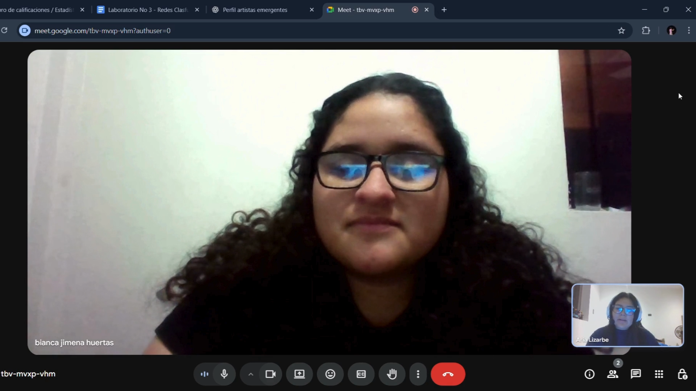

**Resumen:**

Bianca Huertas, de 20 años, es estudiante de Diseño de Interiores y vive en el distrito de Ventanilla, Callao. Es una usuaria muy activa en redes sociales, particularmente en TikTok e Instagram, donde sigue a sus artistas favoritos y se entera de nuevos eventos. Aunque no asiste a conciertos todas las semanas, menciona que va en promedio dos veces al mes, dependiendo de la cercanía y del tipo de evento.

Sus géneros musicales favoritos incluyen salsa, reguetón y K-pop, y muestra mucho entusiasmo por la experiencia de asistir a eventos musicales. Bianca admite que a veces no logra encontrar información clara o a tiempo sobre los conciertos que le interesan, lo cual considera una limitación importante en su experiencia.

Afirma que una aplicación como GigMap le parecería sumamente útil, ya que facilitaría el descubrimiento de eventos sin tener que buscarlos manualmente en diversas redes. Está especialmente interesada en funcionalidades como mapa de eventos cercanos, notificaciones de próximos conciertos, filtros por género musical y alertas sobre fechas próximas según ubicación. Además, valoraría mucho una función que le permita compartir eventos con sus amigos dentro de la misma app para poder asistir acompañada.

### Segmento objetivo #2: Artistas emergentes y bandas independientes

#### Entrevista #1

- **Nombre completo:** Zaleth Feijóo
- **Edad:** 19 años
- **Distrito:** Pueblo Libre
- **Inicio de entrevista:** 00:01:06

  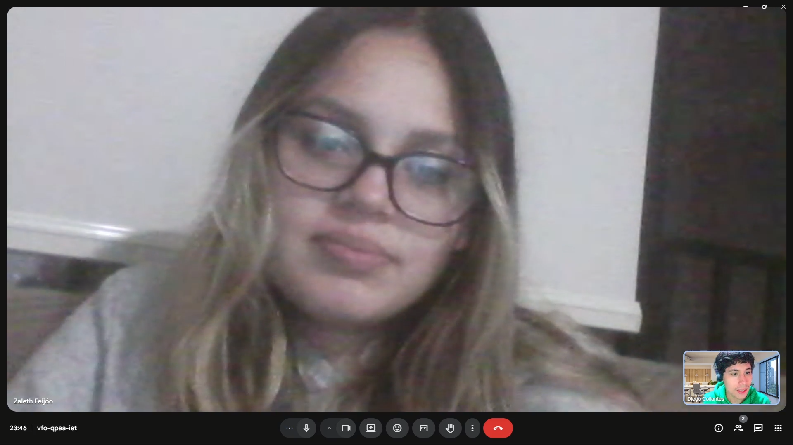

**Resumen:**

La entrevistada, Zaleth Feijóo, es una joven artista de 19 años, residente en Pueblo Libre. Su nombre artístico es Ithli, y se dedica principalmente al género indie rock, siendo una artista independiente con tres años de trayectoria.

Durante la conversación, Zaleth manifestó que utiliza redes sociales como Instagram y TikTok como sus principales canales de promoción para eventos y lanzamientos. No cuenta con un equipo de apoyo fijo. Sin embargo, en ocasiones, colabora con colegas del mismo ámbito. La difusión de su música ha representado un reto constante, debido a la dificultad de alcanzar al público objetivo y a la crítica negativa que recibe en redes.

Afirma que no ha utilizado aplicaciones especializadas para promocionar conciertos, y considera que las redes sociales no son suficientes para que un artista emergente se dé a conocer de forma adecuada. A su parecer, esto se debe tanto a la ausencia de una aplicación especializada como a la falta de valorización del arte y la música emergente.

En cuanto a la propuesta de GigMap, la artista considera que una aplicación de este tipo podría ser muy útil, ya que permitiría a los usuarios encontrar eventos cercanos según sus intereses musicales. Además, mostró interés en poder crear un perfil artístico, gestionar fechas, y contar con funcionalidades como estadísticas de asistencia a eventos, integración de redes sociales, y espacios de comunicación directa con fans.

Zaleth cree que GigMap puede ser una herramienta poderosa para aumentar la visibilidad de los artistas emergentes si incluye funciones de filtro por género musical. También estaría interesada en construir una comunidad dentro de la aplicación, en donde los artistas puedan interactuar directamente con sus seguidores y compartir contenido exclusivo.

#### Entrevista #2

- **Nombre completo:** Diego Zúñiga
- **Edad:** 20
- **Distrito:** Comas
- **Inicio de entrevista:** 00:00:10

  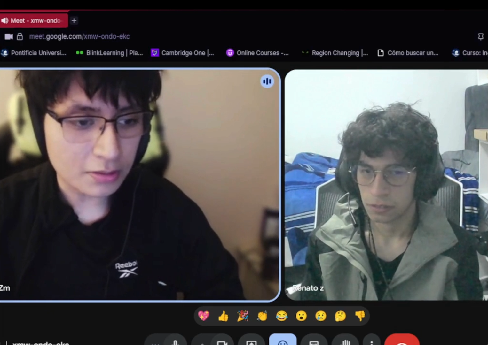

**Resumen:**

El entrevistado, Diego Zúñiga, es un artista emergente de 20 años que vive en el distrito de Comas. Su nombre artístico es Dekay, y su propuesta musical combina elementos de indie pop y rock alternativo. Tiene aproximadamente 5 años de experiencia, en los que ha compuesto música y se ha presentado en vivo.

Promociona sus lanzamientos y conciertos principalmente mediante redes sociales como Instagram y TikTok, donde dice que se encuentra la mayor parte de su público. Además, sube su música a Spotify y YouTube. Si bien realiza toda la gestión de forma independiente, ocasionalmente cuenta con el apoyo de amigos para diseño y difusión. Aún no cuenta con un mánager.

Comenta que la difusión local es difícil, ya que la información suele quedarse en su círculo más cercano. Ha utilizado herramientas como Facebook Events y Eventbrite, pero opina que no son efectivas para conectar con personas interesadas en descubrir música nueva. Considera que las aplicaciones actuales están saturadas y que es muy difícil destacar entre tanto contenido, especialmente para artistas emergentes.

La propuesta de GigMap le pareció muy interesante, particularmente la idea de que los usuarios puedan encontrar eventos musicales en un mapa interactivo local. Considera que esto facilitaría mucho la visibilidad de los conciertos sin tener que depender de múltiples aplicaciones.

Le interesaría poder crear un perfil artístico dentro de la app, así como gestionar fechas de conciertos y publicar eventos. Además, valoraría mucho tener estadísticas sobre asistentes, una posible integración con Spotify, e incluso información sobre la cantidad de oyentes interesados en su estilo musical. Como aspectos de personalización, mencionó que le gustaría poder editar su perfil con fotos, logo, biografía, enlaces a redes y playlists propias.

Diego cree que GigMap le permitiría ampliar y consolidar su audiencia, especialmente fuera de su red actual. También considera que sería un excelente canal para crear comunidad, compartir contenido exclusivo y mantener el vínculo con sus seguidores a través de notificaciones y recordatorios de conciertos.

Finalmente, recomendaría una aplicación como GigMap a otros artistas emergentes, ya que considera necesario tener un espacio centrado en la música independiente y en vivo, y no perder visibilidad en redes sociales donde el contenido musical suele pasar desapercibido.

#### Entrevista #3

- **Nombre completo:** 
- **Edad:**  años
- **Distrito:** 
- **Inicio de entrevista:** 00:00:55

  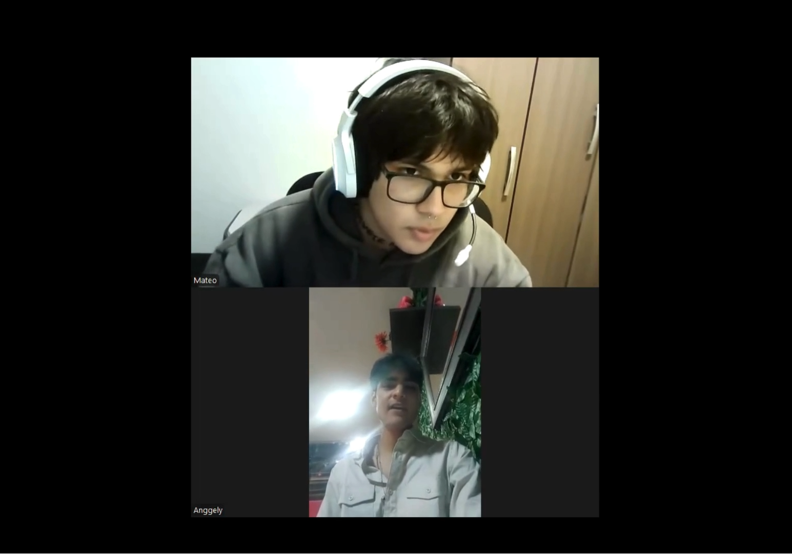

**Resumen:**

### 2.2.3. Análisis de entrevistas

A continuación, se presenta el análisis cualitativo y cuantitativo de las entrevistas realizadas, agrupadas por segmento objetivo. Este análisis identifica las características más representativas de cada grupo, con el fin de sustentar la construcción de arquetipos de usuario. Las observaciones aquí descritas se fundamentan directamente en los resúmenes de las entrevistas aplicadas a un total de seis personas, distribuidas en dos segmentos clave.

### Segmento objetivo #1: Fans de la música

Este grupo está conformado por estudiantes universitarios entre los 19 y 20 años, residentes en distintos distritos de Lima Metropolitana. Son consumidores activos de música, aunque con distinta frecuencia de asistencia a conciertos. Representan el público objetivo final de la aplicación propuesta (GigMap).

#### Entrevistas incluidas
- Entrevista #1: Reina Ruiz (20 años, Cercado de Lima)
- Entrevista #2: Rodrigo Chávez (19 años, San Martín de Porres)
- Entrevista #3: Bianca Huertas (20 años, Ventanilla)

#### Características Objetivas

| Variable                               | Valor común identificado                            | Frecuencia | Porcentaje (%) |
|----------------------------------------|------------------------------------------------------|------------|----------------|
| **Edad**                               | 19-20 años                                           | 3/3        | 100%           |
| **Ocupación**                          | Estudiantes universitarios                           | 3/3        | 100%           |
| **Distritos de residencia**            | Lima Metropolitana (zona norte y centro)            | 3/3        | 100%           |
| **Frecuencia de asistencia a conciertos** | Esporádica (1–2 veces al mes o menos)             | 2/3        | 66.7%          |
| **Uso de redes para enterarse de eventos** | Sí (Instagram, TikTok, YouTube, Spotify)          | 3/3        | 100%           |
| **Dificultades para enterarse de eventos** | Sí                                                | 3/3        | 100%           |
| **Disposición a usar una app como GigMap** | Sí                                               | 3/3        | 100%           |

#### Características Subjetivas

**Motivaciones comunes:**
- Desean mejorar la experiencia de búsqueda de eventos
- Buscan socializar a través de la música (coordinación con amigos)
- Muestran interés por descubrir artistas nuevos

**Frustraciones frecuentes:**
- No reciben notificaciones a tiempo o de manera relevante
- La información está dispersa entre varias aplicaciones
- Poca personalización en las apps actuales de eventos

**Preferencias destacadas:**
- Mapa interactivo de conciertos por ubicación
- Filtros por género musical
- Notificaciones automáticas personalizadas
- Compartir eventos con amigos desde la app
- Integración con redes sociales y aplicaciones de música

#### Implicancias para el diseño
Este grupo representa un público digitalmente activo, con expectativas altas respecto a la experiencia de usuario. El hallazgo más relevante es la necesidad de centralizar y personalizar la información sobre conciertos, así como fomentar la interacción social entre asistentes. Las funcionalidades sugeridas están alineadas con una interfaz amigable, dinámica y conectada a las redes sociales que ya utilizan.

### Segmento objetivo #2: Artistas emergentes y bandas independientes

Está compuesto por jóvenes músicos independientes que gestionan su carrera de forma autónoma. Son creadores de contenido musical con experiencia en presentaciones en vivo, difusión en redes sociales y distribución digital. Constituyen el segundo público clave para GigMap, como usuarios generadores de eventos.

#### Entrevistas incluidas
- Entrevista #1: Zaleth Feijóo (19 años, Pueblo Libre)
- Entrevista #2: Diego Zúñiga (20 años, Comas)

#### Características Objetivas

| Variable                                         | Valor común identificado                          | Frecuencia | Porcentaje (%) |
|--------------------------------------------------|--------------------------------------------------|------------|----------------|
| **Edad**                                         | 19-20 años                                       | 3/3        | 100%           |
| **Género musical principal**                     | Indie rock, pop alternativo, indie pop           | 3/3        | 100%           |
| **Gestión independiente de eventos**             | Sí                                               | 3/3        | 100%           |
| **Uso de redes para difusión**                   | Instagram, TikTok, Spotify                       | 3/3        | 100%           |
| **Ha enfrentado dificultades de visibilidad**    | Sí                                               | 3/3        | 100%           |
| **Ha usado aplicaciones como Eventbrite o Facebook Events** | Sí                                       | 2/3        | 66.7%          |
| **Interés en usar una app como GigMap**          | Sí                                               | 3/3        | 100%           |

#### Características Subjetivas

**Motivaciones comunes:**
- Aumentar visibilidad fuera de su red cercana
- Alcanzar públicos locales con mayor precisión
- Profesionalizar la gestión de sus eventos

**Frustraciones frecuentes:**
- Saturación de contenido en redes sociales
- Limitado alcance por algoritmos o falta de presupuesto
- Ausencia de aplicaciones dedicadas a artistas emergentes

**Preferencias destacadas:**
- Perfil artístico personalizado (logo, biografía, URL)
- Publicación de eventos y fechas de conciertos
- Estadísticas de visualización y asistencia
- Integración con Spotify y redes sociales
- Espacios de comunidad y contenido exclusivo

#### Implicancias para el diseño
Este segmento valora profundamente las herramientas de gestión profesional que, a la vez, faciliten la construcción de una comunidad auténtica. GigMap debe ofrecer funcionalidades pensadas desde el artista independiente, como la personalización del perfil, gestión de eventos, conexión directa con fans, y analítica simple y útil. La posibilidad de reducir la dependencia de algoritmos y redes sociales tradicionales es clave para ellos.

### Conclusión General del Análisis
Los hallazgos de ambas agrupaciones muestran una alineación clara entre los problemas identificados y la propuesta de valor de GigMap. Los usuarios finales demandan una aplicación que centralice, personalice y notifique sobre eventos musicales de forma proactiva. Por su parte, los artistas emergentes buscan una aplicaciones que les ofrezca visibilidad, herramientas de gestión y conexión directa con su audiencia, sin la saturación ni limitaciones de las redes sociales tradicionales.

## 2.3. Needfinding

### 2.3.1. User Personas

Los user personas son representaciones de los distintos tipos de usuarios que permiten entender con mayor claridad sus necesidades, motivaciones y formas de interactuar. En GigMap, estos perfiles sirven como referencia para orientar el diseño y la evolución de la aplicaciones, garantizando que se ajuste a lo que esperan nuestros principales públicos, como los aficionados a la música y los artistas en crecimiento.

  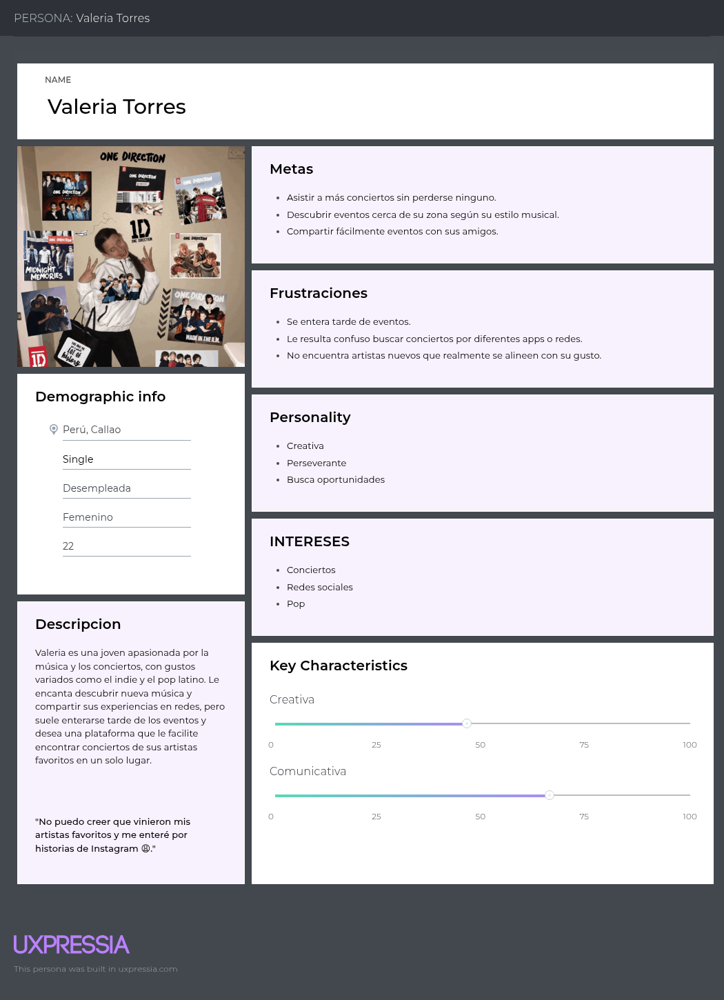

  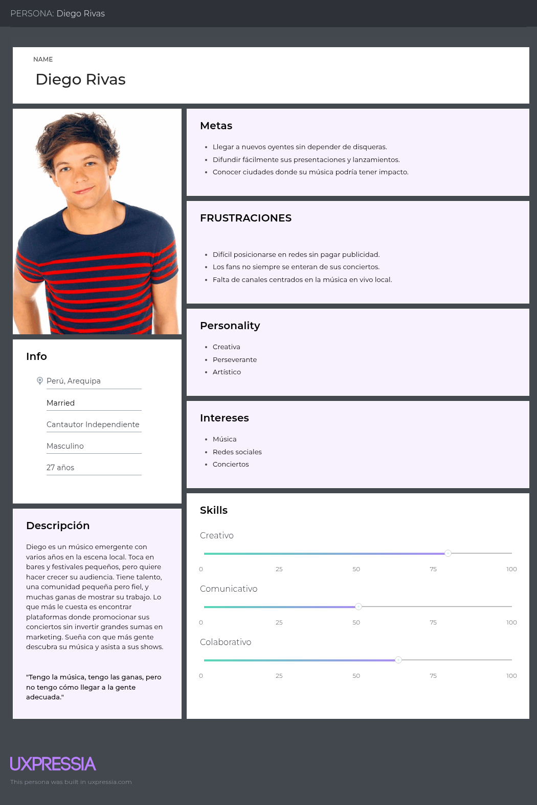

### 2.3.2. User Task Matrix

| Tareas                                        | Frecuencia | Importancia |
|-----------------------------------------------|------------|-------------|
| Buscar conciertos cerca de su zona            | Frecuente  | Alta        |
| Descubrir nuevos artistas y géneros           | Frecuente  | Media       |
| Comparar información de eventos entre diferentes redes | Ocasional | Media |
| Consultas redes sociales para enterarse de eventos | Muy frecuente | Alta |

### Diego Rivas

| Tareas                                        | Frecuencia | Importancia |
|-----------------------------------------------|------------|-------------|
| Promocionar sus conciertos                    | Frecuente  | Muy alta    |
| Buscar aplicaciones gratuitas o de bajo costo para difusión | Frecuente  | Muy alta |
| Organizar y coordinar presentaciones en bares o festivales | Ocasional | Alta |
| Interactuar con su comunidad de seguidores    | Frecuente  | Medio       |

### 2.3.3. User Journey Mapping

En esta sección se muestran los User Journey Maps As-Is de los principales segmentos objetivo identificados. Estos mapas reflejan el recorrido actual que siguen los usuarios en su vida cotidiana, sin contar todavía con la solución que propone GigMap.

A lo largo de las diferentes etapas de su experiencia, se examinan las acciones que realizan, las necesidades o frustraciones que enfrentan, los puntos de contacto que utilizan, así como las emociones que atraviesan en ese proceso. Además, se identifican oportunidades que permiten diseñar una solución capaz de atender dichos puntos de dolor. Esta representación facilita una comprensión profunda del contexto de los usuarios y constituye una base sólida para idear funcionalidades relevantes, empáticas y de alto impacto en futuras iteraciones de la aplicación.

**Fans de la música**

  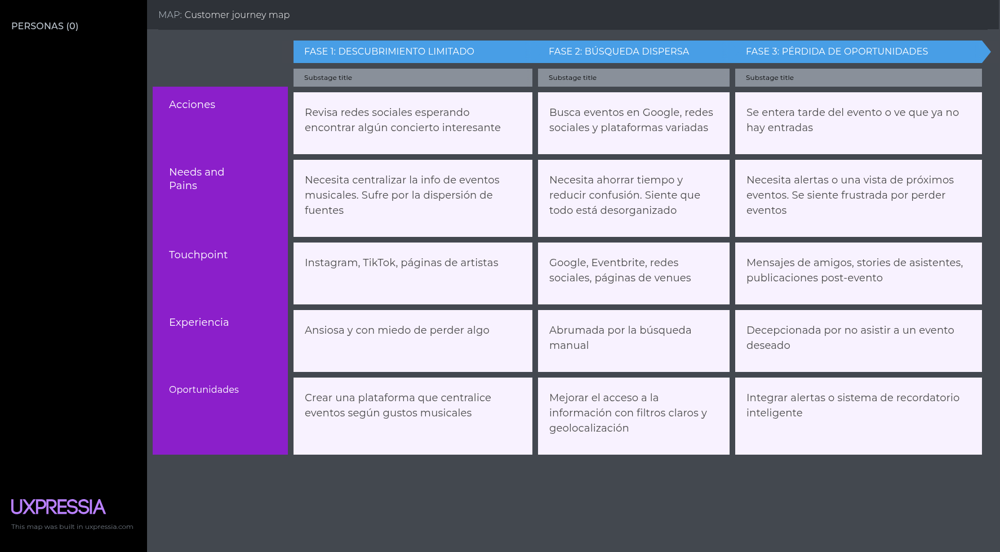

**Artistas emergentes**

  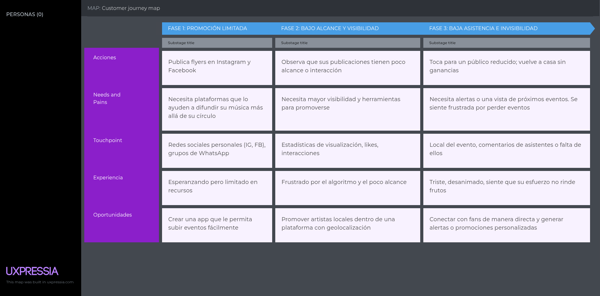

### 2.3.4. Empathy Mapping

**Diego Rivas**

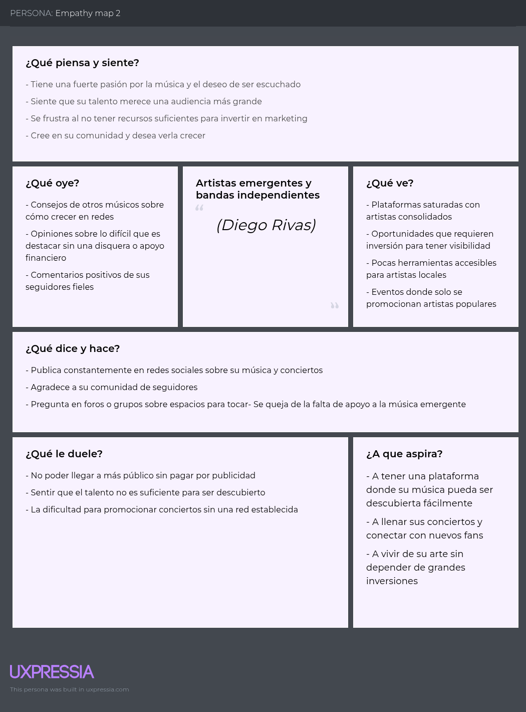
</td>

**Valeria Torres**

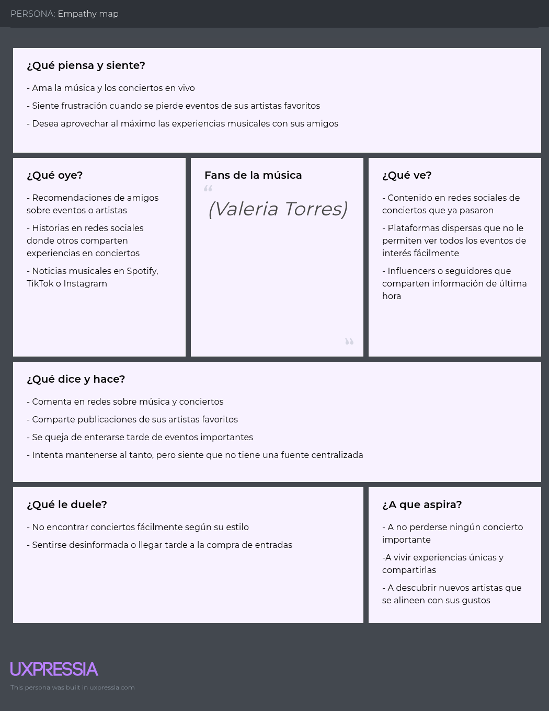
</td>

## 2.3.5. As-is Scenario Mapping

**Fans de la música:**

  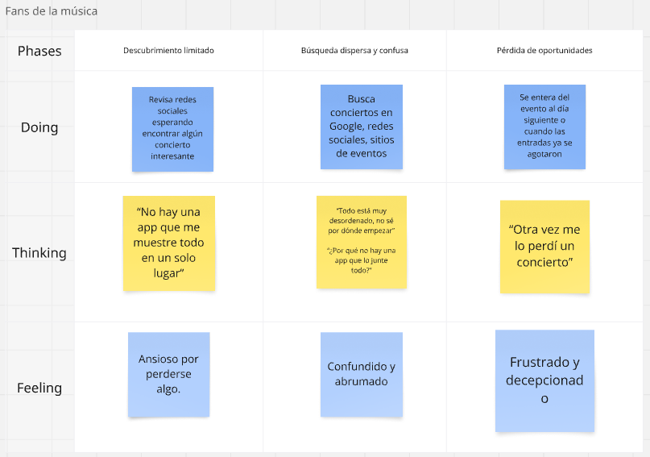

**Artistas emergentes y bandas independientes:**

  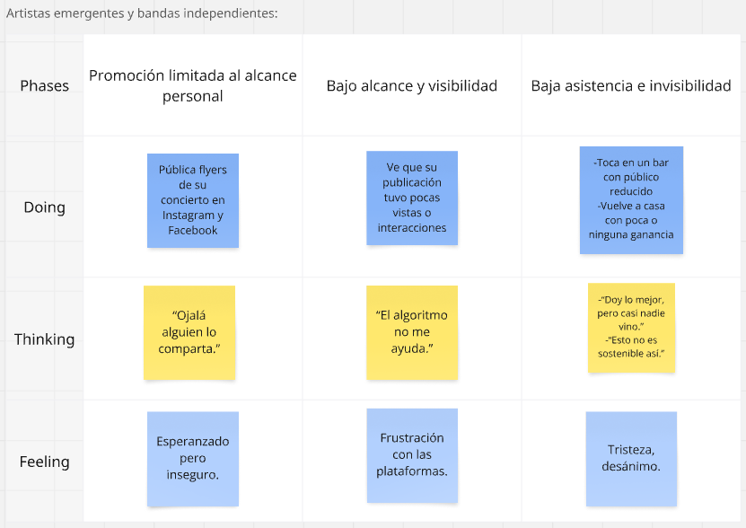

## 2.4. Ubiquitous Language

<table>
  <thead>
    <tr>
      <th><strong>Término</strong></th>
      <th><strong>Definición/descripción</strong></th>
    </tr>
  </thead>
  <tbody>
    <tr>
      <td>GigMap</td>
      <td>Aplicación móvil que conecta a fans con conciertos en vivo, especialmente de la escena musical local e independiente</td>
    </tr>
    <tr>
      <td>Evento</td>
      <td>Cualquier concierto, tocada, jam session o presentación musical está listada en la aplicación Incluye ubicación, fecha, hora y artistas</td>
    </tr>
    <tr>
      <td>Mapa de conciertos</td>
      <td>Vista geolocalizada que muestra los eventos en tiempo real según la ubicación del usuario</td>
    </tr>
    <tr>
      <td>Fan</td>
      <td>Usuario interesado en asistir a conciertos y descubrir nueva música. Puede seguir artistas, activar notificaciones y guardar eventos</td>
    </tr>
    <tr>
      <td>Artista</td>
      <td>Músico independiente o banda que utiliza la aplicación para publicar y promocionar sus conciertos</td>
    </tr>
    <tr>
      <td>Comunidad local</td>
      <td>Red de usuarios y artistas que interactúan en una misma ciudad o región, promoviendo la música en vivo</td>
    </tr>
    <tr>
      <td>Exploración de evento</td>
      <td>Función que permite descubrir conciertos por género, zona, fecha o artista recomendado</td>
    </tr>
    <tr>
      <td>Evento destacado</td>
      <td>Concierto con mayor visibilidad en la app, ya sea por tendencia, ubicación o interés del usuario</td>
    </tr>
    <tr>
      <td>Promoción de eventos</td>
      <td>Difusión gratuita de eventos dentro de GigMap mediante algoritmos de afinidad y relevancia, sin necesidad de pagar publicidad</td>
    </tr>
    <tr>
      <td>Check-in</td>
      <td>Acción que realiza un fan al asistir a un evento, permitiendo registrar asistencia y generar recomendaciones futuras</td>
    </tr>
    <tr>
      <td>Perfil del artista</td>
      <td>Página dentro de la app donde el músico puede mostrar su biografía, próximos conciertos, redes sociales y contenido multimedia</td>
    </tr>
  </tbody>
</table>

# CAPÍTULO III: Requirements Specification

## 3.1. To-Be Scenario Mapping

**SEGMENTO #1: Fans de la música**

	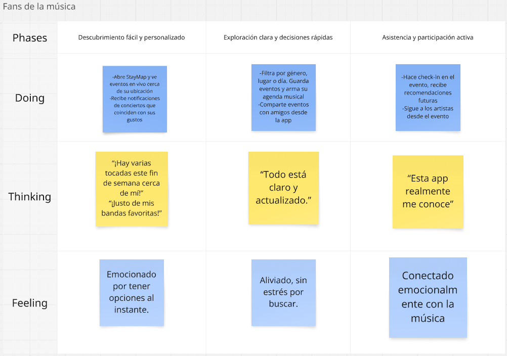

**SEGMENTO #2: Artistas emergentes y bandas independientes**

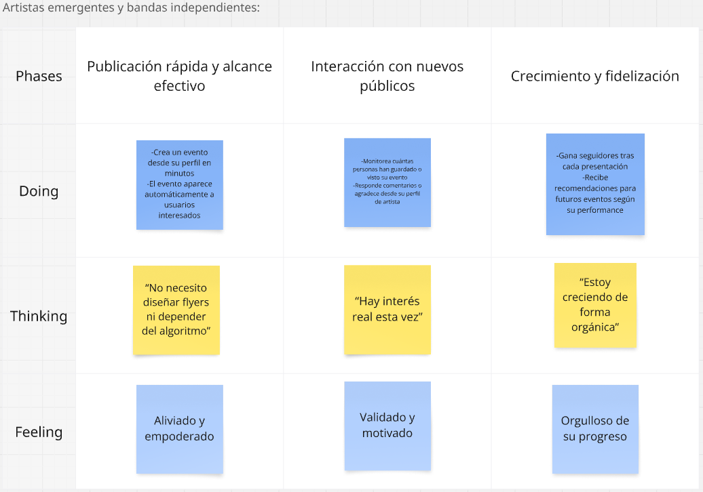

## 3.2. User Stories

**Epics:**
| Epic ID | Título                                             | Descripción                                                                                                                                                                                       |
|---------|----------------------------------------------------|---------------------------------------------------------------------------------------------------------------------------------------------------------------------------------------------------|
| EP01    | Creación y descubrimiento de conciertos         | Esta épica se centra en permitir a los artistas registrar y gestionar conciertos en la aplicación, mientras que los usuarios podrán descubrir nuevos eventos según su ubicación, género musical y artistas favoritos. Se busca optimizar la experiencia de búsqueda y exploración para que los fans encuentren fácilmente conciertos relevantes y personalizados. |
| EP02    | Notificaciones personalizadas                      | Incluye el desarrollo de un sistema de alertas que informe a los usuarios sobre nuevos conciertos, cambios en eventos, promociones y recordatorios, todo basado en sus preferencias e historial de interacción. El objetivo es mantenerlos siempre actualizados y fomentar su participación activa en la aplicación.|
| EP03    | Interacción social y comunidades               | Esta épica permitirá a los usuarios interactuar con otros fans a través de comunidades dentro de la aplicación. Se busca construir un espacio social donde los usuarios compartan experiencias, recomendaciones y opiniones, fortaleciendo el sentido de comunidad alrededor de la música en vivo.|
| EP04    | Gestión de Identidad y Acceso (Registro y Autenticación) | Enfocada en el inicio de sesión y registro de usuarios, esta épica incluye autenticación mediante correo electrónico o redes sociales, recuperación de contraseñas y gestión de roles y permisos básicos. Su objetivo es garantizar la seguridad, privacidad y facilidad de acceso a la aplicación para todos los usuarios. |
| EP05    | Exploración y Gestión de Eventos Relacionados    | Esta épica se centra en permitir la creación y descubrimiento de eventos asociados a un concierto principal, como juntadas de fans en un parque, fiestas temáticas previas, actividades comunitarias o afterparties. Los usuarios podrán explorar, unirse y organizar este tipo de encuentros que enriquecen la experiencia musical más allá del show oficial. El objetivo es fomentar la interacción entre fans y ampliar el ecosistema de eventos alrededor de los conciertos.|
| EP06    | Desarrollo técnico del backend (RESTful API)       | Esta épica comprende la implementación de la infraestructura técnica que soportará la aplicación, incluyendo la base de datos, API, servicios en la nube y escalabilidad del sistema. El foco está en garantizar rendimiento, seguridad y estabilidad para manejar de manera eficiente las operaciones de usuarios y organizadores. |
| EP07    | Plataforma informativa (Landing Page)     | Se centra en el desarrollo de una landing page que funcione como punto de entrada informativo, presentando la propuesta de valor, características principales y beneficios de la aplicación. El objetivo es atraer nuevos usuarios, transmitiendo confianza y profesionalismo desde la primera interacción. |

**User Stories:**
<table>
  <thead>
    <tr>
      <th>Story ID</th>
      <th>User</th>
      <th>Priority</th>
      <th>Epic</th>
    </tr>
  </thead>
  <tbody>
    <tr>
      <td>US01</td>
      <td>Fan</td>
      <td>3</td>
      <td>EP01</td>
    </tr>
    <tr>
      <td><strong>Title</strong></td>
      <td colspan="3">Filtrar conciertos por género musical</td>
    </tr>
    <tr>
      <td colspan="4"><strong>Description</strong></td>
    </tr>
    <tr>
      <td colspan="4">Como fan, quiero filtrar conciertos por género para ver solo los que me interesan.</td>
    </tr>
    <tr>
      <td colspan="4"><strong>Acceptance Criteria</strong></td>
    </tr>
    <tr>
      <td colspan="4">
        <strong>Escenario 1: Filtrar conciertos por un género</strong> 
        Dado que el usuario se encuentra en la lista de conciertos 
        Cuando selecciona un género musical en el filtro 
        Entonces el sistema muestra únicamente los conciertos que pertenecen a ese género.  
        <strong>Escenario 2: No hay resultados para el género seleccionado</strong> 
        Dado que el usuario se encuentra en la lista de conciertos 
        Cuando selecciona un género musical que no tiene conciertos disponibles 
        Entonces el sistema muestra un mensaje indicando que no hay resultados.
      </td>
    </tr>
  </tbody>
</table>

<table>
  <thead>
    <tr>
      <th>Story ID</th>
      <th>User</th>
      <th>Priority</th>
      <th>Epic</th>
    </tr>
  </thead>
  <tbody>
    <tr>
      <td>US02</td>
      <td>Artista</td>
      <td>5</td>
      <td>EP01</td>
    </tr>
    <tr>
      <td><strong>Title</strong></td>
      <td colspan="3">Publicar nuevo concierto</td>
    </tr>
    <tr>
      <td colspan="4"><strong>Description</strong></td>
    </tr>
    <tr>
      <td colspan="4">Como artista, quiero crear un evento para promocionar mi presentación.</td>
    </tr>
    <tr>
      <td colspan="4"><strong>Acceptance Criteria</strong></td>
    </tr>
    <tr>
      <td colspan="4">
        <strong>Escenario: Acceso al formulario de creación de evento</strong> 
        Dado que el artista inicia sesión 
        Cuando accede a "Crear evento" 
        Entonces puede ingresar datos y publicarlo en el mapa.  
        <strong>Escenario: Publicación inmediata y visible</strong> 
        Dado que los datos son válidos 
        Cuando se confirma la creación 
        Entonces el evento aparece visible en la aplicación.
      </td>
    </tr>
  </tbody>
</table>

<table>
  <thead>
    <tr>
      <th>Story ID</th>
      <th>User</th>
      <th>Priority</th>
      <th>Epic</th>
    </tr>
  </thead>
  <tbody>
    <tr>
      <td>US03</td>
      <td>Artista</td>
      <td>2</td>
      <td>EP03</td>
    </tr>
    <tr>
      <td><strong>Title</strong></td>
      <td colspan="3">Personalizar perfil de artista</td>
    </tr>
    <tr>
      <td colspan="4"><strong>Description</strong></td>
    </tr>
    <tr>
      <td colspan="4">Como artista, quiero personalizar mi perfil con mi nombre artístico y fotografía para conectar mejor con el público.</td>
    </tr>
    <tr>
      <td colspan="4"><strong>Acceptance Criteria</strong></td>
    </tr>
    <tr>
      <td colspan="4">
    <strong>Escenario 1: Actualizar nombre artístico y fotografía</strong> 
    Dado que el artista se encuentra en la sección de edición de perfil 
    Cuando ingresa un nombre artístico válido y selecciona una fotografía 
    Entonces el sistema guarda los cambios y muestra la información actualizada en su perfil.  
<strong>Escenario 2: Intentar guardar sin datos válidos</strong> 
    Dado que el artista se encuentra en la sección de edición de perfil 
    Cuando intenta guardar el perfil sin ingresar un nombre artístico o sin seleccionar una fotografía válida 
    Entonces el sistema muestra un mensaje de error indicando que los campos son obligatorios o inválidos.
      </td>
    </tr>
  </tbody>
</table>

<table>
  <thead>
    <tr>
      <th>Story ID</th>
      <th>User</th>
      <th>Priority</th>
      <th>Epic</th>
    </tr>
  </thead>
  <tbody>
    <tr>
      <td>US04</td>
      <td>Usuario</td>
      <td>5</td>
      <td>EP03</td>
    </tr>
    <tr>
      <td><strong>Title</strong></td>
      <td colspan="3">Crear comunidad</td>
    </tr>
    <tr>
      <td colspan="4"><strong>Description</strong></td>
    </tr>
    <tr>
      <td colspan="4">Como usuario, quiero crear una comunidad temática para reunir a otros usuarios en torno a intereses compartidos.</td>
    </tr>
    <tr>
      <td colspan="4"><strong>Acceptance Criteria</strong></td>
    </tr>
    <tr>
      <td colspan="4">
        <strong>Escenario: Acceso a la opción de crear comunidad</strong> 
		Dado que el usuario ha iniciado sesión 
		Cuando accede a la sección de comunidades 
		Entonces puede ver y seleccionar la opción para crear una nueva comunidad.  
        <strong>Escenario: Creación de comunidad correcta</strong> 
		Dado que el usuario ha accedido al formulario de creación 
		Cuando completa los campos requeridos y confirma la acción 
		Entonces se crea la comunidad y queda visible para otros usuarios.
      </td>
    </tr>
  </tbody>
</table>

<table>
  <thead>
    <tr>
      <th>Story ID</th>
      <th>User</th>
      <th>Priority</th>
      <th>Epic</th>
    </tr>
  </thead>
  <tbody>
    <tr>
      <td>US05</td>
      <td>Fan</td>
      <td>5</td>
      <td>EP01</td>
    </tr>
    <tr>
      <td><strong>Title</strong></td>
      <td colspan="3">Ver mapa con geolocalización</td>
    </tr>
    <tr>
      <td colspan="4"><strong>Description</strong></td>
    </tr>
    <tr>
      <td colspan="4">Como fan, quiero ver un mapa con mi ubicación y los conciertos cercanos marcados para explorar visualmente las opciones disponibles.</td>
    </tr>
    <tr>
      <td colspan="4"><strong>Acceptance Criteria</strong></td>
    </tr>
    <tr>
      <td colspan="4">
        <strong>Escenario: Visualización del mapa con eventos</strong> 
        Dado que el usuario está logueado y ha permitido el acceso a su ubicación 
        Cuando entra a la sección de mapa 
        Entonces visualiza su ubicación y los conciertos cercanos.  
        <strong>Escenario: Información de eventos en el mapa</strong> 
        Dado que el usuario interactúa con un marcador de evento 
        Cuando hace clic en un ícono del mapa 
        Entonces puede ver detalles del evento como nombre, hora y lugar.
      </td>
    </tr>
  </tbody>
</table>

<table>
  <thead>
    <tr>
      <th>Story ID</th>
      <th>User</th>
      <th>Priority</th>
      <th>Epic</th>
    </tr>
  </thead>
  <tbody>
    <tr>
      <td>US06</td>
      <td>Usuario</td>
      <td>2</td>
      <td>EP01</td>
    </tr>
    <tr>
      <td><strong>Title</strong></td>
      <td colspan="3">Buscar conciertos</td>
    </tr>
    <tr>
      <td colspan="4"><strong>Description</strong></td>
    </tr>
    <tr>
      <td colspan="4">Como usuario, quiero buscar conciertos por nombre o artista para encontrarlos fácilmente.</td>
    </tr>
    <tr>
      <td colspan="4"><strong>Acceptance Criteria</strong></td>
    </tr>
    <tr>
      <td colspan="4">
        <strong>Escenario: Búsqueda por palabra clave</strong> 
        Dado que el usuario accede al buscador de conciertos 
        Cuando escribe un nombre o artista 
        Entonces se muestran los conciertos coincidentes.
      </td>
    </tr>
  </tbody>
</table>

<table>
  <thead>
    <tr>
      <th>Story ID</th>
      <th>User</th>
      <th>Priority</th>
      <th>Epic</th>
    </tr>
  </thead>
  <tbody>
    <tr>
      <td>US07</td>
      <td>Usuario</td>
      <td>2</td>
      <td>EP03</td>
    </tr>
    <tr>
      <td><strong>Title</strong></td>
      <td colspan="3">Buscar comunidades</td>
    </tr>
    <tr>
      <td colspan="4"><strong>Description</strong></td>
    </tr>
    <tr>
      <td colspan="4">Como usuario, quiero buscar comunidades por nombre o temática para unirme a las que me interesen.</td>
    </tr>
    <tr>
      <td colspan="4"><strong>Acceptance Criteria</strong></td>
    </tr>
    <tr>
      <td colspan="4">
        <strong>Escenario: Búsqueda de comunidades</strong> 
        Dado que el usuario accede al buscador de comunidades 
        Cuando ingresa una palabra clave 
        Entonces ve las comunidades coincidentes.
      </td>
    </tr>
  </tbody>
</table>

<table>
  <thead>
    <tr>
      <th>Story ID</th>
      <th>User</th>
      <th>Priority</th>
      <th>Epic</th>
    </tr>
  </thead>
  <tbody>
    <tr>
      <td>US08</td>
      <td>Usuario registrado</td>
      <td>3</td>
      <td>EP04</td>
    </tr>
    <tr>
      <td><strong>Title</strong></td>
      <td colspan="3">Iniciar sesión en la app mobile</td>
    </tr>
    <tr>
      <td colspan="4"><strong>Description</strong></td>
    </tr>
    <tr>
      <td colspan="4">Como usuario registrado, quiero iniciar sesión desde la aplicación móvil para acceder a mi cuenta.</td>
    </tr>
    <tr>
      <td colspan="4"><strong>Acceptance Criteria</strong></td>
    </tr>
    <tr>
      <td colspan="4">
        <strong>Escenario: Ingreso exitoso desde app mobile</strong> 
        Dado que el usuario tiene una cuenta 
        Cuando accede al formulario de login y envía sus credenciales 
        Entonces accede correctamente a su perfil.
      </td>
    </tr>
  </tbody>
</table>

<table>
  <thead>
    <tr>
      <th>Story ID</th>
      <th>User</th>
      <th>Priority</th>
      <th>Epic</th>
    </tr>
  </thead>
  <tbody>
    <tr>
      <td>US09</td>
      <td>Artista</td>
      <td>3</td>
      <td>EP04</td>
    </tr>
    <tr>
      <td><strong>Title</strong></td>
      <td colspan="3">Registrarse como artista</td>
    </tr>
    <tr>
      <td colspan="4"><strong>Description</strong></td>
    </tr>
    <tr>
      <td colspan="4">Como nuevo usuario, quiero registrarme como artista para promocionar mis conciertos.</td>
    </tr>
    <tr>
      <td colspan="4"><strong>Acceptance Criteria</strong></td>
    </tr>
    <tr>
      <td colspan="4">
        <strong>Escenario: Registro como artista</strong> 
        Dado que el visitante accede al formulario de registro 
        Cuando selecciona la opción 'Artista' y completa sus datos 
        Entonces su cuenta es creada con perfil de artista.
      </td>
    </tr>
  </tbody>
</table>
<table>
  <thead>
    <tr>
      <th>Story ID</th>
      <th>User</th>
      <th>Priority</th>
      <th>Epic</th>
    </tr>
  </thead>
  <tbody>
    <tr>
      <td>US10</td>
      <td>Fan</td>
      <td>3</td>
      <td>EP04</td>
    </tr>
    <tr>
      <td><strong>Title</strong></td>
      <td colspan="3">Registrarse como fan</td>
    </tr>
    <tr>
      <td colspan="4"><strong>Description</strong></td>
    </tr>
    <tr>
      <td colspan="4">Como nuevo usuario, quiero registrarme como fan para participar en la comunidad y explorar conciertos.</td>
    </tr>
    <tr>
      <td colspan="4"><strong>Acceptance Criteria</strong></td>
    </tr>
    <tr>
      <td colspan="4">
        <strong>Escenario: Registro como fan</strong> 
        Dado que el visitante accede al formulario de registro 
        Cuando selecciona la opción 'Fan' y completa sus datos 
        Entonces su cuenta es creada con perfil de fan.
      </td>
    </tr>
  </tbody>
</table>

<table>
  <thead>
    <tr>
      <th>Story ID</th>
      <th>User</th>
      <th>Priority</th>
      <th>Epic</th>
    </tr>
  </thead>
  <tbody>
    <tr>
      <td>US11</td>
      <td>Fan</td>
      <td>2</td>
      <td>EP01</td>
    </tr>
    <tr>
      <td><strong>Title</strong></td>
      <td colspan="3">Zoom a concierto en el mapa</td>
    </tr>
    <tr>
      <td colspan="4"><strong>Description</strong></td>
    </tr>
    <tr>
      <td colspan="4">Como fan, quiero que al seleccionar un concierto en el mapa se haga zoom a su ubicación.</td>
    </tr>
    <tr>
      <td colspan="4"><strong>Acceptance Criteria</strong></td>
    </tr>
    <tr>
      <td colspan="4">
        <strong>Escenario: Zoom en mapa a concierto seleccionado</strong> 
        Dado que el usuario está en el mapa 
        Cuando hace touch en un concierto 
        Entonces el mapa se centra y hace zoom sobre su ubicación.
      </td>
    </tr>
  </tbody>
</table>
<table>
  <thead>
    <tr>
      <th>Story ID</th>
      <th>User</th>
      <th>Priority</th>
      <th>Epic</th>
    </tr>
  </thead>
  <tbody>
    <tr>
      <td>US12</td>
      <td>Usuario</td>
      <td>2</td>
      <td>EP01</td>
    </tr>
    <tr>
      <td><strong>Title</strong></td>
      <td colspan="3">Ver estado del concierto</td>
    </tr>
    <tr>
      <td colspan="4"><strong>Description</strong></td>
    </tr>
    <tr>
      <td colspan="4">Como usuario, quiero saber si un concierto está disponible o agotado para decidir si puedo asistir.</td>
    </tr>
    <tr>
      <td colspan="4"><strong>Acceptance Criteria</strong></td>
    </tr>
    <tr>
      <td colspan="4">
        <strong>Escenario: Visualización de estado del concierto</strong> 
        Dado que el usuario revisa la lista de conciertos 
        Cuando observa el estado de disponibilidad 
        Entonces puede ver si el evento está 'Disponible' o 'Agotado'.
      </td>
    </tr>
  </tbody>
</table>
<table>
  <thead>
    <tr>
      <th>Story ID</th>
      <th>User</th>
      <th>Priority</th>
      <th>Epic</th>
    </tr>
  </thead>
  <tbody>
    <tr>
      <td>US13</td>
      <td>Fan</td>
      <td>3</td>
      <td>EP01</td>
    </tr>
    <tr>
      <td><strong>Title</strong></td>
      <td colspan="3">Ver información detallada del concierto</td>
    </tr>
    <tr>
      <td colspan="4"><strong>Description</strong></td>
    </tr>
    <tr>
      <td colspan="4">Como fan, quiero ver la información completa de un concierto para decidir si asistir.</td>
    </tr>
    <tr>
      <td colspan="4"><strong>Acceptance Criteria</strong></td>
    </tr>
    <tr>
      <td colspan="4">
        <strong>Escenario: Acceso a detalles del concierto</strong> 
        Dado que el usuario selecciona un concierto 
        Cuando accede a su ficha de detalle 
        Entonces visualiza el artista, ubicación, fecha, hora, imagen, y descripción.
      </td>
    </tr>
  </tbody>
</table>
<table>
  <thead>
    <tr>
      <th>Story ID</th>
      <th>User</th>
      <th>Priority</th>
      <th>Epic</th>
    </tr>
  </thead>
  <tbody>
    <tr>
      <td>US14</td>
      <td>Fan</td>
      <td>3</td>
      <td>EP03</td>
    </tr>
    <tr>
      <td><strong>Title</strong></td>
      <td colspan="3">Unirse a una comunidad</td>
    </tr>
    <tr>
      <td colspan="4"><strong>Description</strong></td>
    </tr>
    <tr>
      <td colspan="4">Como fan, quiero unirme a una comunidad musical para interactuar con otros usuarios con intereses similares.</td>
    </tr>
    <tr>
      <td colspan="4"><strong>Acceptance Criteria</strong></td>
    </tr>
    <tr>
      <td colspan="4">
        <strong>Escenario: Unirse a comunidad</strong> 
        Dado que el fan accede a una comunidad disponible 
        Cuando presiona el botón 'Unirse' 
        Entonces queda registrado como miembro.
      </td>
    </tr>
  </tbody>
</table>
<table>
  <thead>
    <tr>
      <th>Story ID</th>
      <th>User</th>
      <th>Priority</th>
      <th>Epic</th>
    </tr>
  </thead>
  <tbody>
    <tr>
      <td>US15</td>
      <td>Fan</td>
      <td>3</td>
      <td>EP03</td>
    </tr>
    <tr>
      <td><strong>Title</strong></td>
      <td colspan="3">Publicar en la comunidad</td>
    </tr>
    <tr>
      <td colspan="4"><strong>Description</strong></td>
    </tr>
    <tr>
      <td colspan="4">Como fan, quiero crear publicaciones en la comunidad a la que me he unido, para compartir opiniones, fotos o recomendaciones con otros miembros.</td>
    </tr>
    <tr>
      <td colspan="4"><strong>Acceptance Criteria</strong></td>
    </tr>
    <tr>
      <td colspan="4">
        <strong>Escenario: Crear publicación exitosa</strong> 
        Dado que el usuario está unido a una comunidad, 
        Cuando accede a la comunidad y le da al botón agregar una nueva publicación y escribe un mensaje, 
        Entonces la publicación se guarda y se muestra en el feed de la comunidad.
      </td>
    </tr>
  </tbody>
</table>
<table>
  <thead>
    <tr>
      <th>Story ID</th>
      <th>User</th>
      <th>Priority</th>
      <th>Epic</th>
    </tr>
  </thead>
  <tbody>
    <tr>
      <td>US16</td>
      <td>Fan</td>
      <td>2</td>
      <td>EP03</td>
    </tr>
    <tr>
      <td><strong>Title</strong></td>
      <td colspan="3">Editar perfil personal</td>
    </tr>
    <tr>
      <td colspan="4"><strong>Description</strong></td>
    </tr>
    <tr>
      <td colspan="4">Como fan, quiero poder editar mi información de perfil (foto, nombre y nombre de usuario), para que los demás usuarios puedan reconocerme fácilmente y mantener mi perfil actualizado.</td>
    </tr>
    <tr>
      <td colspan="4"><strong>Acceptance Criteria</strong></td>
    </tr>
    <tr>
      <td colspan="4">
        <strong>Escenario: Actualizar información del perfil</strong> 
        Dado que el usuario accede a la sección "Mi Perfil", 
        Cuando le da al botón editar perfil, 
        Entonces puede editar su nombre, nombre de usuario y cambiar su foto de perfil.
      </td>
    </tr>
  </tbody>
</table>
<table>
  <thead>
    <tr>
      <th>Story ID</th>
      <th>User</th>
      <th>Priority</th>
      <th>Epic</th>
    </tr>
  </thead>
  <tbody>
    <tr>
      <td>US17</td>
      <td>Fan</td>
      <td>3</td>
      <td>EP01</td>
    </tr>
    <tr>
      <td><strong>Title</strong></td>
      <td colspan="3">Confirmar o marcar asistencia a un concierto</td>
    </tr>
    <tr>
      <td colspan="4"><strong>Description</strong></td>
    </tr>
    <tr>
      <td colspan="4">Como fan, quiero poder marcar un concierto como “Marcar asistencia”, para llevar un seguimiento de los conciertos que planeo asistir.</td>
    </tr>
    <tr>
      <td colspan="4"><strong>Acceptance Criteria</strong></td>
    </tr>
    <tr>
      <td colspan="4">
        <strong>Escenario: Confirmar asistencia a un evento</strong> 
        Dado que el usuario visualiza los detalles de un evento, 
        Cuando presiona el botón "Confirmar asistencia", 
        Entonces el evento se agrega a su lista de “Por asistir” y el botón cambia a "Cancelar asistencia".  
        <strong>Escenario: Cancelar asistencia</strong> 
        Dado que el evento ya está marcado como “Por asistir”, 
        Cuando presiona el botón "Cancelar asistencia", 
        Entonces el evento se elimina de su lista de eventos futuros y vuelve a estar disponible para confirmar.
      </td>
    </tr>
  </tbody>
</table>
<table>
  <thead>
    <tr>
      <th>Story ID</th>
      <th>User</th>
      <th>Priority</th>
      <th>Epic</th>
    </tr>
  </thead>
  <tbody>
    <tr>
      <td>US18</td>
      <td>Usuario</td>
      <td>2</td>
      <td>EP03</td>
    </tr>
    <tr>
      <td><strong>Title</strong></td>
      <td colspan="3">Ver comunidades accedidas</td>
    </tr>
    <tr>
      <td colspan="4"><strong>Description</strong></td>
    </tr>
    <tr>
      <td colspan="4">Como usuario, quiero visualizar en el apartado "Tus grupos" las comunidades a las que me he unido.</td>
    </tr>
    <tr>
      <td colspan="4"><strong>Acceptance Criteria</strong></td>
    </tr>
    <tr>
      <td colspan="4">
        <strong>Escenario: Visualización de comunidades unidas</strong> 
        Dado que el usuario ha ingresado a comunidades 
        Cuando accede a la sección "Tus grupos" 
        Entonces puede ver la lista de comunidades a las que pertenece.
      </td>
    </tr>
  </tbody>
</table>
<table>
  <thead>
    <tr>
      <th>Story ID</th>
      <th>User</th>
      <th>Priority</th>
      <th>Epic</th>
    </tr>
  </thead>
  <tbody>
    <tr>
      <td>US19</td>
      <td>Usuario</td>
      <td>2</td>
      <td>EP03</td>
    </tr>
    <tr>
      <td><strong>Title</strong></td>
      <td colspan="3">Reaccionar a publicaciones en comunidades</td>
    </tr>
    <tr>
      <td colspan="4"><strong>Description</strong></td>
    </tr>
    <tr>
      <td colspan="4">Como usuario, quiero poder reaccionar a publicaciones dentro de las comunidades.</td>
    </tr>
    <tr>
      <td colspan="4"><strong>Acceptance Criteria</strong></td>
    </tr>
    <tr>
      <td colspan="4">
        <strong>Escenario: Reacción a publicación</strong> 
        Dado que el usuario navega por una comunidad 
        Cuando encuentra una publicación 
        Entonces puede reaccionar con un emoji o símbolo.
      </td>
    </tr>
  </tbody>
</table>
<table>
  <thead>
    <tr>
      <th>Story ID</th>
      <th>User</th>
      <th>Priority</th>
      <th>Epic</th>
    </tr>
  </thead>
  <tbody>
    <tr>
      <td>US20</td>
      <td>Usuario</td>
      <td>2</td>
      <td>EP03</td>
    </tr>
    <tr>
      <td><strong>Title</strong></td>
      <td colspan="3">Acceder a perfil de otros usuarios</td>
    </tr>
    <tr>
      <td colspan="4"><strong>Description</strong></td>
    </tr>
    <tr>
      <td colspan="4">Como usuario, quiero poder acceder al perfil de otros usuarios para conocer más sobre ellos.</td>
    </tr>
    <tr>
      <td colspan="4"><strong>Acceptance Criteria</strong></td>
    </tr>
    <tr>
      <td colspan="4">
        <strong>Escenario: Navegar al perfil de otro usuario</strong> 
        Dado que el usuario ve un nombre o avatar 
        Cuando hace clic sobre él 
        Entonces se redirige al perfil público de ese usuario.
      </td>
    </tr>
  </tbody>
</table>
<table>
  <thead>
    <tr>
      <th>Story ID</th>
      <th>User</th>
      <th>Priority</th>
      <th>Epic</th>
    </tr>
  </thead>
  <tbody>
    <tr>
      <td>US21</td>
      <td>Usuario</td>
      <td>2</td>
      <td>EP03</td>
    </tr>
    <tr>
      <td><strong>Title</strong></td>
      <td colspan="3">Ver publicaciones con like</td>
    </tr>
    <tr>
      <td colspan="4"><strong>Description</strong></td>
    </tr>
    <tr>
      <td colspan="4">Como usuario, quiero ver una lista de publicaciones a las que les he dado "like".</td>
    </tr>
    <tr>
      <td colspan="4"><strong>Acceptance Criteria</strong></td>
    </tr>
    <tr>
      <td colspan="4">
        <strong>Escenario: Historial de publicaciones favoritas</strong> 
        Dado que el usuario ha interactuado en comunidades 
        Cuando accede a su sección de favoritos 
        Entonces puede visualizar todas las publicaciones que le han gustado.
      </td>
    </tr>
  </tbody>
</table>
<table>
  <thead>
    <tr>
      <th>Story ID</th>
      <th>User</th>
      <th>Priority</th>
      <th>Epic</th>
    </tr>
  </thead>
  <tbody>
    <tr>
      <td>US22</td>
      <td>Usuario</td>
      <td>2</td>
      <td>EP01</td>
    </tr>
    <tr>
      <td><strong>Title</strong></td>
      <td colspan="3">Permitir acceso a ubicación</td>
    </tr>
    <tr>
      <td colspan="4"><strong>Description</strong></td>
    </tr>
    <tr>
      <td colspan="4">Como usuario, quiero que GigMap acceda a mi ubicación para recibir información personalizada.</td>
    </tr>
    <tr>
      <td colspan="4"><strong>Acceptance Criteria</strong></td>
    </tr>
    <tr>
      <td colspan="4">
        <strong>Escenario: Permiso de ubicación</strong> 
        Dado que el usuario entra a la app por primera vez 
        Cuando se le solicita permiso de ubicación 
        Entonces puede aceptar o denegar el acceso.
      </td>
    </tr>
  </tbody>
</table>
<table>
  <thead>
    <tr>
      <th>Story ID</th>
      <th>User</th>
      <th>Priority</th>
      <th>Epic</th>
    </tr>
  </thead>
  <tbody>
    <tr>
      <td>US23</td>
      <td>Usuario</td>
      <td>3</td>
      <td>EP03</td>
    </tr>
    <tr>
      <td><strong>Title</strong></td>
      <td colspan="3">Subir imágenes en comunidades</td>
    </tr>
    <tr>
      <td colspan="4"><strong>Description</strong></td>
    </tr>
    <tr>
      <td colspan="4">Como usuario, quiero subir imágenes en publicaciones de comunidad para compartir experiencias visuales.</td>
    </tr>
    <tr>
      <td colspan="4"><strong>Acceptance Criteria</strong></td>
    </tr>
    <tr>
      <td colspan="4">
        <strong>Escenario: Publicación con imagen</strong> 
        Dado que el usuario quiere compartir contenido 
        Cuando crea una publicación 
        Entonces puede adjuntar una o más imágenes que se muestren en el feed.
      </td>
    </tr>
  </tbody>
</table>
<table>
  <thead>
    <tr>
      <th>Story ID</th>
      <th>User</th>
      <th>Priority</th>
      <th>Epic</th>
    </tr>
  </thead>
  <tbody>
    <tr>
      <td>US24</td>
      <td>Usuario de GigMap</td>
      <td>3</td>
      <td>EP05</td>
    </tr>
    <tr>
      <td><strong>Title</strong></td>
      <td colspan="3">Ver eventos asociados</td>
    </tr>
    <tr>
      <td colspan="4"><strong>Description</strong></td>
    </tr>
    <tr>
      <td colspan="4">Como usuario de GigMap, quiero ver un apartado de eventos relacionados en el perfil de un concierto, para conocer actividades cercanas en tiempo y lugar (pre/after/meetups) que podría realizar.</td>
    </tr>
    <tr>
      <td colspan="4"><strong>Acceptance Criteria</strong></td>
    </tr>
    <tr>
      <td colspan="4">
        <strong>Escenario: Ver eventos relacionados exitosamente</strong> 
        Dado que estoy autenticado 
        Y estoy en el perfil de un concierto 
        Cuando desplazo la vista hasta el apartado “Eventos relacionados” 
        Entonces veo una lista de eventos con título, fecha/hora y distancia 
        Y puedo abrir el detalle de cualquier evento desde su tarjeta.
      </td>
    </tr>
  </tbody>
</table>
<table>
  <thead>
    <tr>
      <th>Story ID</th>
      <th>User</th>
      <th>Priority</th>
      <th>Epic</th>
    </tr>
  </thead>
  <tbody>
    <tr>
      <td>US25</td>
      <td>Usuario</td>
      <td>2</td>
      <td>EP05</td>
    </tr>
    <tr>
      <td><strong>Title</strong></td>
      <td colspan="3">Confirmar o marcar asistencia a eventos asociados</td>
    </tr>
    <tr>
      <td colspan="4"><strong>Description</strong></td>
    </tr>
    <tr>
      <td colspan="4">Como usuario, quiero poder marcar mi asistencia a un evento asociado, para que pueda llevar un seguimiento de los eventos asociados que planeo asistir.</td>
    </tr>
    <tr>
      <td colspan="4"><strong>Acceptance Criteria</strong></td>
    </tr>
    <tr>
      <td colspan="4">
        <strong>Escenario: Confirmar asistencia</strong> 
        Dado que el usuario visualiza los detalles de un evento asociado, 
        Cuando presiona el botón "Confirmar asistencia", 
        Entonces el evento asociado se agrega a su lista de “Por asistir” y el botón cambia a "Cancelar asistencia".  
        <strong>Escenario: Cancelar asistencia</strong> 
        Dado que el evento asociado ya está marcado como “Confirmar asistencia”, 
        Cuando presiona el botón "Cancelar asistencia", 
        Entonces el evento asociado se elimina de su lista de eventos futuros y vuelve a estar disponible para confirmar.
      </td>
    </tr>
  </tbody>
</table>
<table>
  <thead>
    <tr>
      <th>Story ID</th>
      <th>User</th>
      <th>Priority</th>
      <th>Epic</th>
    </tr>
  </thead>
  <tbody>
    <tr>
      <td>US26</td>
      <td>Usuario</td>
      <td>2</td>
      <td>EP03</td>
    </tr>
    <tr>
      <td><strong>Title</strong></td>
      <td colspan="3">Visualizar el contenido de las comunidades pertenecientes</td>
    </tr>
    <tr>
      <td colspan="4"><strong>Description</strong></td>
    </tr>
    <tr>
      <td colspan="4">Como usuario, quiero poder visualizar las publicaciones y anuncios de las comunidades que sigo en la pantalla de “Mis comunidades”.</td>
    </tr>
    <tr>
      <td colspan="4"><strong>Acceptance Criteria</strong></td>
    </tr>
    <tr>
      <td colspan="4">
        <strong>Escenario: Visualizar el contenido de las comunidades exitosamente</strong> 
        Dado que un usuario sigue una o más comunidades 
        Cuando accede a la pantalla "Mis comunidades" 
        Entonces el sistema muestra las publicaciones y anuncios más recientes de esas comunidades.
      </td>
    </tr>
  </tbody>
</table>
<table>
  <thead>
    <tr>
      <th>Story ID</th>
      <th>User</th>
      <th>Priority</th>
      <th>Epic</th>
    </tr>
  </thead>
  <tbody>
    <tr>
      <td>US27</td>
      <td>Usuario</td>
      <td>5</td>
      <td>EP02</td>
    </tr>
    <tr>
      <td><strong>Title</strong></td>
      <td colspan="3">Recibir recordatorio de concierto por asistir</td>
    </tr>
    <tr>
      <td colspan="4"><strong>Description</strong></td>
    </tr>
    <tr>
      <td colspan="4">Como usuario, quiero recibir la notificación de recordatorio del concierto al que confirme mi asistencia cuando la fecha de presentación esté cercana.</td>
    </tr>
    <tr>
      <td colspan="4"><strong>Acceptance Criteria</strong></td>
    </tr>
    <tr>
      <td colspan="4">
        <strong>Escenario: Recordatorio antes del evento</strong> 
        Dado que el usuario confirmó asistencia a un concierto en GigMap 
        Cuando falten 24 horas para la fecha del evento 
        Entonces recibe una notificación con el nombre, lugar y hora del concierto.
      </td>
    </tr>
  </tbody>
</table>
<table>
  <thead>
    <tr>
      <th>Story ID</th>
      <th>User</th>
      <th>Priority</th>
      <th>Epic</th>
    </tr>
  </thead>
  <tbody>
    <tr>
      <td>US28</td>
      <td>Usuario registrado</td>
      <td>5</td>
      <td>EP02</td>
    </tr>
    <tr>
      <td><strong>Title</strong></td>
      <td colspan="3">Recibir notificaciones de conciertos cercanos</td>
    </tr>
    <tr>
      <td colspan="4"><strong>Description</strong></td>
    </tr>
    <tr>
      <td colspan="4">Como usuario registrado, quiero recibir notificaciones sobre conciertos cerca de mi ubicación para no perderme eventos de mi interés.</td>
    </tr>
    <tr>
      <td colspan="4"><strong>Acceptance Criteria</strong></td>
    </tr>
    <tr>
      <td colspan="4">
        <strong>Escenario: Notificación de un concierto cercano disponible</strong> 
        Dado que el usuario tiene activadas las notificaciones 
        Cuando se registre un nuevo concierto en un radio de 5 km de su ubicación 
        Entonces recibe una notificación en su dispositivo con el nombre, fecha y lugar del evento.
      </td>
    </tr>
  </tbody>
</table>
<table>
  <thead>
    <tr>
      <th>Story ID</th>
      <th>User</th>
      <th>Priority</th>
      <th>Epic</th>
    </tr>
  </thead>
  <tbody>
    <tr>
      <td>US29</td>
      <td>Usuario</td>
      <td>5</td>
      <td>EP02</td>
    </tr>
    <tr>
      <td><strong>Title</strong></td>
      <td colspan="3">Recibir notificaciones por interacciones sociales</td>
    </tr>
    <tr>
      <td colspan="4"><strong>Description</strong></td>
    </tr>
    <tr>
      <td colspan="4">Como usuario, quiero recibir notificaciones cuando alguien interactúe con mis publicaciones (comentarios, likes, etc.) para mantenerme al tanto de la actividad en mi perfil.</td>
    </tr>
    <tr>
      <td colspan="4"><strong>Acceptance Criteria</strong></td>
    </tr>
    <tr>
      <td colspan="4">
        <strong>Escenario: Notificación por comentario recibido</strong> 
        Dado que el usuario ha publicado un contenido en una comunidad 
        Cuando otro usuario comente en su publicación 
        Entonces recibe una notificación indicando quién comentó y un acceso directo para ver el comentario.  
        <strong>Escenario: Notificación por like recibido</strong> 
        Dado que el usuario ha compartido una publicación o confirmado asistencia a un evento 
        Cuando otro usuario dé "like" a esa publicación 
        Entonces recibe una notificación con el nombre del usuario que reaccionó.
      </td>
    </tr>
  </tbody>
</table>
<table>
  <thead>
    <tr>
      <th>Story ID</th>
      <th>User</th>
      <th>Priority</th>
      <th>Epic</th>
    </tr>
  </thead>
  <tbody>
    <tr>
      <td>US30</td>
      <td>Fan</td>
      <td>2</td>
      <td>EP05</td>
    </tr>
    <tr>
      <td><strong>Title</strong></td>
      <td colspan="3">Ver información detallada del evento asociado</td>
    </tr>
    <tr>
      <td colspan="4"><strong>Description</strong></td>
    </tr>
    <tr>
      <td colspan="4">Como fan, quiero ver la información completa de un concierto para decidir si asistir.</td>
    </tr>
    <tr>
      <td colspan="4"><strong>Acceptance Criteria</strong></td>
    </tr>
    <tr>
      <td colspan="4">
        <strong>Escenario: Acceso a detalles del evento asociado</strong> 
        Dado que el usuario selecciona un evento asociado 
        Cuando accede a su ficha de detalle 
        Entonces visualiza la temática, ubicación, fecha, hora, imagen, y descripción.
      </td>
    </tr>
  </tbody>
</table>
<table>
  <thead>
    <tr>
      <th>Story ID</th>
      <th>User</th>
      <th>Priority</th>
      <th>Epic</th>
    </tr>
  </thead>
  <tbody>
    <tr>
      <td>US31</td>
      <td>Visitante (Fan)</td>
      <td>1</td>
      <td>EP07</td>
    </tr>
    <tr>
      <td><strong>Title</strong></td>
      <td colspan="3">Ver beneficios para fans</td>
    </tr>
    <tr>
      <td colspan="4"><strong>Description</strong></td>
    </tr>
    <tr>
      <td colspan="4">Como visitante del segmento fan, quiero conocer los beneficios de la app para mí, para decidir registrarme.</td>
    </tr>
    <tr>
      <td colspan="4"><strong>Acceptance Criteria</strong></td>
    </tr>
    <tr>
      <td colspan="4">
        <strong>Escenario: Acceso a sección para fans</strong> 
        Dado que el visitante accede a la landing page 
        Cuando visualiza la sección "Para fans de la música" 
        Entonces puede leer los beneficios de unirse a la app.  
        <strong>Escenario: Decisión de registro influenciada por beneficios</strong> 
        Dado que el visitante revisa los beneficios presentados 
        Cuando encuentra opciones que se alinean con sus intereses 
        Entonces aumenta su intención de registrarse en la aplicación
      </td>
    </tr>
  </tbody>
</table>
<table>
  <thead>
    <tr>
      <th>Story ID</th>
      <th>User</th>
      <th>Priority</th>
      <th>Epic</th>
    </tr>
  </thead>
  <tbody>
    <tr>
      <td>US32</td>
      <td>Visitante (Artista)</td>
      <td>1</td>
      <td>EP07</td>
    </tr>
    <tr>
      <td><strong>Title</strong></td>
      <td colspan="3">Ver beneficios para artista</td>
    </tr>
    <tr>
      <td colspan="4"><strong>Description</strong></td>
    </tr>
    <tr>
      <td colspan="4">Como visitante del segmento artista, quiero ver cómo la app me ayuda a promocionar mis eventos.</td>
    </tr>
    <tr>
      <td colspan="4"><strong>Acceptance Criteria</strong></td>
    </tr>
    <tr>
      <td colspan="4">
        <strong>Escenario: Acceso a sección para artistas</strong> 
        Dado que el visitante está en la landing page 
        Cuando revisa la sección "Para artistas" 
        Entonces puede visualizar herramientas y ventajas destacadas.  
        <strong>Escenario: Evaluación del valor de la app</strong> 
        Dado que el visitante es un artista emergente 
        Cuando analiza las herramientas promocionales disponibles 
        Entonces comprende cómo GigMap puede ayudarle a crecer.
      </td>
    </tr>
  </tbody>
</table>
<table>
  <thead>
    <tr>
      <th>Story ID</th>
      <th>User</th>
      <th>Priority</th>
      <th>Epic</th>
    </tr>
  </thead>
  <tbody>
    <tr>
      <td>US33</td>
      <td>Visitante</td>
      <td>1</td>
      <td>EP07</td>
    </tr>
    <tr>
      <td><strong>Title</strong></td>
      <td colspan="3">Acceder a testimonios</td>
    </tr>
    <tr>
      <td colspan="4"><strong>Description</strong></td>
    </tr>
    <tr>
      <td colspan="4">Como visitante, quiero leer testimonios de usuarios reales para aumentar mi confianza en la app.</td>
    </tr>
    <tr>
      <td colspan="4"><strong>Acceptance Criteria</strong></td>
    </tr>
    <tr>
      <td colspan="4">
        <strong>Escenario: Visualización de comentarios de usuarios</strong> 
        Dado que el visitante navega por la landing 
        Cuando encuentra la sección de testimonios 
        Entonces puede leer comentarios y valoraciones de otros usuarios.  
        <strong>Escenario: Confianza reforzada por experiencias ajenas</strong> 
        Dado que el visitante tiene dudas sobre la app 
        Cuando lee testimonios positivos 
        Entonces se siente más confiado para unirse.
      </td>
    </tr>
  </tbody>
</table>

**Technical Stories:**

<table>
  <thead>
    <tr>
      <th>Story ID</th>
      <th>User</th>
      <th>Priority</th>
      <th>Epic</th>
    </tr>
  </thead>
  <tbody>
    <tr>
      <td>TS-01</td>
      <td>Developer</td>
      <td>1</td>
      <td>EP06</td>
    </tr>
    <tr>
      <td><strong>Title</strong></td>
      <td colspan="3">Crear concierto</td>
    </tr>
    <tr>
      <td colspan="4"><strong>Description</strong></td>
    </tr>
    <tr>
      <td colspan="4">
        Como developer, quiero un endpoint POST en /api/v1/concerts que permita crear conciertos con toda su información.
      </td>
    </tr>
    <tr>
      <td colspan="4"><strong>Acceptance Criteria</strong></td>
    </tr>
    <tr>
      <td colspan="4">
        <strong>Escenario: Creación exitosa de concierto</strong> 
        Dado que el cliente envía una petición POST a /api/v1/concerts con un body válido 
        Cuando los datos del concierto están completos y son correctos 
        Entonces el sistema guarda el concierto en la base de datos 
        Y responde con un código 201 Created
          
        <strong>Escenario: Error por datos inválidos</strong> 
        Dado que el cliente envía una petición POST a /api/v1/concerts 
        Y el body contiene datos incompletos o inválidos 
        Cuando el sistema valida la información 
        Entonces rechaza la solicitud 
        Y responde con un código 400 Bad Request
      </td>
    </tr>
  </tbody>
</table>

<table>
  <thead>
    <tr>
      <th>Story ID</th>
      <th>User</th>
      <th>Priority</th>
      <th>Epic</th>
    </tr>
  </thead>
  <tbody>
    <tr>
      <td>TS-02</td>
      <td>Developer</td>
      <td>1</td>
      <td>EP06</td>
    </tr>
    <tr>
      <td><strong>Title</strong></td>
      <td colspan="3">Crear publicación en comunidad</td>
    </tr>
    <tr>
      <td colspan="4"><strong>Description</strong></td>
    </tr>
    <tr>
      <td colspan="4">
        Como developer, quiero un endpoint POST en /api/v1/posts que permita a un usuario crear publicaciones dentro de una comunidad.
      </td>
    </tr>
    <tr>
      <td colspan="4"><strong>Acceptance Criteria</strong></td>
    </tr>
    <tr>
      <td colspan="4">
        <strong>Escenario: Creación exitosa de publicación</strong> 
        Dado que el usuario se encuentra dentro de una comunidad válida 
        Y envía una petición POST a /api/v1/posts con contenido (mensaje y/o imagen) 
        Cuando los datos son válidos 
        Entonces el sistema guarda la publicación en la base de datos 
        Y la publicación aparece en el feed de la comunidad
          
        <strong>Escenario: Error por contenido inválido</strong> 
        Dado que el usuario envía una petición POST a /api/v1/posts 
        Y no incluye contenido mínimo requerido (mensaje o imagen) 
        Cuando el sistema valida la solicitud 
        Entonces rechaza la operación 
        Y responde con un código 400 Bad Request
      </td>
    </tr>
  </tbody>
</table>

<table>
  <thead>
    <tr>
      <th>Story ID</th>
      <th>User</th>
      <th>Priority</th>
      <th>Epic</th>
    </tr>
  </thead>
  <tbody>
    <tr>
      <td>TS-03</td>
      <td>Developer</td>
      <td>1</td>
      <td>EP06</td>
    </tr>
    <tr>
      <td><strong>Title</strong></td>
      <td colspan="3">Listar comunidades de usuario</td>
    </tr>
    <tr>
      <td colspan="4"><strong>Description</strong></td>
    </tr>
    <tr>
      <td colspan="4">
        Como developer, quiero un endpoint GET en /api/v1/communities/joined/{userId} que permita obtener las comunidades a las que pertenece un usuario.
      </td>
    </tr>
    <tr>
      <td colspan="4"><strong>Acceptance Criteria</strong></td>
    </tr>
    <tr>
      <td colspan="4">
        <strong>Escenario: Comunidades obtenidas correctamente</strong> 
        Dado que el usuario está autenticado 
        Y existe un usuario con el userId proporcionado 
        Cuando se realiza una petición GET a /api/v1/communities/joined/{userId} 
        Entonces el sistema devuelve la lista de comunidades a las que pertenece el usuario
          
        <strong>Escenario: Usuario sin comunidades</strong> 
        Dado que el usuario está autenticado 
        Y el usuario no pertenece a ninguna comunidad 
        Cuando se realiza una petición GET a /api/v1/communities/joined/{userId} 
        Entonces el sistema devuelve una lista vacía
      </td>
    </tr>
  </tbody>
</table>

<table>
  <thead>
    <tr>
      <th>Story ID</th>
      <th>User</th>
      <th>Priority</th>
      <th>Epic</th>
    </tr>
  </thead>
  <tbody>
    <tr>
      <td>TS-04</td>
      <td>Developer</td>
      <td>1</td>
      <td>EP06</td>
    </tr>
    <tr>
      <td><strong>Title</strong></td>
      <td colspan="3">Obtener todos los conciertos</td>
    </tr>
    <tr>
      <td colspan="4"><strong>Description</strong></td>
    </tr>
    <tr>
      <td colspan="4">
        Como developer, quiero un endpoint GET en /api/v1/concerts que devuelva todos los conciertos públicos para mostrarlos en la sección de exploración.
      </td>
    </tr>
    <tr>
      <td colspan="4"><strong>Acceptance Criteria</strong></td>
    </tr>
    <tr>
      <td colspan="4">
        <strong>Escenario: Conciertos obtenidos correctamente</strong> 
        Dado que el usuario accede a la sección de exploración 
        Cuando se realiza una petición GET a /api/v1/concerts 
        Entonces el sistema devuelve la lista de conciertos públicos disponibles
          
        <strong>Escenario: Sin conciertos disponibles</strong> 
        Dado que no existen conciertos públicos registrados 
        Cuando se realiza una petición GET a /api/v1/concerts 
        Entonces el sistema devuelve una lista vacía
      </td>
    </tr>
  </tbody>
</table>

<table>
  <thead>
    <tr>
      <th>Story ID</th>
      <th>User</th>
      <th>Priority</th>
      <th>Epic</th>
    </tr>
  </thead>
  <tbody>
    <tr>
      <td>TS-05</td>
      <td>Developer</td>
      <td>1</td>
      <td>EP06</td>
    </tr>
    <tr>
      <td><strong>Title</strong></td>
      <td colspan="3">Confirmar asistencia a concierto</td>
    </tr>
    <tr>
      <td colspan="4"><strong>Description</strong></td>
    </tr>
    <tr>
      <td colspan="4">
        Como developer, quiero un endpoint POST en /api/v1/concerts/{concertId}/attendees que permita a los usuarios confirmar su asistencia a un concierto.
      </td>
    </tr>
    <tr>
      <td colspan="4"><strong>Acceptance Criteria</strong></td>
    </tr>
    <tr>
      <td colspan="4">
        <strong>Escenario: Asistencia confirmada correctamente</strong> 
        Dado que el usuario está autenticado 
        Y existe un concierto con el concertId proporcionado 
        Cuando se realiza una petición POST a /api/v1/concerts/{concertId}/attendees 
        Entonces el sistema registra la asistencia del usuario en la base de datos
          
        <strong>Escenario: Usuario ya registrado</strong> 
        Dado que el usuario ya confirmó su asistencia previamente 
        Cuando se realiza una petición POST a /api/v1/concerts/{concertId}/attendees 
        Entonces el sistema rechaza la operación 
        Y responde con un código 400 Bad Request
      </td>
    </tr>
  </tbody>
</table>

<table>
  <thead>
    <tr>
      <th>Story ID</th>
      <th>User</th>
      <th>Priority</th>
      <th>Epic</th>
    </tr>
  </thead>
  <tbody>
    <tr>
      <td>TS-06</td>
      <td>Developer</td>
      <td>1</td>
      <td>EP06</td>
    </tr>
    <tr>
      <td><strong>Title</strong></td>
      <td colspan="3">Cancelar asistencia a concierto</td>
    </tr>
    <tr>
      <td colspan="4"><strong>Description</strong></td>
    </tr>
    <tr>
      <td colspan="4">
        Como developer, quiero un endpoint DELETE en /api/v1/concerts/{concertId}/attendees que permita a los usuarios cancelar su asistencia a un concierto.
      </td>
    </tr>
    <tr>
      <td colspan="4"><strong>Acceptance Criteria</strong></td>
    </tr>
    <tr>
      <td colspan="4">
        <strong>Escenario: Asistencia cancelada correctamente</strong> 
        Dado que el usuario está autenticado 
        Y está registrado como asistente en el concierto 
        Cuando se realiza una petición DELETE a /api/v1/concerts/{concertId}/attendees 
        Entonces el sistema elimina su asistencia de la base de datos
          
        <strong>Escenario: Usuario no registrado</strong> 
        Dado que el usuario no está registrado como asistente en el concierto 
        Cuando se realiza una petición DELETE a /api/v1/concerts/{concertId}/attendees 
        Entonces el sistema rechaza la operación 
        Y responde con un código 400 Bad Request
      </td>
    </tr>
  </tbody>
</table>

<table>
  <thead>
    <tr>
      <th>Story ID</th>
      <th>User</th>
      <th>Priority</th>
      <th>Epic</th>
    </tr>
  </thead>
  <tbody>
    <tr>
      <td>TS-07</td>
      <td>Developer</td>
      <td>1</td>
      <td>EP06</td>
    </tr>
    <tr>
      <td><strong>Title</strong></td>
      <td colspan="3">Obtener comunidades</td>
    </tr>
    <tr>
      <td colspan="4"><strong>Description</strong></td>
    </tr>
    <tr>
      <td colspan="4">
        Como developer, quiero un endpoint GET en /api/v1/communities que devuelva todas las comunidades disponibles para unirse.
      </td>
    </tr>
    <tr>
      <td colspan="4"><strong>Acceptance Criteria</strong></td>
    </tr>
    <tr>
      <td colspan="4">
        <strong>Escenario: Comunidades obtenidas correctamente</strong> 
        Dado que el usuario accede a la vista de comunidades 
        Cuando se realiza una petición GET a /api/v1/communities 
        Entonces el sistema devuelve la lista completa de comunidades disponibles
          
        <strong>Escenario: Sin comunidades disponibles</strong> 
        Dado que no existen comunidades registradas 
        Cuando se realiza una petición GET a /api/v1/communities 
        Entonces el sistema devuelve una lista vacía
      </td>
    </tr>
  </tbody>
</table>

<table>
  <thead>
    <tr><th>Story ID</th><th>User</th><th>Priority</th><th>Epic</th></tr>
  </thead>
  <tbody>
    <tr><td>TS-08</td><td>Developer</td><td>1</td><td>EP06</td></tr>
    <tr><td><strong>Title</strong></td><td colspan="3">Unirse a una comunidad</td></tr>
    <tr><td colspan="4"><strong>Description</strong></td></tr>
    <tr><td colspan="4">Como developer, quiero un endpoint POST en /api/v1/communities/{communityId}/join que permita a los usuarios unirse a una comunidad.</td></tr>
    <tr><td colspan="4"><strong>Acceptance Criteria</strong></td></tr>
    <tr><td colspan="4">
      <strong>Escenario: Unión exitosa a comunidad</strong> 
      Dado que el usuario está autenticado 
      Y la comunidad existe 
      Cuando realiza POST a /api/v1/communities/{communityId}/join 
      Entonces queda registrado como miembro de la comunidad
        
      <strong>Escenario: Usuario ya es miembro</strong> 
      Dado que el usuario ya pertenece a la comunidad 
      Cuando realiza POST al endpoint 
      Entonces el sistema responde 400 Bad Request
    </td></tr>
  </tbody>
</table>

<table>
  <thead>
    <tr><th>Story ID</th><th>User</th><th>Priority</th><th>Epic</th></tr>
  </thead>
  <tbody>
    <tr><td>TS-09</td><td>Developer</td><td>1</td><td>EP06</td></tr>
    <tr><td><strong>Title</strong></td><td colspan="3">Salir de una comunidad</td></tr>
    <tr><td colspan="4"><strong>Description</strong></td></tr>
    <tr><td colspan="4">Como developer, quiero un endpoint DELETE en /api/v1/communities/{communityId}/join para permitir que los usuarios abandonen una comunidad.</td></tr>
    <tr><td colspan="4"><strong>Acceptance Criteria</strong></td></tr>
    <tr><td colspan="4">
      <strong>Escenario: Salida exitosa de comunidad</strong> 
      Dado que el usuario pertenece a la comunidad 
      Cuando realiza DELETE a /api/v1/communities/{communityId}/join 
      Entonces se elimina su membresía
        
      <strong>Escenario: Usuario no es miembro</strong> 
      Dado que el usuario no pertenece a la comunidad 
      Cuando realiza DELETE al endpoint 
      Entonces responde 400 Bad Request
    </td></tr>
  </tbody>
</table>

<table>
  <thead>
    <tr><th>Story ID</th><th>User</th><th>Priority</th><th>Epic</th></tr>
  </thead>
  <tbody>
    <tr><td>TS-10</td><td>Developer</td><td>1</td><td>EP06</td></tr>
    <tr><td><strong>Title</strong></td><td colspan="3">Obtener concierto por ID</td></tr>
    <tr><td colspan="4"><strong>Description</strong></td></tr>
    <tr><td colspan="4">Como developer, quiero un endpoint GET en /api/v1/concerts/{id} que devuelva los datos de un concierto específico.</td></tr>
    <tr><td colspan="4"><strong>Acceptance Criteria</strong></td></tr>
    <tr><td colspan="4">
      <strong>Escenario: Concierto encontrado</strong> 
      Dado que existe un concierto con el id 
      Cuando se hace GET a /api/v1/concerts/{id} 
      Entonces se devuelven sus datos
        
      <strong>Escenario: Concierto no existe</strong> 
      Dado que no existe el id 
      Cuando se hace GET 
      Entonces responde 404 Not Found
    </td></tr>
  </tbody>
</table>

<table>
  <thead>
    <tr><th>Story ID</th><th>User</th><th>Priority</th><th>Epic</th></tr>
  </thead>
  <tbody>
    <tr><td>TS-11</td><td>Developer</td><td>1</td><td>EP06</td></tr>
    <tr><td><strong>Title</strong></td><td colspan="3">Eliminar concierto</td></tr>
    <tr><td colspan="4"><strong>Description</strong></td></tr>
    <tr><td colspan="4">Como developer, quiero un endpoint DELETE en /api/v1/concerts/{id} que permita eliminar un concierto.</td></tr>
    <tr><td colspan="4"><strong>Acceptance Criteria</strong></td></tr>
    <tr><td colspan="4">
      <strong>Escenario: Eliminación exitosa</strong> 
      Dado que el concierto existe 
      Cuando se hace DELETE 
      Entonces el concierto se elimina
        
      <strong>Escenario: Concierto no encontrado</strong> 
      Dado que no existe el id 
      Cuando se hace DELETE 
      Entonces responde 404 Not Found
    </td></tr>
  </tbody>
</table>

<table>
  <thead>
    <tr><th>Story ID</th><th>User</th><th>Priority</th><th>Epic</th></tr>
  </thead>
  <tbody>
    <tr><td>TS-12</td><td>Developer</td><td>1</td><td>EP06</td></tr>
    <tr><td><strong>Title</strong></td><td colspan="3">Actualizar concierto</td></tr>
    <tr><td colspan="4"><strong>Description</strong></td></tr>
    <tr><td colspan="4">Como developer, quiero un endpoint PUT en /api/v1/concerts/{id} que permita actualizar toda la información de un concierto.</td></tr>
    <tr><td colspan="4"><strong>Acceptance Criteria</strong></td></tr>
    <tr><td colspan="4">
      <strong>Escenario: Concierto actualizado correctamente</strong> 
      Dado que el usuario es organizador 
      Y existe un concierto con el id proporcionado 
      Cuando hace el PUT con todos los datos actualizados del concierto 
      Entonces se actualizan todos los campos del concierto en el sistema 
      Y se devuelve el concierto con la información actualizada
        
      <strong>Escenario: Concierto no encontrado</strong> 
      Dado que no existe el id 
      Cuando se hace PUT 
      Entonces responde 404 Not Found
    </td></tr>
  </tbody>
</table>

<table>
  <thead>
    <tr><th>Story ID</th><th>User</th><th>Priority</th><th>Epic</th></tr>
  </thead>
  <tbody>
    <tr><td>TS-13</td><td>Developer</td><td>1</td><td>EP06</td></tr>
    <tr><td><strong>Title</strong></td><td colspan="3">Obtener usuario por ID</td></tr>
    <tr><td colspan="4"><strong>Description</strong></td></tr>
    <tr><td colspan="4">Como developer, quiero un endpoint GET en /api/v1/users/{id} para ver el perfil público de un usuario.</td></tr>
    <tr><td colspan="4"><strong>Acceptance Criteria</strong></td></tr>
    <tr><td colspan="4">
      <strong>Escenario: Usuario encontrado</strong> 
      Dado que el ID es válido 
      Cuando se hace GET a /api/v1/users/{id} 
      Entonces devuelve nombre, imagen y comunidades visibles
        
      <strong>Escenario: Usuario no encontrado</strong> 
      Dado que el ID no existe 
      Cuando se hace GET 
      Entonces responde 404 Not Found
    </td></tr>
  </tbody>
</table>

<table>
  <thead>
    <tr><th>Story ID</th><th>User</th><th>Priority</th><th>Epic</th></tr>
  </thead>
  <tbody>
    <tr><td>TS-14</td><td>Developer</td><td>1</td><td>EP06</td></tr>
    <tr><td><strong>Title</strong></td><td colspan="3">Actualizar perfil de usuario</td></tr>
    <tr><td colspan="4"><strong>Description</strong></td></tr>
    <tr><td colspan="4">Como developer, quiero un endpoint PUT en /api/v1/users/{id} para permitir al usuario modificar su información personal.</td></tr>
    <tr><td colspan="4"><strong>Acceptance Criteria</strong></td></tr>
    <tr><td colspan="4">
      <strong>Escenario: Actualización exitosa</strong> 
      Dado que el usuario envía un body válido 
      Cuando se hace PUT a /api/v1/users/{id} 
      Entonces se actualiza su perfil
        
      <strong>Escenario: Datos inválidos</strong> 
      Dado que el body contiene información inválida 
      Cuando se procesa la solicitud 
      Entonces responde 400 Bad Request
    </td></tr>
  </tbody>
</table>

<table>
  <thead>
    <tr><th>Story ID</th><th>User</th><th>Priority</th><th>Epic</th></tr>
  </thead>
  <tbody>
    <tr><td>TS-15</td><td>Developer</td><td>1</td><td>EP06</td></tr>
    <tr><td><strong>Title</strong></td><td colspan="3">Obtener todos los usuarios</td></tr>
    <tr><td colspan="4"><strong>Description</strong></td></tr>
    <tr><td colspan="4">Como developer, quiero un endpoint GET en /api/v1/users que liste todos los usuarios registrados en la aplicación.</td></tr>
    <tr><td colspan="4"><strong>Acceptance Criteria</strong></td></tr>
    <tr><td colspan="4">
      <strong>Escenario: Usuarios obtenidos correctamente</strong> 
      Dado que se realiza una petición GET a /api/v1/users 
      Cuando el sistema procesa la solicitud 
      Entonces devuelve la lista completa de usuarios
        
      <strong>Escenario: Sin usuarios registrados</strong> 
      Dado que no existen usuarios en el sistema 
      Cuando se hace GET 
      Entonces devuelve una lista vacía
    </td></tr>
  </tbody>
</table>

<table>
  <thead>
    <tr><th>Story ID</th><th>User</th><th>Priority</th><th>Epic</th></tr>
  </thead>
  <tbody>
    <tr><td>TS-16</td><td>Developer</td><td>1</td><td>EP06</td></tr>
    <tr><td><strong>Title</strong></td><td colspan="3">Dar like a publicación</td></tr>
    <tr><td colspan="4"><strong>Description</strong></td></tr>
    <tr><td colspan="4">Como developer, quiero un endpoint POST en /api/v1/posts/{postId}/like que registre un like del usuario a un post.</td></tr>
    <tr><td colspan="4"><strong>Acceptance Criteria</strong></td></tr>
    <tr><td colspan="4">
      <strong>Escenario: Like registrado correctamente</strong> 
      Dado que el usuario está autenticado 
      Y el post existe 
      Cuando realiza POST a /api/v1/posts/{postId}/like 
      Entonces se incrementa el contador de likes
        
      <strong>Escenario: Usuario ya dio like</strong> 
      Dado que el usuario ya dio like previamente 
      Cuando intenta dar like nuevamente 
      Entonces el sistema responde 400 Bad Request
    </td></tr>
  </tbody>
</table>

<table>
  <thead>
    <tr><th>Story ID</th><th>User</th><th>Priority</th><th>Epic</th></tr>
  </thead>
  <tbody>
    <tr><td>TS-17</td><td>Developer</td><td>1</td><td>EP06</td></tr>
    <tr><td><strong>Title</strong></td><td colspan="3">Quitar like a publicación</td></tr>
    <tr><td colspan="4"><strong>Description</strong></td></tr>
    <tr><td colspan="4">Como developer, quiero un endpoint DELETE en /api/v1/posts/{postId}/unlike para eliminar el like de un usuario a una publicación.</td></tr>
    <tr><td colspan="4"><strong>Acceptance Criteria</strong></td></tr>
    <tr><td colspan="4">
      <strong>Escenario: Like eliminado correctamente</strong> 
      Dado que el usuario ya dio like 
      Cuando realiza DELETE a /api/v1/posts/{postId}/unlike 
      Entonces se reduce el contador de likes
        
      <strong>Escenario: Usuario no había dado like</strong> 
      Dado que el usuario no ha dado like previamente 
      Cuando intenta eliminar el like 
      Entonces responde 404 Not Found
    </td></tr>
  </tbody>
</table>

<table>
  <thead>
    <tr><th>Story ID</th><th>User</th><th>Priority</th><th>Epic</th></tr>
  </thead>
  <tbody>
    <tr><td>TS-18</td><td>Developer</td><td>1</td><td>EP04 / EP06</td></tr>
    <tr><td><strong>Title</strong></td><td colspan="3">Crear publicación en comunidad</td></tr>
    <tr><td colspan="4"><strong>Description</strong></td></tr>
    <tr><td colspan="4">Como developer, quiero un endpoint POST en /api/v1/posts que permita crear publicaciones nuevas.</td></tr>
    <tr><td colspan="4"><strong>Acceptance Criteria</strong></td></tr>
    <tr><td colspan="4">
      <strong>Escenario: Publicación creada correctamente</strong> 
      Dado que el usuario está en una comunidad válida 
      Y envía contenido (texto o imagen) 
      Cuando se realiza POST a /api/v1/posts 
      Entonces la publicación se guarda 
      Y aparece en el feed
        
      <strong>Escenario: Contenido inválido</strong> 
      Dado que no se envía contenido mínimo 
      Cuando se procesa la solicitud 
      Entonces responde 400 Bad Request
    </td></tr>
  </tbody>
</table>

<table>
  <thead>
    <tr><th>Story ID</th><th>User</th><th>Priority</th><th>Epic</th></tr>
  </thead>
  <tbody>
    <tr><td>TS-19</td><td>Developer</td><td>1</td><td>EP06</td></tr>
    <tr><td><strong>Title</strong></td><td colspan="3">Ver publicación por ID</td></tr>
    <tr><td colspan="4"><strong>Description</strong></td></tr>
    <tr><td colspan="4">Como developer, quiero un endpoint GET en /api/v1/posts/{id} para obtener el detalle de una publicación.</td></tr>
    <tr><td colspan="4"><strong>Acceptance Criteria</strong></td></tr>
    <tr><td colspan="4">
      <strong>Escenario: Publicación encontrada</strong> 
      Dado que el ID es válido 
      Cuando se hace GET a /api/v1/posts/{id} 
      Entonces se devuelven los detalles de la publicación
        
      <strong>Escenario: Publicación no encontrada</strong> 
      Dado que el ID no existe 
      Cuando se hace GET 
      Entonces responde 404 Not Found
    </td></tr>
  </tbody>
</table>

<table>
  <thead>
    <tr><th>Story ID</th><th>User</th><th>Priority</th><th>Epic</th></tr>
  </thead>
  <tbody>
    <tr><td>TS-20</td><td>Developer</td><td>1</td><td>EP06</td></tr>
    <tr><td><strong>Title</strong></td><td colspan="3">Eliminar publicación por ID</td></tr>
    <tr><td colspan="4"><strong>Description</strong></td></tr>
    <tr><td colspan="4">Como developer, quiero un endpoint DELETE en /api/v1/posts/{id} para permitir que un usuario borre su publicación.</td></tr>
    <tr><td colspan="4"><strong>Acceptance Criteria</strong></td></tr>
    <tr><td colspan="4">
      <strong>Escenario: Eliminación exitosa</strong> 
      Dado que el usuario es el autor 
      Y la publicación existe 
      Cuando se hace DELETE a /api/v1/posts/{id} 
      Entonces el post se elimina
        
      <strong>Escenario: Publicación no encontrada</strong> 
      Dado que el ID no existe 
      Cuando se hace DELETE 
      Entonces responde 404 Not Found
    </td></tr>
  </tbody>
</table>

<table>
  <thead>
    <tr><th>Story ID</th><th>User</th><th>Priority</th><th>Epic</th></tr>
  </thead>
  <tbody>
    <tr><td>TS-21</td><td>Developer</td><td>1</td><td>EP06</td></tr>
    <tr><td><strong>Title</strong></td><td colspan="3">Ver publicaciones por comunidad</td></tr>
    <tr><td colspan="4"><strong>Description</strong></td></tr>
    <tr><td colspan="4">Como developer, quiero un endpoint GET en /api/v1/posts?communityId={communityId} que liste todas las publicaciones de una comunidad.</td></tr>
    <tr><td colspan="4"><strong>Acceptance Criteria</strong></td></tr>
    <tr><td colspan="4">
      Escenario 1: Publicaciones obtenidas correctamente 
      Dado que el usuario accede a una comunidad 
      Y existen publicaciones asociadas al communityId 
      Cuando hace GET con el communityId 
      Entonces se devuelve la lista de publicaciones de esa comunidad
        
      Escenario 2: Comunidad sin publicaciones 
      Dado que el usuario accede a una comunidad 
      Y no existen publicaciones asociadas al communityId 
      Cuando hace GET con el communityId 
      Entonces se devuelve una lista vacía
    </td></tr>
  </tbody>
</table>

<table>
  <thead>
    <tr><th>Story ID</th><th>User</th><th>Priority</th><th>Epic</th></tr>
  </thead>
  <tbody>
    <tr><td>TS-22</td><td>Developer</td><td>1</td><td>EP06</td></tr>
    <tr><td><strong>Title</strong></td><td colspan="3">Registro de usuario</td></tr>
    <tr><td colspan="4"><strong>Description</strong></td></tr>
    <tr><td colspan="4">Como developer, quiero un endpoint POST en /api/v1/auth/register para registrar nuevos usuarios con contraseña encriptada.</td></tr>
    <tr><td colspan="4"><strong>Acceptance Criteria</strong></td></tr>
    <tr><td colspan="4">
      <strong>Escenario: Registro exitoso</strong> 
      Dado que el usuario envía datos válidos 
      Cuando se hace POST a /api/v1/auth/register 
      Entonces se guarda el usuario 
        
      <strong>Escenario: Email duplicado</strong> 
      Dado que el correo ya existe 
      Cuando se intenta registrar 
      Entonces el sistema responde 400 Bad Request
    </td></tr>
  </tbody>
</table>

<table>
  <thead>
    <tr><th>Story ID</th><th>User</th><th>Priority</th><th>Epic</th></tr>
  </thead>
  <tbody>
    <tr><td>TS-23</td><td>Developer</td><td>1</td><td>EP06</td></tr>
    <tr><td><strong>Title</strong></td><td colspan="3">Login de usuario</td></tr>
    <tr><td colspan="4"><strong>Description</strong></td></tr>
    <tr><td colspan="4">Como developer, quiero un endpoint POST en /api/v1/auth/login que permita iniciar sesión con validación de credenciales.</td></tr>
    <tr><td colspan="4"><strong>Acceptance Criteria</strong></td></tr>
    <tr><td colspan="4">
      <strong>Escenario: Login exitoso</strong> 
      Dado que las credenciales son correctas 
      Cuando se hace POST a /api/v1/auth/login 
      Entonces se retorna un JWT
        
      <strong>Escenario: Fallo de autenticación</strong> 
      Dado que las credenciales no son válidas 
      Cuando se intenta iniciar sesión 
      Entonces el sistema responde 400 Bad Request
    </td></tr>
  </tbody>
</table>

**Spike Stories:**

<table>
  <thead>
    <tr><th>Story ID</th><th>User</th><th>Priority</th><th>Epic</th></tr>
  </thead>
  <tbody>
    <tr><td>SP-01</td><td>Developer</td><td>Alta</td><td>EP01</td></tr>
    <tr><td><strong>Title</strong></td><td colspan="3">Integración de mapa para conciertos</td></tr>
    <tr><td colspan="4"><strong>Description</strong></td></tr>
    <tr><td colspan="4">Como miembro del equipo, quiero investigar las distintas APIs de mapas disponibles para identificar cuál se adapta mejor a la visualización de conciertos en la aplicación.</td></tr>
    <tr><td colspan="4"><strong>Acceptance Criteria</strong></td></tr>
    <tr><td colspan="4">
      <strong>Escenario: Evaluación comparativa de APIs</strong> 
      Dado que se analizan distintas APIs de mapas 
      Cuando se comparan en términos de facilidad de uso, costo y personalización 
      Entonces se documenta una comparación clara entre las opciones evaluadas
    </td></tr>
  </tbody>
</table>

<table>
  <thead>
    <tr><th>Story ID</th><th>User</th><th>Priority</th><th>Epic</th></tr>
  </thead>
  <tbody>
    <tr><td>SP-02</td><td>Developer</td><td>Alta</td><td>EP02</td></tr>
    <tr><td><strong>Title</strong></td><td colspan="3">Viabilidad de notificaciones personalizadas</td></tr>
    <tr><td colspan="4"><strong>Description</strong></td></tr>
    <tr><td colspan="4">Como miembro del equipo, quiero investigar opciones para enviar notificaciones push personalizadas a los usuarios según sus intereses y actividad.</td></tr>
    <tr><td colspan="4"><strong>Acceptance Criteria</strong></td></tr>
    <tr><td colspan="4">
      <strong>Escenario: Evaluación de herramientas de notificación</strong> 
      Dado que se analizan herramientas de notificaciones push 
      Cuando se evalúan funcionalidades como segmentación y compatibilidad 
      Entonces se documenta la herramienta más adecuada
    </td></tr>
  </tbody>
</table>

<table>
  <thead>
    <tr><th>Story ID</th><th>User</th><th>Priority</th><th>Epic</th></tr>
  </thead>
  <tbody>
    <tr><td>SP-03</td><td>Developer</td><td>Alta</td><td>EP03</td></tr>
    <tr><td><strong>Title</strong></td><td colspan="3">Seguimiento de artistas y usuarios</td></tr>
    <tr><td colspan="4"><strong>Description</strong></td></tr>
    <tr><td colspan="4">Como miembro del equipo, quiero investigar cómo implementar un sistema escalable de seguimiento entre usuarios y artistas.</td></tr>
    <tr><td colspan="4"><strong>Acceptance Criteria</strong></td></tr>
    <tr><td colspan="4">
      <strong>Escenario: Diseño de modelo de datos</strong> 
      Dado que se requiere representar relaciones de seguimiento 
      Cuando se diseña el modelo en base de datos 
      Entonces se documenta una estructura eficiente y escalable
        
      <strong>Escenario: Validación mediante prototipo</strong> 
      Dado que se implementa un prototipo básico 
      Cuando se prueban endpoints de follow/unfollow 
      Entonces se valida el impacto en funcionalidades como feed y notificaciones
    </td></tr>
  </tbody>
</table>

<table>
  <thead>
    <tr><th>Story ID</th><th>User</th><th>Priority</th><th>Epic</th></tr>
  </thead>
  <tbody>
    <tr><td>SP-04</td><td>Developer</td><td>Alta</td><td>EP03</td></tr>
    <tr><td><strong>Title</strong></td><td colspan="3">Interacción en comunidades</td></tr>
    <tr><td colspan="4"><strong>Description</strong></td></tr>
    <tr><td colspan="4">Como miembro del equipo, quiero investigar cómo implementar funcionalidades de interacción dentro de comunidades.</td></tr>
    <tr><td colspan="4"><strong>Acceptance Criteria</strong></td></tr>
    <tr><td colspan="4">
      <strong>Escenario: Diseño de estructura de comunidades</strong> 
      Dado que se requiere soportar posts, comentarios y reacciones 
      Cuando se define el modelo de datos 
      Entonces se documenta una estructura relacional adecuada
        
      <strong>Escenario: Validación de interacción básica</strong> 
      Dado que se implementa un prototipo 
      Cuando se prueban acciones como comentar y reaccionar 
      Entonces se valida la viabilidad funcional de la comunidad
    </td></tr>
  </tbody>
</table>

<table>
  <thead>
    <tr><th>Story ID</th><th>User</th><th>Priority</th><th>Epic</th></tr>
  </thead>
  <tbody>
    <tr><td>SP-05</td><td>Developer</td><td>Alta</td><td>EP06</td></tr>
    <tr><td><strong>Title</strong></td><td colspan="3">Revisión legal sobre datos de ubicación</td></tr>
    <tr><td colspan="4"><strong>Description</strong></td></tr>
    <tr><td colspan="4">Como miembro del equipo, quiero investigar la normativa sobre el uso de datos de geolocalización para asegurar cumplimiento legal.</td></tr>
    <tr><td colspan="4"><strong>Acceptance Criteria</strong></td></tr>
    <tr><td colspan="4">
      <strong>Escenario: Análisis de normativa vigente</strong> 
      Dado que se revisa la legislación aplicable 
      Cuando se identifican requisitos legales sobre datos personales 
      Entonces se documentan obligaciones y restricciones
    </td></tr>
  </tbody>
</table>

## 3.3. Product Backlog

| # Orden | User Story Id | Título                                                    | Descripción                                                                                                                                                                                       | Story Points (1 / 2 / 3 / 5 / 8) |
| ------- | ------------- | --------------------------------------------------------- | ------------------------------------------------------------------------------------------------------------------------------------------------------------------------------------------------- | -------------------------------- |
| 1       | US31          | Ver beneficios para fans                                  | Como visitante del segmento fan, quiero conocer los beneficios de la app para mí, para decidir registrarme.                                                                                       | 3                                |
| 2       | US32          | Ver beneficios para artista                               | Como visitante del segmento artista, quiero ver cómo la app me ayuda a promocionar mis eventos.                                                                                                   | 3                                |
| 3       | US33          | Acceder a testimonios                                     | Como visitante, quiero leer testimonios de usuarios reales para aumentar mi confianza en la app.                                                                                                  | 2                                |
| 4       | US03          | Personalizar perfil de artista                            | Como artista, quiero personalizar mi perfil con mi nombre artístico y fotografía para conectar mejor con el público.                                                                              | 5                                |
| 5       | US06          | Buscar conciertos                                         | Como usuario, quiero buscar conciertos por nombre o artista para encontrarlos fácilmente.                                                                                                         | 3                                |
| 6       | US07          | Buscar comunidades                                        | Como usuario, quiero buscar comunidades por nombre o temática para unirme a las que me interesen.                                                                                                 | 3                                |
| 7       | US11          | Zoom a concierto en el mapa                               | Como fan, quiero que al seleccionar un concierto en el mapa se haga zoom a su ubicación.                                                                                                          | 2                                |
| 8       | US12          | Ver estado del concierto                                  | Como usuario, quiero saber si un concierto está disponible o agotado para decidir si puedo asistir.                                                                                               | 2                                |
| 9       | US16          | Editar perfil personal                                    | Como fan, quiero poder editar mi información de perfil (foto, nombre y nombre de usuario), para que los demás usuarios puedan reconocerme fácilmente y mantener mi perfil actualizado.            | 5                                |
| 10      | US18          | Ver comunidades accedidas                                 | Como usuario, quiero visualizar en el apartado "Tus grupos" las comunidades a las que me he unido.                                                                                                | 2                                |
| 11      | US19          | Reaccionar a publicaciones en comunidades                 | Como usuario, quiero poder reaccionar a publicaciones dentro de las comunidades.                                                                                                                  | 3                                |
| 12      | US20          | Acceder a perfil de otros usuarios                        | Como usuario, quiero poder acceder al perfil de otros usuarios para conocer más sobre ellos.                                                                                                      | 2                                |
| 13      | US21          | Ver publicaciones con like                                | Como usuario, quiero ver una lista de publicaciones a las que les he dado "like".                                                                                                                 | 2                                |
| 14      | US22          | Permitir acceso a ubicación                               | Como usuario, quiero que GigMap acceda a mi ubicación para recibir información personalizada.                                                                                                     | 2                                |
| 15      | US25          | Confirmar o marcar asistencia a eventos asociados         | Como usuario, quiero poder marcar mi asistencia a un evento asociado, para que pueda llevar un seguimiento de los eventos asociados que planeo asistir.                                           | 5                                |
| 16      | US26          | Visualizar el contenido de las comunidades pertenecientes | Como usuario, quiero poder visualizar las publicaciones y anuncios de las comunidades que sigo en la pantalla de “Mis comunidades”.                                                               | 3                                |
| 17      | US30          | Ver información detallada del evento asociado             | Como fan, quiero ver la información completa de un concierto para decidir si asistir.                                                                                                             | 3                                |
| 18      | US01          | Filtrar conciertos por género musical                     | Como fan, quiero filtrar conciertos por género para ver solo los que me interesan.                                                                                                                | 3                                |
| 19      | US02          | Publicar nuevo concierto                                  | Como artista, quiero crear un evento para promocionar mi presentación.                                                                                                                            | 5                                |
| 20      | US04          | Crear comunidad                                           | Como usuario, quiero crear una comunidad temática para reunir a otros usuarios en torno a intereses compartidos.                                                                                  | 5                                |
| 21      | US05          | Ver mapa con geolocalización                              | Como fan, quiero ver un mapa con mi ubicación y los conciertos cercanos marcados para explorar visualmente las opciones disponibles.                                                              | 8                                |
| 22      | US08          | Iniciar sesión en la app mobile                           | Como usuario registrado, quiero iniciar sesión desde la aplicación móvil para acceder a mi cuenta.                                                                                                | 3                                |
| 23      | US09          | Registrarse como artista                                  | Como nuevo usuario, quiero registrarme como artista para promocionar mis conciertos.                                                                                                              | 3                                |
| 24      | US10          | Registrarse como fan                                      | Como nuevo usuario, quiero registrarme como fan para participar en la comunidad y explorar conciertos.                                                                                            | 3                                |
| 25      | US13          | Ver información detallada del concierto                   | Como fan, quiero ver la información completa de un concierto para decidir si asistir.                                                                                                             | 3                                |
| 26      | US14          | Unirse a una comunidad                                    | Como fan, quiero unirme a una comunidad musical para interactuar con otros usuarios con intereses similares.                                                                                      | 3                                |
| 27      | US15          | Publicar en la comunidad                                  | Como fan, quiero crear publicaciones en la comunidad a la que me he unido, para compartir opiniones, fotos o recomendaciones con otros miembros.                                                  | 5                                |
| 28      | US17          | Confirmar o marcar asistencia a un concierto              | Como fan, quiero poder marcar un concierto como “Marcar asistencia”, para llevar un seguimiento de los conciertos que planeo asistir.                                                             | 5                                |
| 29      | US23          | Subir imágenes en comunidades                             | Como usuario, quiero subir imágenes en publicaciones de comunidad para compartir experiencias visuales.                                                                                           | 5                                |
| 30      | US24          | Ver eventos asociados                                     | Como usuario de GigMap, quiero ver un apartado de eventos relacionados en el perfil de un concierto, para conocer actividades cercanas en tiempo y lugar (pre/after/meetups) que podría realizar. | 5                                |
| 31      | US27          | Recibir recordatorio de concierto por asistir             | Como usuario, quiero recibir la notificación de recordatorio del concierto al que confirme mi asistencia cuando la fecha de presentación esté cercana.                                            | 3                                |
| 32      | US28          | Recibir notificaciones de conciertos cercanos             | Como usuario registrado, quiero recibir notificaciones sobre conciertos cerca de mi ubicación para no perderme eventos de mi interés.                                                             | 5                                |
| 33      | US29          | Recibir notificaciones por interacciones sociales         | Como usuario, quiero recibir notificaciones cuando alguien interactúe con mis publicaciones (comentarios, likes, etc.) para mantenerme al tanto de la actividad en mi perfil.                     | 5                                |
| 34      | TS-01         | Crear concierto                                           | Como developer, quiero un endpoint POST en /api/v1/concerts que permita crear conciertos con toda su información.                                                                                 | 5                                |
| 35      | TS-02         | Crear publicación en comunidad                            | Como developer, quiero un endpoint POST en /api/v1/posts que permita a un usuario crear publicaciones dentro de una comunidad.                                                                    | 5                                |
| 36      | TS-03         | Listar comunidades de usuario                             | Como developer, quiero un endpoint GET en /api/v1/communities/joined/{userId} que permita obtener las comunidades a las que pertenece un usuario.                                                 | 3                                |
| 37      | TS-04         | Obtener todos los conciertos                              | Como developer, quiero un endpoint GET en /api/v1/concerts que devuelva todos los conciertos públicos para mostrarlos en la sección de exploración.                                               | 3                                |
| 38      | TS-05         | Confirmar asistencia a concierto                          | Como developer, quiero un endpoint POST en /api/v1/concerts/{concertId}/attendees que permita a los usuarios confirmar su asistencia a un concierto.                                              | 3                                |
| 39      | TS-06         | Cancelar asistencia a concierto                           | Como developer, quiero un endpoint DELETE en /api/v1/concerts/{concertId}/attendees que permita a los usuarios cancelar su asistencia a un concierto.                                             | 3                                |
| 40      | TS-07         | Obtener comunidades                                       | Como developer, quiero un endpoint GET en /api/v1/communities que devuelva todas las comunidades disponibles para unirse.                                                                         | 3                                |
| 41      | TS-08         | Unirse a una comunidad                                    | Como developer, quiero un endpoint POST en /api/v1/communities/{communityId}/join que permita a los usuarios unirse a una comunidad.                                                              | 3                                |
| 42      | TS-09         | Salir de una comunidad                                    | Como developer, quiero un endpoint DELETE en /api/v1/communities/{communityId}/join para permitir que los usuarios abandonen una comunidad.                                                       | 3                                |
| 43      | TS-10         | Obtener concierto por ID                                  | Como developer, quiero un endpoint GET en /api/v1/concerts/{id} que devuelva los datos de un concierto específico.                                                                                | 2                                |
| 44      | TS-11         | Eliminar concierto                                        | Como developer, quiero un endpoint DELETE en /api/v1/concerts/{id} que permita eliminar un concierto.                                                                                             | 3                                |
| 45      | TS-12         | Actualizar concierto                                      | Como developer, quiero un endpoint PUT en /api/v1/concerts/{id} que permita actualizar toda la información de un concierto.                                                                       | 5                                |
| 46      | TS-13         | Obtener usuario por ID                                    | Como developer, quiero un endpoint GET en /api/v1/users/{id} para ver el perfil público de un usuario.                                                                                            | 2                                |
| 47      | TS-14         | Actualizar perfil de usuario                              | Como developer, quiero un endpoint PUT en /api/v1/users/{id} para permitir al usuario modificar su información personal.                                                                          | 3                                |
| 48      | TS-15         | Obtener todos los usuarios                                | Como developer, quiero un endpoint GET en /api/v1/users que liste todos los usuarios registrados en la aplicación.                                                                                | 3                                |
| 49      | TS-16         | Dar like a publicación                                    | Como developer, quiero un endpoint POST en /api/v1/posts/{postId}/like que registre un like del usuario a un post.                                                                                | 2                                |
| 50      | TS-17         | Quitar like a publicación                                 | Como developer, quiero un endpoint DELETE en /api/v1/posts/{postId}/unlike para eliminar el like de un usuario a una publicación.                                                                 | 2                                |
| 51      | TS-18         | Crear publicación en comunidad                            | Como developer, quiero un endpoint POST en /api/v1/posts que permita crear publicaciones nuevas.                                                                                                  | 3                                |
| 52      | TS-19         | Ver publicación por ID                                    | Como developer, quiero un endpoint GET en /api/v1/posts/{id} para obtener el detalle de una publicación.                                                                                          | 2                                |
| 53      | TS-20         | Eliminar publicación por ID                               | Como developer, quiero un endpoint DELETE en /api/v1/posts/{id} para permitir que un usuario borre su publicación.                                                                                | 3                                |
| 54      | TS-21         | Ver publicaciones por comunidad                           | Como developer, quiero un endpoint GET en /api/v1/posts?communityId={communityId} que liste todas las publicaciones de una comunidad.                                                             | 3                                |
| 55      | TS-22         | Registro de usuario                                       | Como developer, quiero un endpoint POST en /api/v1/auth/register para registrar nuevos usuarios con contraseña encriptada.                                                                        | 5                                |
| 56      | TS-23         | Login de usuario                                          | Como developer, quiero un endpoint POST en /api/v1/auth/login que permita iniciar sesión con validación de credenciales.                                                                          | 5                                |
| 57      | SP-01         | Integración de mapa para conciertos                       | Como miembro del equipo, quiero investigar las distintas APIs de mapas disponibles para identificar cuál se adapta mejor a la visualización de conciertos en la aplicación.                       | 5                                |
| 58      | SP-02         | Viabilidad de notificaciones personalizadas               | Como miembro del equipo, quiero investigar opciones para enviar notificaciones push personalizadas a los usuarios según sus intereses y actividad.                                                | 5                                |
| 59      | SP-03         | Seguimiento de artistas y usuarios                        | Como miembro del equipo, quiero investigar cómo implementar un sistema escalable de seguimiento entre usuarios y artistas.                                                                        | 8                                |
| 60      | SP-04         | Interacción en comunidades                                | Como miembro del equipo, quiero investigar cómo implementar funcionalidades de interacción dentro de comunidades.                                                                                 | 8                                |
| 61      | SP-05         | Revisión legal sobre datos de ubicación                   | Como miembro del equipo, quiero investigar la normativa sobre el uso de datos de geolocalización para asegurar cumplimiento legal.                                                                | 3                                |

## 3.4. Impact Mapping

# CAPÍTULO IV: Product Design

## 4.1. Style Guidelines

### 4.1.1. General Style Guidelines

### 4.1.2. Web Style Guidelines

### 4.1.3. Mobile Style Guidelines

#### 4.1.3.1. iOS Mobile Style Guidelines

#### 4.1.3.2. Android Mobile Style Guidelines

## 4.2. Information Architecture

### 4.2.1. Organization Systems

### 4.2.2. Labeling Systems

### 4.2.3. SEO Tags and Meta Tags

### 4.2.4. Searching Systems

### 4.2.5. Navigation Systems

## 4.3. Landing Page UI Design

### 4.3.1. Landing Page Wireframe

### 4.3.2. Landing Page Mock-up

## 4.4. Mobile Applications UX/UI Design

### 4.4.1. Mobile Applications Wireframes

### 4.4.2. Mobile Applications Wireflow Diagrams

### 4.4.3. Mobile Applications Mock-ups

### 4.4.4. Mobile Applications User Flow Diagrams

## 4.5. Mobile Applications Prototyping

### 4.5.1. Android Mobile Applications Prototyping

### 4.5.2. iOS Mobile Applications Prototyping

## 4.6. Web Applications UX/UI Design

### 4.6.1. Web Applications Wireframes

### 4.6.2. Web Applications Wireflow Diagrams

### 4.6.3. Web Applications Mock-ups

### 4.6.4. Web Applications User Flow Diagrams

## 4.7. Web Applications Prototyping

## 4.8. Domain-Driven Software Architecture

### 4.8.1. Software Architecture Context Diagram

### 4.8.2. Software Architecture Container Diagrams

### 4.8.3. Software Architecture Components Diagrams

## 4.9. Software Object-Oriented Design

### 4.9.1. Class Diagrams

### 4.9.2. Class Dictionary

## 4.10. Database Design

### 4.10.1. Relational/Non-Relational Database Diagram

# CAPÍTULO V: Product Implementation

## 5.1. Software Configuration Management

### 5.1.1. Software Development Environment Configuration

**Project Management**

En esta etapa, se utilizaron herramientas colaborativas que permitieron planificar, organizar y supervisar el progreso del proyecto **GigMap** de manera eficiente. Estas aplicaciones facilitaron la comunicación entre los miembros del equipo y el seguimiento de tareas, optimizando el flujo de trabajo.

- [**Discord:**](https://discord.com/)  Cada integrante empleó la aplicación Discord para realizar reuniones virtuales, coordinar avances y resolver dudas en tiempo real. Esta herramienta fue clave para mantener una comunicación constante y una colaboración efectiva durante todo el desarrollo del proyecto.

- [**Google Docs:**](https://workspace.google.com/intl/es-419/products/docs/) Con Google Docs se logró distribuir el trabajo de forma equitativa y registrar los avances individuales de cada miembro. Además, permitió organizar la información preliminar que posteriormente se integró en GitHub.

**Requirements Management**

Durante esta fase, se utilizaron diversas herramientas visuales para identificar, analizar y documentar los requerimientos del sistema, permitiendo una comprensión profunda de los usuarios y una definición clara de los objetivos del producto.

- [**Trello:**](https://trello.com) Para asignar y organizar las tareas y responsabilidades de cada integrante del grupo en caso de revisiones o modificaciones del proyecto.

**Product UX/UI Design**

En esta etapa se emplearon herramientas de diseño que hicieron posible crear interfaces intuitivas, atractivas y centradas en la experiencia del usuario. Gracias a ellas, se pudieron desarrollar prototipos interactivos y representaciones visuales claras del funcionamiento de la aplicación GigMap.

- [**Figma:**](https://www.figma.com/es-la/) Se utilizó Figma para diseñar wireframes, mockups y prototipos interactivos. Esta aplicación colaborativa permitió iterar de forma ágil sobre el diseño de la interfaz, evaluando tanto su usabilidad como su aspecto visual.

**Software Development**

Empleamos Android y Jetpack Compose para la creación de la mobile application, y Spring Boot para la creación de la API REST.

| **Herramienta** | **Descripción** | **Enlace** |
|-----------------|-----------------|-------------|
| Android | Lenguaje de programación utilizado para la creación de la *mobile application*. | [https://developer.android.com/](https://developer.android.com/) |
| Jetpack Compose | Framework utilizado para la creación de la *mobile application*. | [https://developer.android.com/compose](https://developer.android.com/compose) |

**Software Testing**

Para la verificación y validación del comportamiento del sistema, se emplearon herramientas y lenguajes orientados a la escritura de pruebas de aceptación, garantizando que los criterios definidos respondan a las necesidades del negocio y los requerimientos funcionales de Gigmap.

| **Herramienta** | **Descripción** | **Enlace** |
|-----------------|-----------------|-------------|
| Gherkin | Lenguaje utilizado para la escritura de pruebas de aceptación mediante escenarios estructurados con la sintaxis *Given / When / Then*, permitiendo validar los criterios de aceptación de forma clara y comprensible para todos los miembros del equipo. | [https://cucumber.io/docs/gherkin/reference]( https://cucumber.io/docs/gherkin/reference) |
| Postman | Herramienta utilizada para la realización de pruebas sobre los endpoints de la API REST, permitiendo verificar el correcto funcionamiento de las solicitudes HTTP y validar las respuestas del servidor. | [https://www.postman.com/](https://www.postman.com/) |

**Software Deployment**

Se utilizaron las siguientes herramientas de software para el despliegue de los servicios del proyecto: Render para la base de datos, Render para la API, Github para la landing page, y Android Studio para la aplicación móvil.

| **Herramienta** | **Descripción** | **Enlace** |
|-----------------|-----------------|-------------|
| Github | Para la landing page. | [https://github.com](https://github.com) |
| Render | Data base y Landing Page utilizadas para el proyecto. | [https://render.com/](https://render.com/) |
| Android Studio | Herramienta utilizada para la creación de la *mobile application*. | [https://developer.android.com/studio](https://developer.android.com/studio) |

**Software Documentation**

Para la documentación del software utilizamos el lenguaje Markdown y para el trabajo colaborativo Github.

| **Herramienta** | **Descripción** | **Enlace** |
|-----------------|-----------------|-------------|
| Markdown | Lenguaje de marcado utilizado | [https://www.markdownguide.org/](https://www.markdownguide.org/) |
| GitHub | Plataforma utilizada para subir la documentación del proyecto. | [https://github.com/NRG-4/report](https://github.com/NRG-4/report) |

### 5.1.2. Source Code Management

El código fuente del proyecto **GigMap** es gestionado mediante la plataforma **GitHub**, utilizando repositorios públicos para cada producto del proyecto.

#### Repositorios

| **Producto** | **URL** |
|--------------|---------|
| Landing Page | `link` |
| Mobile Application | `link` |
| Web Services | `link` |
| Acceptance Tests | `link` |

#### GitFlow como Workflow de Control de Versiones

Para el desarrollo del proyecto se implementa **GitFlow** como modelo de gestión de ramas, permitiendo un control ordenado y estructurado de los cambios en el código fuente. Las ramas utilizadas son:

- **Rama `main`:** Contiene la versión estable y desplegada más reciente del proyecto. Solo recibe fusiones desde la rama `develop` una vez que el código ha sido verificado y validado correctamente.

- **Rama `develop`:** Rama de integración continua donde se consolidan los cambios desarrollados. Permite verificar que todas las funcionalidades trabajadas operen correctamente antes de ser promovidas a `main`.

#### Convenciones de Commits

Se aplica la convención **Conventional Commits** para estructurar los mensajes de commit de forma clara y semántica. Los prefijos utilizados son:

- `feat:` para la incorporación de nuevas funcionalidades.
- `fix:` para la corrección de errores o ajustes en funcionalidades existentes.
- `docs:` para cambios relacionados con documentación.
- `refactor:` para reestructuración del código sin alterar su comportamiento.
- `test:` para la adición o modificación de pruebas.

### 5.1.3. Source Code Style Guide & Conventions

Para el desarrollo de la interfaz responsive de la aplicación GigMap se emplearon tecnologías web como HTML, CSS y JavaScript. A continuación, se detallan las convenciones y buenas prácticas aplicadas durante su implementación:

**HTML**

Se aplicó una estructura clara y organizada mediante el uso de etiquetas semánticas y contenedores:

	<header></header>

Encabezado general de la página.

	<nav></nav>

Barra de navegación.

	<main></main>

Contenedor principal del contenido.

	

	
Se utilizó para agrupar bloques de contenido relacionados.

	<footer>

Pie de página con información adicional.

Los títulos se declararon jerárquicamente usando las etiquetas 

	<h1> a <h6>

Las imágenes se insertaron mediante la etiqueta 

	

incluyendo el atributo alt.

Ejemplo:

	<header>
 	 <h1>GigMap</h1>
	</header>

	

  	
Contenido relacionado agrupado.

	

	

**CSS**
Los estilos se definieron en un archivo externo. Se emplearon las siguientes prácticas:
Nombres de clases en formato kebab-case (ej. .contenedor-principal).

- Separación por secciones (tipografía, layout, botones).

- Uso de media queries para diseño responsive.

- Colores definidos por variables CSS para facilitar su reutilización.

Ejemplo:

	h1 {
 	 font-size: 24px;
	  color: #0066cc;
	}

**JavaScript**

Se utilizó JavaScript para interacciones básicas de la interfaz. Las principales convenciones fueron:
Uso de nombres en camelCase.

- Separación del código en archivos externos.

- Comentarios explicativos cuando fue necesario.

		function mostrarMenu() {
  			// Código para mostrar u ocultar el menú
		}

**Buenas prácticas generales**

- Indentación de 2 espacios.

- Uso correcto de etiquetas semánticas y atributos de accesibilidad.

- Organización de archivos en carpetas: /css, /js, /img.

- Separación del contenido (HTML), presentación (CSS) y comportamiento (JavaScript).

**Android (Kotlin/Java)**

Nomenclatura:

- Clases: PascalCase

- Funciones y variables: camelCase

- Constantes: UPPER_SNAKE_CASE

ejemplo:

		class EventDetailViewModel : ViewModel()

		fun loadUserEvents() { /* ... */ }

		const val MAX_PAGE_SIZE = 50

-----

Estructura:

Separar lógica de UI

- apa de presentación: ViewModel

- Lógica de dominio: UseCase (interactors)

La UI consume estados inmutables y dispara eventos hacia el ViewModel.

Ejemplo:

		// Dominio
		class GetUpcomingGigsUseCase(private val repo: GigRepository) {
    	suspend operator fun invoke() = repo.fetchUpcoming()
		}

		// Presentación
		data class EventUiState(
    		val isLoading: Boolean = false,
   			val events: List<Gig> = emptyList(),
    		val error: String? = null
		)

		class EventListViewModel(
    	private val getUpcomingGigs: GetUpcomingGigsUseCase
		) : ViewModel() {
    		var uiState by mutableStateOf(EventUiState())
        		private set

    		fun load() = viewModelScope.launch {
        		uiState = uiState.copy(isLoading = true)
        		runCatching { getUpcomingGigs() }
            		.onSuccess { uiState = uiState.copy(isLoading = false, events = it) }
            		.onFailure { uiState = uiState.copy(isLoading = false, error = it.message) }
    		}
		}

----------

**Jetpack Compose**

Componentes:
- Nombre de funciones composables: PascalCase (p. ej., ButtonSubmit()).
- El estado (remember, mutableStateOf) se gestiona en el ViewModel; la UI recibe state y callbacks.
  
Ejemplo:

		@Composable
		fun EventListScreen(
    		state: EventUiState,
    		onRetry: () -> Unit
		) {
    		when {
        		state.isLoading -> Loading()
        		state.error != null -> ErrorView(message = state.error, onRetry = onRetry)
        		else -> EventList(events = state.events)
    		}
		}

Recomposición:

- Extraer lógica a UseCase/ViewModel o usar remember{} / derivedStateOf{} si aplica.

- Utilizar Modifier para estilos reutilizables y composición.

Ejemplo de Modifier reutilizable:

		val cardModifier = Modifier
    		.fillMaxWidth()
    		.padding(16.dp)

		@Composable
		fun GigCard(gig: Gig, modifier: Modifier = Modifier) {
    		Card(modifier.then(cardModifier)) {
        		Column(Modifier.padding(16.dp)) {
            		Text(gig.title, style = MaterialTheme.typography.titleMedium)
            		Text(gig.venue, style = MaterialTheme.typography.bodyMedium)
        		}
    		}
		}

### 5.1.4. Software Deployment Configuration

**Despliegue de la Aplicación GigMap**

En esta sección se detallan las consideraciones y pasos necesarios para el despliegue de los componentes de la aplicación GigMap, incluyendo la Landing Page, la aplicación móvil y el backend.

---

**Landing Page**

Requerimientos previos

- Repositorio de desarrollo de la Landing Page en GitHub.  
- Repositorio de GitHub con visibilidad pública.  
- Tener una cuenta activa en Render.

Pasos para desplegar la Landing Page:

- Ingresar al sitio web de [Render](https://render.com/).  
- Iniciar sesión en la cuenta de Render.  
- Seleccionar la opción New → Web Service.  
- Conceder acceso a Render para leer los repositorios de GitHub (si es la primera vez).  
- Elegir el repositorio correspondiente a la Landing Page de GigMap.  
- Configurar el nombre del servicio y confirmar los ajustes de despliegue (puerto, comando de build, etc.).  
- Hacer clic en **“Deploy”**.  
- Esperar a que Render complete el proceso de compilación y despliegue.  
- Acceder a la **URL pública generada por Render** para verificar que la Landing Page funcione correctamente.  

---

**Aplicación Móvil**

Consideraciones antes del despliegue

- Se debe contar con el API del backend desplegado en un servidor accesible externamente (Render en este caso).  
- Verificar que las rutas del backend estén configuradas correctamente en el proyecto móvil.

Requerimientos previos

- Repositorio de desarrollo del API en **GitHub.  
- Dispositivo Android en el que se pueda instalar la aplicación.  

Pasos para desplegar la aplicación móvil

- Activar el modo desarrollador en el dispositivo Android.  
- Habilitar la depuración por USB.  
- Conectar el dispositivo móvil a la computadora.  
- Abrir **Android Studio** y seleccionar el proyecto de GigMap.  
- Escoger el dispositivo en la lista de dispositivos disponibles.  
- Hacer clic en **“Run” (Ejecutar)** para compilar e instalar la aplicación.  
- Esperar a que el proceso finalice.  
- Abrir la aplicación en el dispositivo y verificar que funcione correctamente.  

---

**Backend**

Consideraciones antes del despliegue

- La base de datos debe estar desplegada en un servidor accesible externamente.  
- Verificar la correcta configuración de las variables de entorno (por ejemplo, cadenas de conexión, claves secretas, etc.).  

Requerimientos previos

- Repositorio de desarrollo del backend en GitHub.  
- Repositorio con visibilidad pública.  
- Cuenta activa en Render.  

Pasos para desplegar el backend en Render

- Extraer el pipeline de la base de datos de Gigmap y vincularlo con el código del API.  
- Crear un archivo Dockerfile para configurar el despliegue del API.  
- Iniciar sesión en [Render](https://render.com/).  
- Crear un nuevo proyecto de tipo Web Service.  
- Importar el repositorio del API de GigMap al proyecto en Render.  
- Configurar las variables de entorno necesarias (DB_URL, PORT, etc.).  
- Hacer clic en Deploy*.  
- Esperar a que Render complete el despliegue y verificar el estado del servicio.  

## 5.2. Product Implementation & Deployment

### 5.2.1. Sprint Backlogs

### 5.2.2. Implemented Landing Page Evidence

### 5.2.3. Implemented Frontend-Web Application Evidence

### 5.2.4. Acuerdo de Servicio - SaaS

### 5.2.5. Implemented Native-Mobile Application Evidence

### 5.2.6. Implemented RESTful API and/or Serverless Backend Evidence

### 5.2.7. RESTful API documentation

### 5.2.8. Team Collaboration Insights

## 5.3. Video About-the-Product
